# 第七届全国青少年人工智能创新挑战赛“未来校园”智能应用专项赛  

# 参赛手册  

中国少年儿童发展服务中心2024年4月  

# 一、赛项简介  

随着人工智能在日常生活中的逐步普及，校园生活已逐步进入数字时代。为更好帮助中小学生提升数字素养与技能，保护学生好奇心，激发求知欲和想象力，培养学生的探索创新精神和实践能力，特举办“未来校园”智能应用专项赛。  

竞赛主题：某地拟新建设一所智慧学校，校方向全国青少年征集校内智能应用场景。相关作品需应用数字孪生技术，将校园场景在“元宇宙”沉浸式环境以“智能应用”的创新形式展现出来。  

专项赛需要参赛选手编写程序及执行指令，指挥数字人完成“智能交通信号”、“智能灯”、“自动浇灌”、“扫地机器人”、“智能空调”、“自动感应门”、“智慧图书馆”、“智能微波炉”、“智能停车场”等九大任务，并对相应方案的可行性、可靠性与科学性进行测试，满足学校的实际使用需求。  

本次挑战赛坚持公益性，赛事任何环节、任何单位都不会向学生、学校收取成本费、工本费、活动费、报名费、食宿费、参赛材料费、器材费和其他各种项目的费用，做到“零收费”；不会指定参与竞赛活动时的交通、酒店、餐厅等配套服务；不会通过面向参赛学生组织与竞赛关联的培训、游学、冬令营、夏令营等方式，变相收取费用；不会推销或变相推销资料、书籍、辅助工具、器材、材料等商品；不会面向参赛的学生、家长或老师开展培训；不会借竞赛之名开展等级考试违规收取费用；不会以任何方式向学生或组织学生参赛的学校转嫁竞赛活动成本。本次挑战赛坚持自愿原则，不强迫、诱导任何学校、学生或家长参加竞赛活动。竞赛以及竞赛产生的结果不作为中小学招生入学的依据。赞助单位不得借赞助竞赛活动进行相关营销、促销活动。  

# 二、参赛条件及分组办法  

# （一）参赛要求  

1.在校小学、初中、高中、中专或职高学生均可参赛。  

2.选手所在学段组别分为：小学组、初中组、高中组(含中专、职高)。  

3.未来校园智能应用专项赛为个人赛，每位参赛选手对应一位指导教师，一位指导教师可对应多位学生。  

4.指导教师作为责任人，有责任监督竞赛期间参赛选手关注人身、财产安全，指导参赛选手制定学习计划，督促参赛选手顺利完成比赛。  

# （二）比赛环境  

软件环境要求：国产自研开源3D虚拟仿真平台。  

参赛者需自备笔记本电脑、电源排插（三插位以上）、网络/热点等设备，并保证比赛时笔记本电脑电量充足，win7及以上系统的电脑，键盘、鼠标、网络连接正常。电脑推荐配置如下：  

<html><body><table><tr><td>分类</td><td>部件</td><td>要求</td></tr><tr><td rowspan="8">硬件</td><td>CPU</td><td>2.4 Ghz 或以上兼容 64 位处理器</td></tr><tr><td>内存</td><td>4GB 或以上</td></tr><tr><td>硬盘</td><td>剩余空间50GB 或以上</td></tr><tr><td>显卡</td><td>带 3D 加速功能，Nvidia GT710同档或以上</td></tr><tr><td>显示器</td><td>1280X720或以上分辨率</td></tr><tr><td>声卡</td><td>AC97或以上</td></tr><tr><td>声音输出</td><td>音箱或耳机</td></tr><tr><td>键盘</td><td>windows兼容键盘均可</td></tr><tr><td>鼠标</td><td></td></tr><tr><td>软件</td><td>操作系统</td><td>2键 windows兼容鼠标 win764位或以上</td></tr></table></body></html>  

<html><body><table><tr><td>网络要求</td><td>网络带宽</td><td>5 Mbps/台</td></tr></table></body></html>  

# （三）竞赛方式  

1.比赛形式为虚拟竞赛，总时长为2小时。  

2.提交答卷后系统会自行记录，并统计学生的答题情况。  

# 三、选拔赛参与办法  

1.选拔赛报名。参加活动的青少年通过访问“人工智能创新挑战赛”网站https://aiic.china61.org.cn/，在首页点击“选拔赛报名”进行在线报名，详细登记相关信息和报名赛项、组别。2.本赛项选拔赛以线上形式开展，参加选拔赛的青少年需通过“人工智能创新挑战赛”网站点击“参加选拔赛”链接，选择“未来校园智能应用专项赛”并凭报名信息进入线上竞赛系统参赛。3.报名时间：2024年4月15日-5月15日，选拔赛时间为2024年5月16日-7月1日（具体时间另行通知）。4.主办单位将根据选拔赛成绩，甄选部分优秀选手入围全国挑战赛决赛。5.选拔赛成绩可以在2024年7月15日后，登录“人工智能创新挑战赛”网站进行查询，入围决赛的选手可以参加全国决赛。  

# 四、竞赛规则  

# （一）主题介绍  

未来校园智能应用专项赛需要在虚拟环境下根据任务要求通过可视化编程进行设计，完成挑战。比赛以任务闯关积分的形式，将编程控制、人工智能等科技巧妙融合，给学生充分发挥的空间，提高学生的探究学习能力与动手实践能力。  

参赛选手需要在比赛规定的时间内，在规定的竞赛平台中围绕“未来校园”，选择不同的任务，完成相应难度的任务获得相应积分；完成任务越多，所得积分越高。  

# （二）任务描述  

本次比赛共有九项任务，每个任务有1至4项子任务，对应难度及分值不同，学生根据难度情况选择任一子任务完成即可得到对应分值。  

任务一：模拟交通信号灯  

任务情境：通过设定十字路口的两组信号灯，实现对交通的管理。  

  
△十字路口信号灯程序的编写  

  
△自助式人行信号灯  

1、交通信号灯设定（10分）  

通过程序，编写出基础交通信号灯。  
设定红灯与绿灯各10秒，黄灯3秒。  

# 2、十字路口交通信号灯（20分）  

通过程序，编写出基础交通信号灯。  
设定红灯与绿灯各10秒，黄灯3秒。  
注意南北向与东西向车流在黄灯时的程序处理。  

3、绿波带设计（30分）  

通过程序，编写出使小车能连续三个信号灯路口的程序。  
设定红灯与绿灯各10秒，黄灯3秒。  
如何调整三个路口交通信号灯的交替规则。  

# 4、自助式交通信号灯（40分）  

通过程序，设定行人专用的自助交通信号灯。  
模拟点击按钮后，车行信号灯变红，行人信号灯变红的逻辑。  

任务二：模拟智能灯  

任务情境：智能灯是物联网中最常见的应用案例，通过各种传感器，使灯实现各种不同的开启/关闭的控制。  

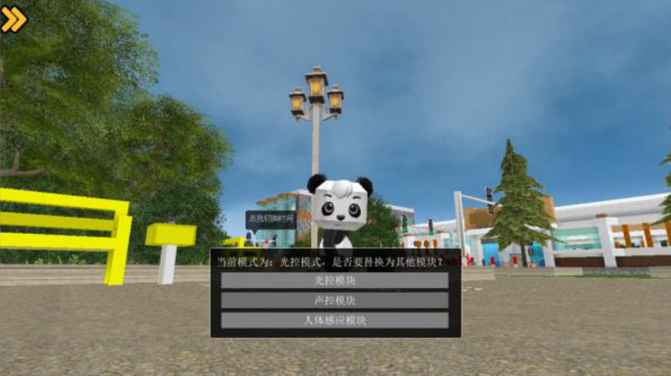  
△三种控制方式下的灯  

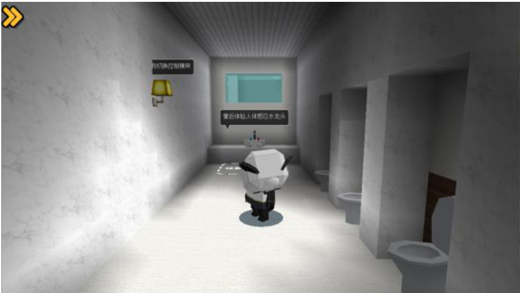  
△多功能感应控制灯  

1、实现声音控制灯（10分）  

通过程序，编写出当接受到模拟声音时即会点亮的小灯。  
设定小灯在点亮后，10秒后熄灭。  

2、实现光线控制灯（10分）  

通过程序，编写出当接受到模拟光线强度小于指定值时，即会点亮的小灯。  

3、实现模拟人体感应控制灯（10分）  

通过程序，编写出当有物体经过红外感应区时，即会点亮的小灯。  
设定小灯在点亮后，10秒后熄灭。  

4、实现多功能感应控制灯（30分）  

通过程序，编写出只有在夜晚才会开启触发条件，当有物体经过或接受到声音，就会点亮的小灯。  

设定小灯在点亮后，10秒后熄灭。  

任务三：模拟自动浇灌系统  

任务情境：未来校园中的花园可以通过物联网获得相关的温度、温度等信息，并决定何时开始浇水。通过程序，设置出一套能够适应各类环境的浇灌系统。  

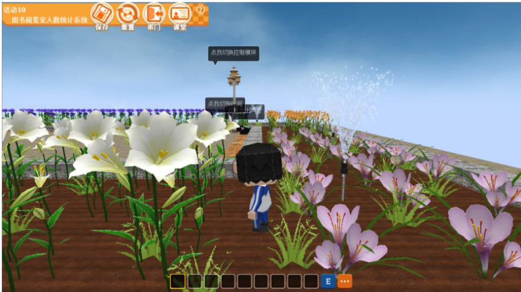  

# △自动浇灌系统  

1、根据获取到的湿度情况进行浇灌（10分）通过程序获取土壤湿度。  
当湿度低于 $30\%$ 时，开始浇水。  

2、设置每日浇灌计划（20分）  

合理科学浇水，避免在正午最热的时候。  
设计每日浇水计划，在每天的早上6点和下午5点，对土壤的湿度进行检测。  
当湿度低于 $30\%$ 时，开始浇水。  

任务四：模拟扫地机器人  

任务情境：扫地机器人是一种常见的清洁工具，面对学校地面这种复杂的环境，可通过循环指令，根据地形，以最少的代码实现整个场所的清洁工作。  

本题操作难度非常低，但通过学生的思维能力，拉开学生在本关挑战中消耗所花费的时间长度。同时也考验学时临场的决断能力，在面临难关时，不应过度追求技术，也可采用稳扎稳打的方法通过。  

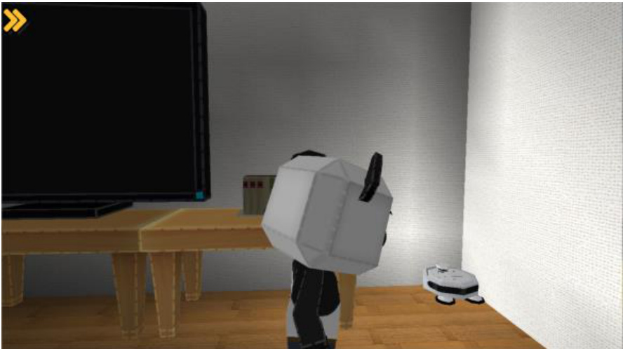  
△扫地机器人经过的地面会变干净  

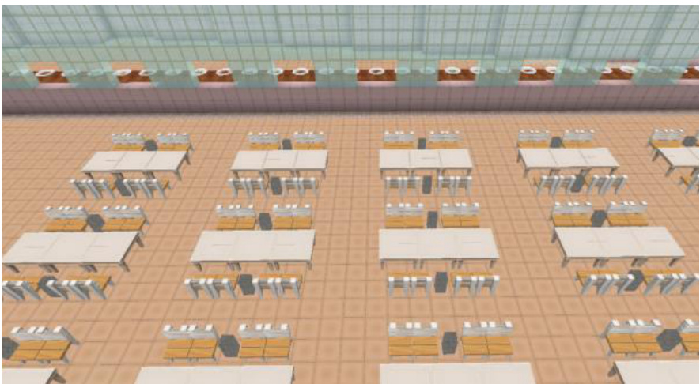  

△根据整个场景，判断如何控制机器人清洁所有的地面  

1、清洁走廊（10分）  

通过前进，转弯指令，让扫地机器人完成所有单元格的地面清洁。  

2、清洁班级（20分）  

通过循环，组合前进、转弯指令，让扫地机器人完成所有单元格的地面清洁。  

# 3、清洁食堂（20分）  

寻找地形中的规律，通过循环，组合前进、转弯指令，让扫地机器人完成所有单元格的地面清洁。  

任务五：设置智能空调  

任务情境：空调是最经典的过程控制，通过测试外界的温度，确定所需要释放的制冷功率。当达到温度时，空调将停止或怠速运转。  

本题为对于一套机械控制完整原理的逐步拆解，属于拔高和拉开选手水平的综合题目。  

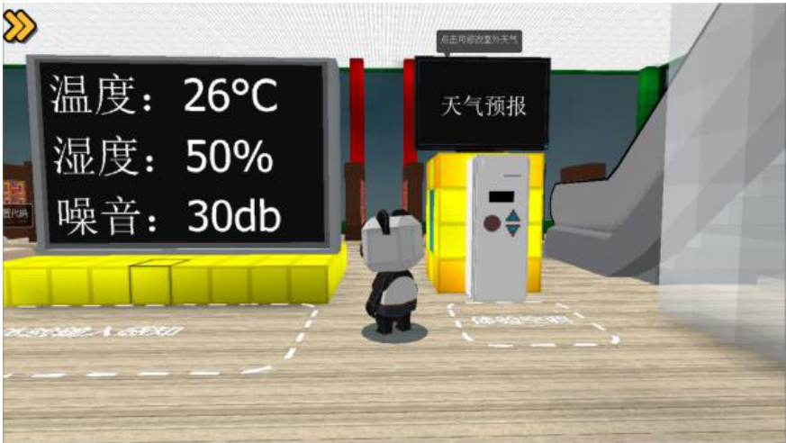  
△设定按钮逻辑  

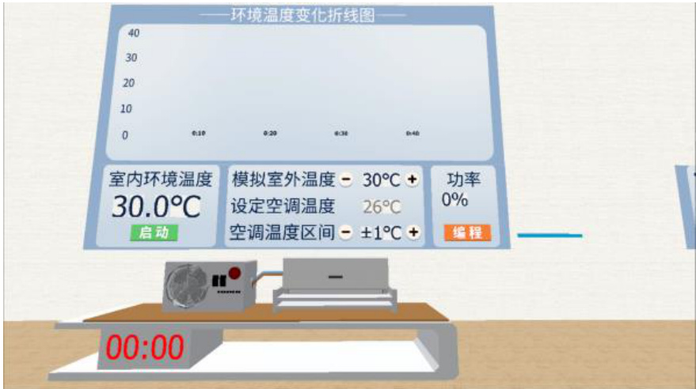  
△设定空调温度控制  

1、设计空调的初始状态和开关逻辑（20分）  

设定程序的初始状态。  

根据开关按钮接收到的点击事件设定空间在开启和关闭状态间的切换逻辑。  

2、空调温度控制按钮的逻辑设置（30分）  

根据接收到的点击事件对变量进行赋值。  

设定变量的上限和下限，当温度达到上限或下限时，温控按钮的+/-按钮点击无效。  

3、空调对于室温的检测和工作逻辑的判断（50分）  

设定一套循环的震荡区间逻辑。  

当超过区间的上限时，空调开始满负荷工作，当接近上限时，空调采用 $20\%$ 的功率工作，在达到下限时，空调以 $10\%$ 的功率工作。使空调保持在一个变频的工作状态。  

任务六：自动感应门  

任务情境：自动感应门当人进入红外感应区时便会打开，而人离开感应区时就会关闭的装置。  

本题是一个不对称的循环，在门打开的过程中，不论人是否离开了感应区，门始终会执行至门完全打开的状态。  

而当门在执行关闭时，如果有人进入了感应区，则门应当跳出当前的循环，停止关闭指令，转而打开门。  

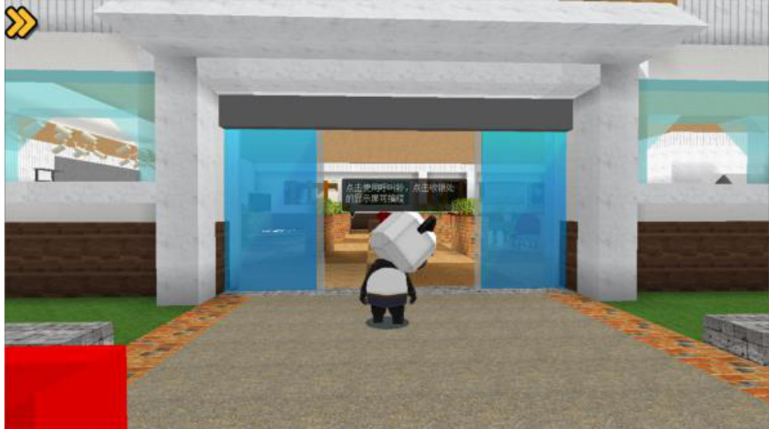  
△当人靠近感应区域时，门开启  

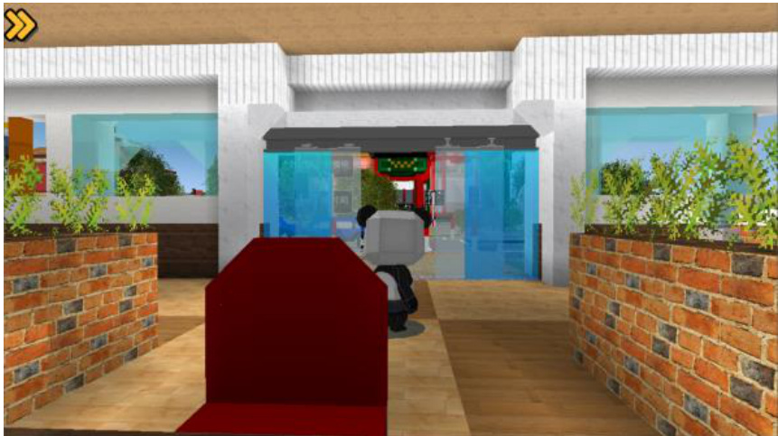  

△在门关闭的过程中，如果有人靠近则打断相关进程  

1、能够自动开启和关闭的感应门（20分）  

设置感应半径，当感应区域内有人时，开始执行门打开的命令，直到门开到最大为止。  

如果感应区域内没有人，在10秒后，开始执行门关闭的命令，直到门完全关闭。  

# 2、带有安全逻辑的感应门（30分）  

在上述命令的基础上，添加在门关闭过程中的循环打断逻辑。  

任务七：图书馆人数统计系统  

任务情境：人流量控制是物联网中最常见的一种应用，当人通过闸机进入公共区域时，公共区域内的人数就会进行累加。而当人通过闸机离开公共区域时，人数会相应减少。当人数达到饱和时，将关闭进入的闸机，实现只进不出的模式。通过这套机制设定出一个完整的机制。  

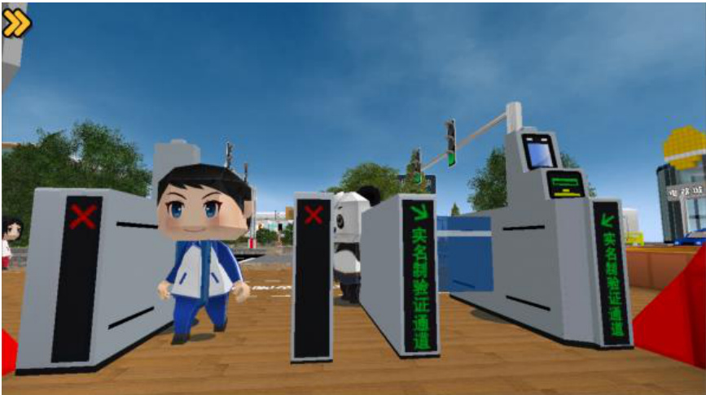  

△当人靠近闸机时，闸机开启，人数 $+1$  

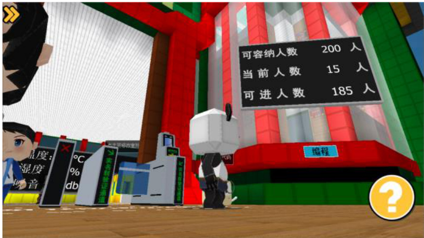  
△人数计数器  

1、进出闸机的人数统计（30分）  

设置计数器的初始状态。  
设置感应半径，当感应区域内有人时，开启闸机，同时人数 $+1$ 。  

2、设计出人流量控制闸机（40分）  

设置计数器和最大人数上限。设置两个闸机开启和关闭对计数器赋值，设置在上限时，闸机不会开启的逻辑。  

任务八：智能微波炉系统  

任务情境：微波炉是生活中最常见的设备，通过微波炉的设置，加热食物。根据功率和时间，可以得出微波炉总共在工作状态下释放的能量。而食物受到能量，而有可能是生、熟、焦三种状态中的一种。  

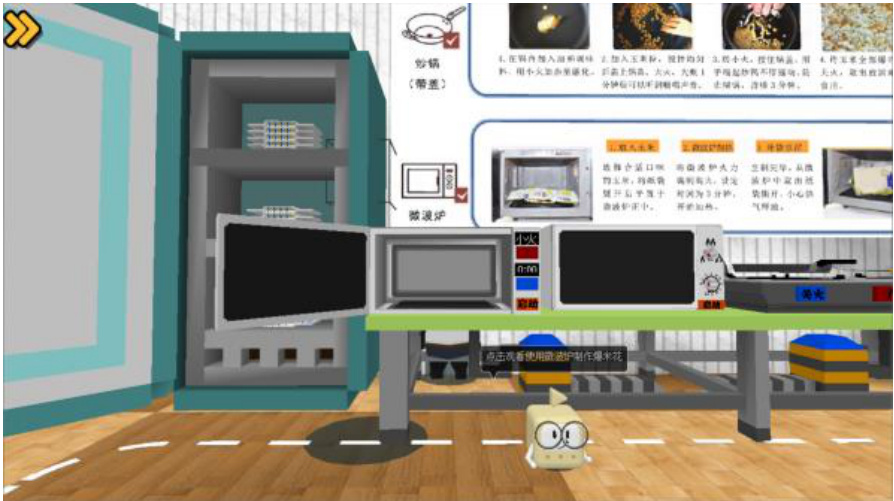  
△在虚拟仿真的操作环境中，完成微波炉的控制  

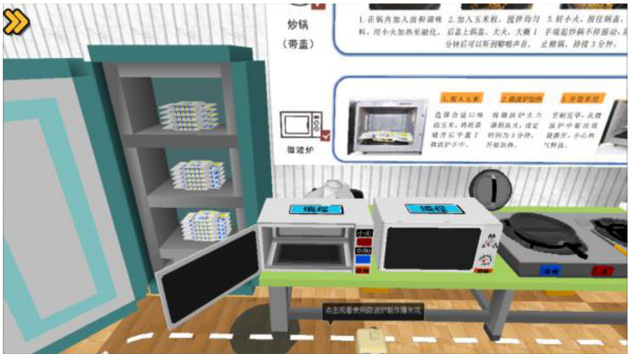  
△修理微波炉的加热程序  

1、加热爆米花，使之变熟（10分）  

2、修复微波炉的功率问题（10分）  

任务九：智能停车场系统  

任务情境：智能停车场通过摄像头来识别汽车的车牌号码和颜色，基于这个原理，编写出一套智能的停车管理系统。  

  
△上方的汽车会尝试进入停车场  

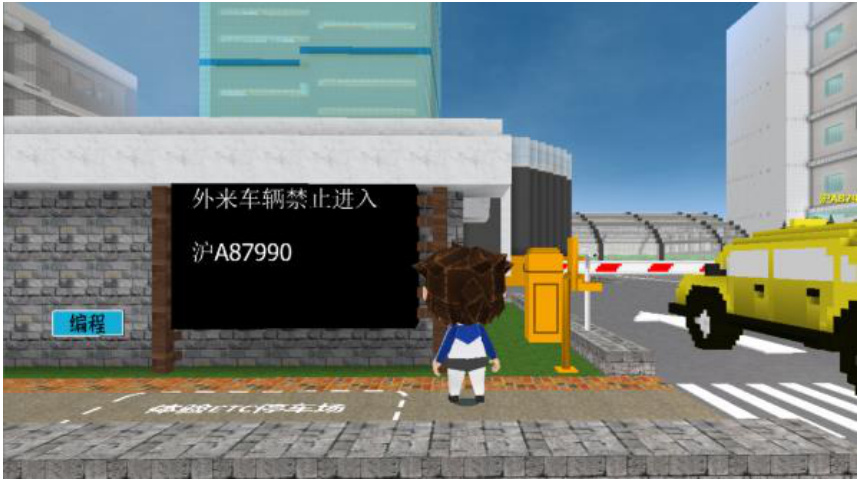  
△不满足条件的汽车无法进入  

1、识别校车（10分）  

通过颜色，将黄色的校车放入学校。  

2、识别指定车牌的汽车（10分）  

将老师的车牌设定为例外情况，可以在颜色识别不通过时进入学校。  

3、根据老师的车牌设定可进入停车场的规则（20分）在四行代码内，实现将所有老师和校车放进校的规则。  

# 五、全国挑战赛规则  

全国挑战赛规则与选拔赛一致。  

# （一）赛前准备  

1.比赛开始前,参赛选手需检查计算机、网络等设备是否满足比赛要求。  

2.根据组委会要求，在规定时间内用参赛账号登录竞赛平台。  

3.比赛开始前 15 分钟，参赛选手下载竞赛场景，确认无误后开始比赛。  

# （二）竞赛期间  

在竞赛时间内，参赛选手可以编程并随时进入仿真环境进行测试， 也可以多次点击“提交成绩”按钮进行成绩提交，系统将自动保留提交的最高成绩。如整场比赛未点击“提交成绩”，则无成绩。  

# （三）评审机制  

提交分数后系统会自行记录并统计参赛选手得分情况，参赛选手按仿真成绩排名。如果出现成绩并列的情况， 则按如下顺序排名：  

1.仿真用时少的选手在前；  
2.仿真最高成绩提交时间早的选手在前。  

# 六、回避范围及方式  

# （一）回避范围  

回避是指评审专家具有法定情形，必须回避，不参与相关作品评审的制度。按照相关规定，结合竞赛活动实际，如果评审专家具备以下情形之一的，应当回避：  

（1）是参赛选手的近亲属；  
（2）与参赛选手有其他直接利害关系；  
（3）担任过参赛选手的辅导老师、指导老师；  
（4）与参赛选手有其他关系，可能影响公正评审的。  

# （二）回避方式  

回避方式有自行回避与申请回避两种：  

# 1.自行回避  

评审专家自行提出回避申请的，应当说明回避的理由，口头提出申请的，应当记录在案。  

评审专家有上述(1)(2)(3)(4)情形之一的，应当自行回避。  

评审专家在活动评审过程中，发现有上述(1)(2)(3)(4)情形之一的，应当自行提出回避；没有自行提出回避的，活动组委会应当决定其回避。评审专家自行回避的，可以口头或者书面提出，并说明理由。口头提出申请的，应当记录在案。  

# 2.申请回避  

参赛选手及评审专家要求其他评审专家参与回避的，应当提出申请，并说明理由。口头提出申请的，应当记录在案。  

# 七、 异议处理机制  

1.第七届全国青少年人工智能创新挑战赛接受社会的监督，挑战赛的评审工作实行异议制度。  

2.任何单位或者个人对第七届全国青少年人工智能创新挑战赛参赛选手、参赛单位及其项目的创新性、先进性、实用性及推荐材料真实性、比赛成绩等持有异议的， 应当在项目成绩公布之日起10日内向活动组委会提出，逾期不予受理。  

3.提出异议的单位或者个人应当提供书面异议材料，并提供必要的证明文件。提出异议的单位、个人应当表明真实身份。个人提出异议的，应当在书面异议材料上签署真实姓名；以单位名义提出异议的，应当加盖本单位公章。以匿名方式提出的异议一般不予受理。  

4.提出异议的单位、个人不得擅自将异议材料直接提交评审组织 或者评审专家；专家收到异议材料的，应当及时转交活动组委会，不得提交评审组织讨论和转发其他评审专家。5.活动组委会在接到异议材料后应当进行审查，对符合规定并能提供充分证据的异议，应予受理。6.为维护异议者的合法权益，活动组委会、推荐单位及其指导老师，以及其他参与异议调查、处理的有关人员应当对异议者的身份予以保密；确实需要公开的，应当事前征求异议者的意见。  

7.涉及参赛选手所完成项目的创新性、先进性、实用性及推荐材料真实性、比赛成绩的真实性等内容的异议由活动组委会负责协调，由有关指导单位或者指导老师协助。参赛选手接到异议通知后，应当在规定的时间内核实异议材料，并将调查、核实情况报送活动组委会审核。必要时，活动组委会可以组织评审专家进行调查，提出处理意见。涉及参赛选手及其排序的异议由指导单位或者指导老师负责协调，提出初步处理意见报送活动组委会审核。参赛选手接到异议材料后，在异议通知规定的时间内未提出调查、核实报告和协调处理意见的，该项目不认可其比赛成绩。  

8.异议处理过程中，涉及异议的任何一方应当积极配合，不得推诿和延误。参赛选手在规定时间内未按要求提供相关证明材料的，视为承认异议内容；提出异议的单位、个人在规定时间内未按要求提供相关证明材料的，视为放弃异议。  

9.异议自异议受理截止之日起 60 日内处理完毕的，可以认可其比赛成绩；自异议受理截止之日起一年内处理完毕的，可以直接参加下一年度比赛。  

# 八、赛事组委会  

本届挑战赛信息发布平台为：  

“中国少年儿童发展服务中心”微信公众号；  
主办单位网站： http://www.china61.org.cn；  
挑战赛网站：http://aiic.china61.org.cn。  

组委会联系方式：  

联系人： 屈老师、辛老师邮  箱：xiaoyuanshi@163.com电  话：010-65124399  

涉赛违规问题线索专用举报邮箱： ghstfmct@163.com  

赛事技术咨询：  

联 系 人 ： 程 老 师 13675512332 、 朱 老 师 15955532337 、 李 老 师13285601736、张老师13285602708  

邮  箱：1836521210@qq.com  

# 九、 知识产权声明  

挑战赛组委会鼓励并倡导技术创新以及技术开源，并尊重参赛队的知识产权。参赛队伍比赛中开发的所有知识产权均归所在队伍所有，组委会不参与处理队伍内部成员之间的知识产权纠纷，参赛队伍须妥善处理本队内部学校及其他身份的成员之间对知识产权的所有关系关系。参赛队伍在使用组委会提供的裁判系统及赛事支持物资 过程中，须尊重原产品的所有知识产权归属方，不得针对产品进行反向工程、复制、翻译等任何有损于归属方知识产权的行为。  

# 十、主办单位免责声明  

1.未经主办单位书面授权，任何单位和个人以本赛事名义开展的活动均属假冒、侵权。2.未经当地防疫和教育部门批准，任何单位和个人不得以本赛事名义组织线下聚集。3.主办单位不会以本赛事名义向学生收取任何费用，更不会以本赛事名义举办夏冬令营、培训班，捆绑销售器材商品、书籍材料等。本赛事也不存在任何指定器材、指定培训机构、指定教材等，请参与活动的师生和家长朋友们谨防上当受骗。4.所有参赛作品，均须为参赛个人原创，不能存在任何侵犯第三方权利的内容，不能违反法律法规的规定，主办单位对此不承担责任。5.请参与活动人员妥善保管自己的贵重物品（如现金、笔记本电脑、手机和参赛设备等），避免丢失或损坏，主办单位对此不承担责任。  

# 十一、其他  

1.比赛期间，凡是规则中没有说明的事项由专家评审委员会现场决定。  

2.主办单位对规则中未说明及有争议的事项拥有最终解释权、补充权和决定权。  