# 第七届全国青少年人工智能创新挑战赛编程创作与信息学专项赛  

# 参赛手册  

中国少年儿童发展服务中心2024年4月  

# 一、赛事简介  

编程是使计算机根据人的意图去完成特定任务的人机之间交流的基本方式，也是实现人工智能的基础能力，在人工智能应用场景中发挥着基础作用。青少年从小学编程，可以培养理性思维、逻辑思维和创新思维。随着互联网、大数据、人工智能时代的来临，也会从基础上培养青少年对人工智能的基本意识、基本概念、基本素养和基本兴趣。  

为了考察青少年对计算机编程和信息学等有关知识的综合运用情况，我们设立了编程创作与信息学专项赛项目。参赛青少年将利用计算机编程工具和语言，围绕特定主题，设计创作编程作品，并通过在线答题、作品展示和专家问辩的形式进行竞赛。  

本次挑战赛坚持公益性，赛事任何环节，任何单位都不会向学生、学校收取成本费、工本费、活动费、报名费、食宿费、参赛材料费、器材费和其他各种名目的费用，做到“零收费”；不会指定参与竞赛活动时的交通、酒店、餐厅等配套服务；不会通过面向参赛学生组织与竞赛关联的培训、游学、冬令营、夏令营等方式，变相收取费用；不会推销或变相推销资料、书籍、辅助工具、器材、材料等商品；不会面向参赛的学生、家长或老师开展培训；不会借竞赛之名开展等级考试违规收取费用；不会以任何方式向学生或组织学生参赛的学校转嫁竞赛活动成本。本次挑战赛坚持自愿原则，不强迫、诱导任何学校、学生或家长参加竞赛活动。竞赛以及竞赛产生的结果不作为中小学招生入学的依据。赞助单位不得借赞助竞赛活动进行相关营销、促销活动。  

# 二、参赛条件及分组办法  

1.在校小学、初中、高中、中专或职高学生均可直接报名参赛，无需其他前置竞赛、考试或测评。  

2.参赛组别：小学低年级组、小学高年级组、初中组、高中组、中职组。  

3.编程创作与信息学专项赛为个人赛，每人仅限选择一个参赛组别和科目报名参赛，参赛科目需要在线上选拔赛举办期选择。4.每人最多可有2名指导老师，多名学生的指导老师可以重复。指导老师作为责任人，有责任监督竞赛期间人身安保护、财产，指导参赛学生制定学习计划，督促参赛学生顺利完成比赛。  

参赛分组及编程工具：  

<html><body><table><tr><td>序号</td><td>参赛科目组</td><td>参赛学段组</td><td>参赛工具</td></tr><tr><td>1</td><td>图形化编程组</td><td>小学低年级组、小学高年级组</td><td>不限</td></tr><tr><td>2</td><td>Python组</td><td>小学高年级组、初中组、高中 组、中职职高组</td><td>不限</td></tr><tr><td>3</td><td>C++组</td><td>小学高年级组、初中组、高中 组、中职职高组</td><td>不限</td></tr></table></body></html>  

# 三、选拔赛参与办法  

1.选拔赛报名。参加活动的青少年通过访问“人工智能创新挑战赛”网站https://aiic.china61.org.cn/，在首页点击“选拔赛报名”进行在线报名，详细登记相关信息和报名赛项、组别。  

2.参加线上选拔赛。选拔赛在线上开展，以线上编程知识测试的形式举办。参加选拔赛的青少年需通过“人工智能创新挑战赛”专题页面点击“参加选拔赛”链接，选择“编程创作与信息学专项赛”进入线上竞赛系统参赛。  

3.报名时间：2024年4月15日-5月15日，选拔赛时间为2024年5月16日-7月1日（具体时间另行通知）。  

4.线上选拔赛时间安排及内容如下（参赛青少年可任选一场参与选拔赛，不可重复参赛）：  

<html><body><table><tr><td>赛事内容</td><td>比赛时间</td><td>比赛内容</td><td>比赛形式</td></tr><tr><td>全国选拔赛 第一场</td><td>2024年6月16日</td><td>由基础编程与挑战编程两部分组 成，编程题需要阅读并理解题目后 按要求完成编程。</td><td>在线</td></tr><tr><td>全国选拔赛 第二场</td><td>2024年6月22日</td><td>由基础编程与挑战编程两部分组 成，编程题需要阅读并理解题目后 按要求完成编程。</td><td>在线</td></tr></table></body></html>  

5.主办单位将根据线上选拔赛的成绩，甄选部分优秀选手入围全国挑战赛。  

6.入围情况可以在2024年7月15日后，通过“人工智能创新挑战赛”专题页面进行查询，入围的选手可以参加全国挑战赛决赛。  

# 四、选拔赛规则  

# （一）注意事项  

1．参赛青少年须按时登录线上选拔网站进行报名和答题，题目包  
括编程知识、代码阅读、命题操作等类型。2．答题部分需要选手自主完成，创作部分作品必须为原创,不得抄  
袭。3．每位选手严禁重复报名或者填写虚假个人信息，未在比赛时间  
内参加比赛视为弃权。4．线上选拔赛采用线上监考的方式进行，监考的主要方式：参与  
选拔的青少年须全程打开摄像头，若考试过程中切换考试页面或视频  

画面出现其他人，均会被系统判定为作弊，请考试前务必关闭电脑桌面上的其他不相关的程序及页面，避免与考试无关的人员接近。  

（二）本次比赛无需下载编程工具，完成报名后，参赛青少年可登录赛事系统，查看参赛信息、进行竞赛答题。  

# （三）选拔赛评分标准：  

<html><body><table><tr><td>题型</td><td>评分标准</td><td></td><td></td><td>题量分值分数</td></tr><tr><td>基础编程题</td><td>编程题以最终完成的编程结果为主，编程过程会有 相应得分，完成相应题目要求也会有相应得分；</td><td>1</td><td>40</td><td>40</td></tr><tr><td>挑战编程题</td><td>编程题以最终完成的编程结果为主，编程过程会有 相应得分，完成相应题目要求也会有相应得分；</td><td>1</td><td>60</td><td>60</td></tr></table></body></html>  

# 五、全国挑战赛决赛规则  

入围决赛的同学可以参加挑战赛决赛活动，决赛为线上赛，规则与要求与选拔赛相同。  

# 六、回避范围及方式  

# （一）回避范围  

回避是指评审专家具有法定情形，必须回避，不参与相关作品评审的制度。按照相关规定，结合竞赛活动实际，如果评审专家具备以下情形之一的，应当回避：  

1．是参赛选手的近亲属；  
2．与参赛选手有其他直接利害关系；  
3．担任过参赛选手的辅导老师、指导老师的；  
4．与参赛选手有其他关系，可能影响公正评审的。  

# （二）回避方式  

回避方式有自行回避与申请回避两种：  

# 1.自行回避  

评审专家自行提出回避申请的，应当说明回避的理由，口头提出评审专家有上述1.2.3.4情形之一的，应当自行回避。  

评审专家在活动评审过程中，发现有上述1.2.3.4情形之一的，应当自行提出回避；没有自行提出回避的，活动组委会应当决定其回避。评审专家自行回避的，可以口头或者书面提出，并说明理由。  

# 2.申请回避  

参赛选手及评审专家要求其他评审专家参与回避的，应当提出申请，并说明理由。口头提出申请的，应当记录在案。  

# 七、异议处理机制  

1.第七届全国青少年人工智能创新挑战赛接受社会的监督，挑战赛的评审工作实行异议制度。  

2.任何单位或者个人对第七届全国青少年人工智能创新挑战赛参赛选手、参赛单位及其项目的创新性、先进性、实用性及推荐材料真实性、比赛成绩等持有异议的，应当在项目成绩公布之日起10日内向活动组委会提出，逾期不予受理。  

3.提出异议的单位或者个人应当提供书面异议材料，并提供必要的证明文件。提出异议的单位、个人应当表明真实身份。个人提出异议的，应当在书面异议材料上签署真实姓名；以单位名义提出异议的，应当加盖本单位公章。以匿名方式提出的异议一般不予受理。  

4.提出异议的单位、个人不得擅自将异议材料直接提交评审组织或者评审专家；专家收到异议材料的，应当及时转交活动组委会，不得提交评审组织讨论和转发其他评审专家。  

5.活动组委会在接到异议材料后应当进行审查，对符合规定并能提供充分证据的异议，应予受理。  

6.为维护异议者的合法权益，活动组委会、推荐单位及其指导老师，以及其他参与异议调查、处理的有关人员应当对异议者的身份予以保密；确实需要公开的，应当事前征求异议者的意见。  

7.涉及参赛选手所完成项目的创新性、先进性、实用性及推荐材料真实性、比赛成绩的真实性等内容的异议由活动组委会负责协调，由有关指导单位或者指导老师协助。参赛选手接到异议通知后，应当在规定的时间内核实异议材料，并将调查、核实情况报送活动组委会审核。必要时，活动组委会可以组织评审专家进行调查，提出处理意见。涉及参赛选手及其排序的异议由指导单位或者指导老师负责协调，提出初步处理意见报送活动组委会审核。参赛选手接到异议材料后，在异议通知规定的时间内未提出调查、核实报告和协调处理意见的，该项目不认可其比赛成绩。  

8.异议处理过程中，涉及异议的任何一方应当积极配合，不得推诿和延误。参赛选手在规定时间内未按要求提供相关证明材料的，视为承认异议内容；提出异议的单位、个人在规定时间内未按要求提供相关证明材料的，视为放弃异议。  

9.异议自异议受理截止之日起60日内处理完毕的，可以认可其比赛成绩；自异议受理截止之日起一年内处理完毕的，可以直接参加下一年度比赛。  

10.活动组委会应当向活动专家评审委员会报告异议核实情况及处理意见，并将决定意见通知异议方和参赛选手。  

# 八、竞赛大纲-图形化编程  

# （一）基本要求  

1.熟练操作图形化编程3.0编辑器；  

2.掌握图形化编程的基本概念和基础指令操作；  

3.掌握运算、变量、列表、自制积木模块的使用；  

4.掌握顺序语句、循环语句和判断语句的使用；  
5.具备综合运用能力，可以根据要求独立设计出完整的程序；  
6.具有一定的算法思维及创新能力。  

# （二）编程知识  

考试所涉及的图形化编程知识包括：1.指令：单一指令的使用，指令的组合；2.事件：单一事件与指令的组合，事件并行；3.克隆：角色克隆自己，给克隆体添加程序；4.广播：广播消息和接收广播，区分广播与广播并等待；5.坐标：二维坐标系概念，原点、坐标轴概念，坐标计算；6.画笔：画笔功能的添加，画笔的属性调节及调用，绘制几何图形；7.运算：四则运算，比较运算，随机数运算，布尔运算，字符串的操作，字符串高级运算；8.变量：变量的赋值与改变数值，变量的调用，利用变量解决数学问题，用变量表示状态；9.列表：创建列表及显示隐藏操作，列表的增删改查，调用列表，列表的索引，用列表表示状态；10.自制积木：自制积木的调用，传递参数；11.顺序语句：一种或多种指令的顺序执行；12.循环语句：单个循环结构，多个循环结构的顺序执行，循环结构嵌套，条件循环；13:判断语句：单条件语句，多条件语句，嵌套条件语句，多分支语句；14.编辑器使用：角色、背景、舞台的设计，添加注释，程序的启动和终止，文件操作。  

# 九、竞赛大纲-Python  

# （一）基本要求  

1.掌握Python语言的基本语法规则、数据结构；  
2.掌握Python常用内置模块及第三方库；  
3.熟练应用冒泡、递归等常见算法；  
4.可以将复杂问题拆解、独立通过编程解决问题。  

# （二）编程知识  

1.Python语言基础：  

（1）程序基础规则，如：变量命名、缩进、注释等；（2）基本数据类型及其相关操作，如字符串、整型、浮点型、列表等；（3）程序的三大控制结构：顺序、分支、循环，并能综合运用。  

# 2.函数及模块  

（1）自定义函数的概念、规则；  
（2）函数参数的传递与返回值；  
（3）变量的作用域；  
（4）内置模块：time、random、os等；  

3.数据结构与算法  

（1）列表、字典、元组、集合的基本操作；（2）算法的概念及应用；（3）常见算法：递归、递推、冒泡/选择等排序算法、动态规划、贪心、枚举等。  

4.程序设计  

（1）结构化程序设计的基本概念；  
（2）流程图的概念及应用；  
（3）阅读理解程序的基本能力，及程序调试能力。  

# 十、竞赛大纲- $-c++$  

# （一）基本要求  

1.掌握 $\mathrm{C}{+}{+}$ 语言的基本语法；  
2.掌握常用算法和数据结构；  
3.熟练使用开发环境；  
4.可以独立编写完整的程序，并且具备Debug的能力。  

# （二）编程知识  

$1.{\mathsf{C}}^{++}$ 的基础语法：  

（1）变量及数据的输入输出；（2）基本数据类型及类型转换：整型（int、long）、布尔型（bool）、字符型（char）、浮点型（float、double）；（3）运算符和表达式：算术、关系、逻辑、赋值、自增自减、条  
件运算符等；（4）分支结构：if-else、switch、分支嵌套；（5）循环结构：for、while、do-while、循环嵌套；（6）数组：一维数组、二维数组；（7）字符串；字符串和字符数组、string字符串及其操作；（8）函数：函数的定义和调用、形参和实参、返回值、变量作用  
域、常用系统函数；（9）STL模板库。  

2.基本数据结构：  

（1）栈；  
（2）队列；  
（3）树；  
（4）图；  
（5）STL模板库。  

3.算法：  

（1）进制转换：二进制、十进制、八进制、十六进制；（2）简单算法：模拟、枚举；（3）简单排序算法：桶排序、冒泡、选择、插入；（4）基础算法：二分、高精度、递推、递归、分治、贪心、深搜、广搜、动态规划、初等数论；（5）算法评估：时间复杂度和空间复杂度。  

# 十一、竞赛题目示例  

图形化编程样题  

例题一：  

【考察知识点】  

设置角色大小及特效、设置角色随机造型、获取鼠标指针的位置、有限循环、按键检测。  

# 【题目描述】  

制作一个烟花秀的项目，按照如下步骤要求，完成程序。  

1、按下空格键，烟花角色移到舞台下边缘，需要显示在鼠标指针的正下方，烟花造型为初始造型，大小为100。  

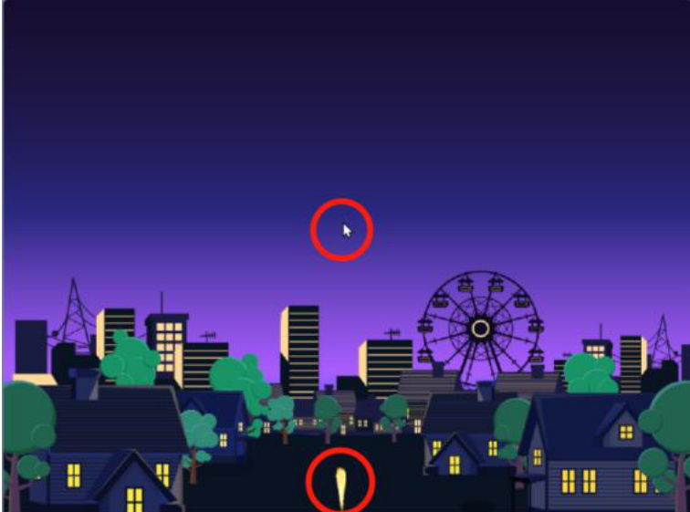  
图1：项目效果1示例  

2、播放“烟花发射”声音，同时烟花1秒内滑行到鼠标指针的位置。  

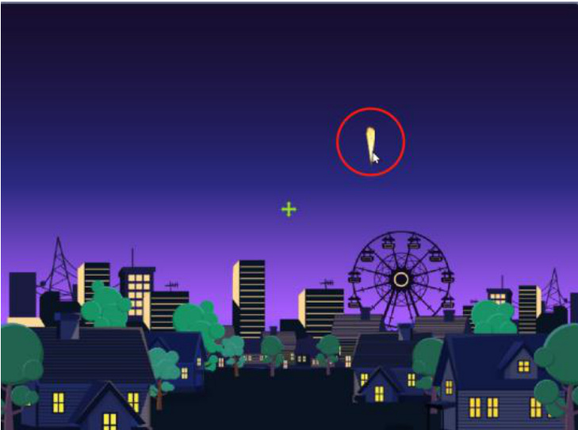  
图2：项目效果2示例  

3、之后烟花绽放，切换为随机的一个绽放造型，最后播放“烟花爆炸”的声音。  

  
图3：项目效果3示例  

4、设置烟花特效：大小、颜色、亮度不断增加，每次增加2，重复增加40次。  

  
图4：项目效果4示例  

5、需要保证每次烟花绽放时，都能看到这三种特效的变化。最后烟花消失，需要隐藏，最后舞台上看不到烟花了。  

  
图5：项目效果5示例  

# 【答案解析及参考代码】  

1、按下空格后，设置烟花出现的位置，X坐标是鼠标的X坐标值，Y是-180，之后依次设置造型、大小及显示。这里判断按下空格可以用如果那么，也可以用按下事件。  

2、烟花滑行到的位置是鼠标的坐标值。  

3、滑行完成后要切换绽放的造型，通过造型区可以看到烟花第  
2--6个造型是绽放的造型，所以应切换为2--6的随机造型。  

4、设置特效逐渐变化要用到有限循环。5、要保证每次都能看到特效变化的效果，需要在按下空格时清除图形特效，否则亮度跟颜色的变化仅第一次有效。  

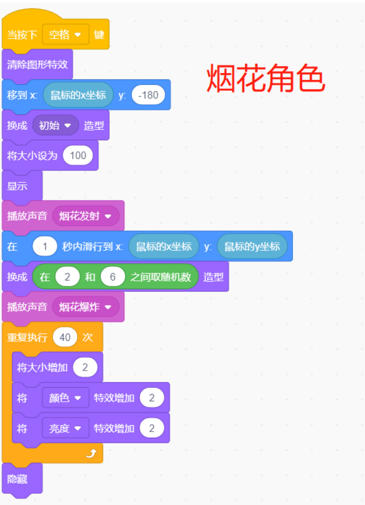  

例题二：  

【考察知识点】  

改变角色面向方向、侦测角色碰撞及舞台边缘碰撞、新建变量，修改变量值、角色不断切换造型、设置角色的随机坐标值。  

【题目描述】  

制作一个躲避小鸟的项目，按照如下步骤要求，完成程序制作：  

1、小鸟初始方向为90，初始坐标为 $\mathrm{x}:-200,\mathrm{y}:0.$ ,小鸟左右移动，碰到边缘就旋转180度进行反方向移动，同时Y坐标变为负140到140之间的随机数。  

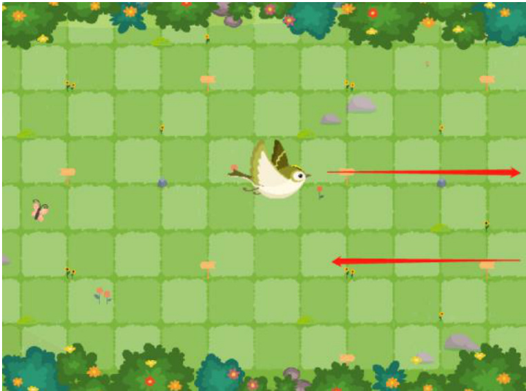  
图6：项目效果1示例  

2、小鸟不断切换下一个造型。  

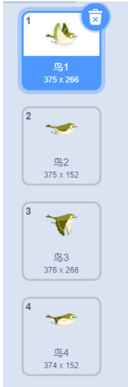  
图7：项目效果2示例  

3、蜜蜂初始方向为0，初始坐标为x:0,y:44。蜜蜂上下移动，如果碰到小鸟就停止程序，通过按键检测事件，检测到按下空格时，蜜蜂就旋转180度，进行反方向移动。  

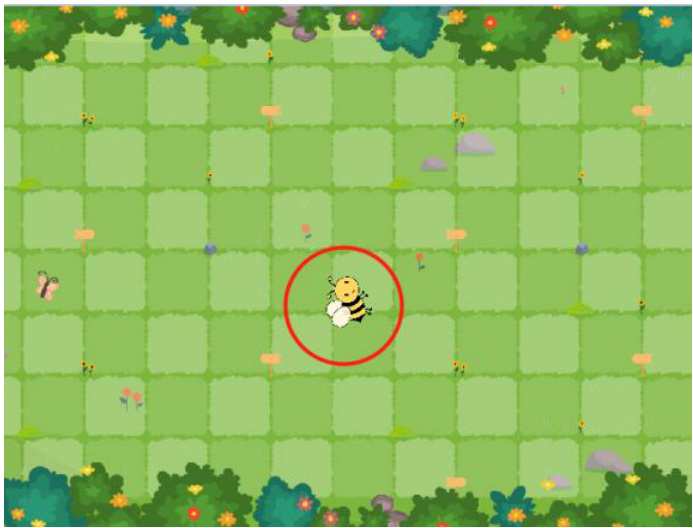  
图8：项目效果3示例  

4、蜜蜂不断切换下一个造型。  

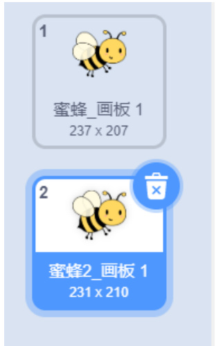  
图9：项目效果4示例  

5、新建“存活时间”变量，一秒钟增加1，记录蜜蜂的存活时间，代码写在小鸟和蜜蜂中均可。  

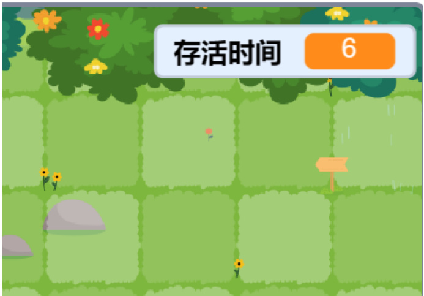  
图10：项目效果5示例  

【答案解析及参考代码】  

1、小鸟翻转需要用到左转或右转180度积木，两个均可，如果碰到舞台边缘，翻转后还需要用随机数设置小鸟新的Y坐标。2、切换造型的过程中，是否添加时间等待均可。3、蜜蜂初始方向是0或180均可，如果碰到小鸟就停止全部脚本。4、切换造型的过程中，是否添加时间等待均可。5、变量每隔一秒增加1，所以需要增加1秒的时间等待。  

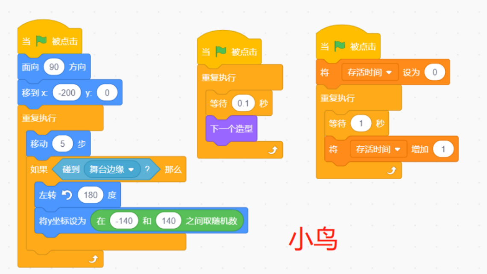  

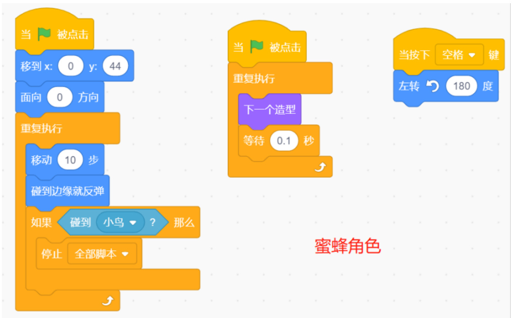  

Python样题例题一：设计背景板  

# 【考察知识点】  

数据类型转换、比较运算符、输入输出语句、变量的自增  

# 【题目描述】  

你是一名图形设计师，正在为一个重要的展示活动设计背景板。背景板将由一系列星号（\*\*\*\*\*）组成，每一行代表背景板的一层。现在，你需要根据客户的需求来确定背景板的层数。  

功能要求：  

1.编写一个Python程序，该程序首先提示用户输入一个正整数n，表示背景板的层数。2.根据用户输入的层数n，程序应使用循环结构来打印出n层由星号（##########）组成的背景板。每一层背景板占一行，且每行都是由五个星号组成。  

3.打印完所有层后，程序结束。  

请注意，每一层背景板都是相同的，即由五个星号组成。你的任务是确保程序能正确接收用户输入的层数，并打印出相应数量的  

背景板层。  

# 【参考代码】  

n = int(input())   
$\dot{\textbf{1}}=\boldsymbol{\mathsf{1}}$   
while i $\scriptstyle<={\mathfrak{n}}$ : print('#########＃') $\textbf{i}=\textbf{i}+\textbf{1}$  

例题二：电子商城  

# 【考察知识点】  

输入输出、分支语句、循环语句、函数  

【题目描述】  

你是一家电子商城的程序员，商城目前主要销售烤鸭和叫花鸡两种商品。商城现在推出了一项优惠活动，即当客户购买的商品总价超过500元时，将享受88折的优惠。你需要编写一个程序来模拟商城的购物流程，并在客户购买的商品总价超过500元时自动应用折扣。  

功能要求：  

1.程序应持续循环，直到用户选择退出为止。2.用户可以选择购买烤鸭（单价198元）或叫花鸡（单价256元）。3.用户输入购买的商品名称后，程序应更新商品总价，并显示当前总价。4.如果用户输入的不是有效的商品名称（烤鸭或叫花鸡），程序应提示用户输入有误并重新输入。5.当用户选择退出时，程序应检查商品总价是否超过500元，如果超过则应用88折优惠，并显示最终的总价。  

请根据以上场景和功能要求，完成Python代码的编写。你的代码应能正确执行购物流程，并在必要时应用折扣。  

# 【参考代码】  

state $\mathbf{\tau}=\mathbf{\tau}$ True   
money $\mathit{\Theta}=\ \Theta$   
def discount(money): if money $>=500$ : print("您的商品总价高于500元，享受88折优惠") money\* $\scriptstyle\mathbf{\Theta}\displaystyle\mathbf{\Lambda}\displaystyle\mathbf{\Lambda}\mathbf{\Lambda}\displaystyle\mathbf{\Lambda}\displaystyle\mathbf{\Lambda}\displaystyle\mathbf{\Lambda}\left(\mathbf{\Lambda}\displaystyle\mathbf{\Lambda}\right)$ .88   
while state: print('本商城现有烤鸭(198元)、叫花鸡(256元)售卖，如需退出请输入退出') goods $\mathbf{\tau}=\mathbf{\tau}$ input（'您想购买：'） $\Dot{\mathsf{\Omega}}$ goods $\scriptstyle==$ money $+=$ 198 print("购买成功,总价：",money) elif goods $\scriptstyle==$ money $\mathrel{+}\infty$ 256 print("购买成功,总价："，money) elif goods $\scriptstyle==$ state $\mathbf{\tau}=\mathbf{\tau}$ False discount(money) print('总价格：'，money) else: print("输入有误请重新输入")  

$\mathrm{C}{+}{+}$ 样题例题一：开关灯【考察知识点】  

变量的输入输出、bool类型，算术运算，双层for循环，数组，模拟算法  

【题目描述】  

礼堂有n盏灯（ $\mathrm{\Pi}_{\mathrm{{n}}}{\leqslant}5000\mathrm{{)}}$ ）,从1到n按顺序对灯进行编号，初始时全部处于开启状态；有m个人（ $\mathrm{\langle{m}\leqslant1000\rangle}$ ）也从1到m依次编号。第一个人（1号）将灯全部关闭，第二个人（2号）将编号为2的倍数的灯打开，第三个人（3号）将编号为3的倍数的灯做了相反处理（即打开的灯关闭，将关闭的灯打开）。依照编号递增顺序，以后的人都和3号一样，将自己编号倍数的灯做相反处理。经过m个人操作最后有多少灯是开着的？输出开着灯的个数。  

# 【输入格式】  

一行，两个整数 n 和 m。 （n≤5000，m≤1000）  

# 【输出格式】  

输出开着的灯的数量。  

# 【输入样例】  

5 4  

【输出样例】  

2  

【参考代码】  

#include <bits/stdc+ +.h>   
using namespace std;   
int mainO{ bool a[5005]={0]; int n,m; cin>>n>>m; for(int i= 1; $1<=m$ ： $\mathbf{i}++\mathbf{\partial}$ for(intj=1;j<=n; j++){ //遍历 n 盏灯 $\mathbf{i}\mathbf{f}(\mathbf{j}^{\mathrm{o}}/\mathrm{o}\mathbf{i}==\mathbf{0}$ a[j] $\c=$ !a[j]; 1 1 int cnt=0; for(int i=1; i<=n; i+ +){ if(a[i] $==0$ ) cnt+ +; cout<<cnt; return O;  

# 例题二：螺旋方阵  

# 【考察知识点】  

二维数组，双层循环，格式化输出，模拟算法  

# 【问题描述】  

一个n行n列的螺旋方阵按如下方法生成：从方阵的左上角（第1行第1列）出发，初始时向右移动；如果前方是未曾经过的格子，则继续前进，否则顺指针方向右转，重复上述操作直到经过方阵中所有格子。根据经过的顺序，在格子中依次填入整数1,2,3，……n，便构成一个螺旋方阵，下面是一个 $\cdot\mathrm{n}{=}4$ 的螺旋方阵。  

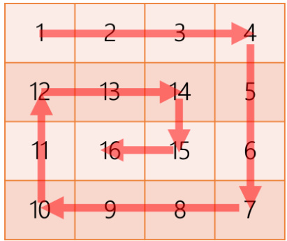  
图11：螺旋方阵示例  

编程输入一个正整数n，生成一个 $\mathbf{\sigma}_{\mathrm{n}}\times\mathbf{\varepsilon}_{\mathrm{n}}$ 的螺旋方阵。  

# 【输入格式】  

一行一个正整数n， $1\leqslant\mathrm{{n}}\leqslant100.$ 。  

# 【输出格式】  

共n行，每行n个正整数，每个正整数占5列，每列靠右对齐  

# 【输入样例1】  

4  

【输出样例1】  

1 2 3 4 12 13 14 5 11 16 15 6 10 9 8 7  

# 【输入样例2】  

5  

# 【输出样例2】  

<html><body><table><tr><td>1</td><td>2</td><td>3</td><td></td><td>4</td></tr><tr><td>16</td><td>17</td><td>18</td><td>19</td><td>6</td></tr><tr><td>15</td><td>24</td><td>25</td><td>20</td><td>7</td></tr><tr><td>14</td><td>23</td><td>22</td><td>21</td><td>8</td></tr></table></body></html>  

# 【参考代码】  

#include<bits/stdc++.h>   
using namespace std;   
int dir[4][2 $\mathbf{\Sigma}=\mathbf{\Sigma}$ ((0,13,{1,0),{0,-1),{-1,0);   
int a[105][105];   
int mainOf int n; cin>>n; int $\scriptstyle\mathbf{x}=0,\mathbf{y}=0;$ int $\scriptstyle\mathbf{d}=0;$ for(int i=1;i<=n\*n;i++){ a[x][y] $\mathrm{=}\mathrm{i}$ if(a[x+dir[d][o]][y+dir[d][1]] $=0)\mathsf{d}=(\mathsf{d}+1)\%\mathsf{d};$ else if(x $^+$ dir[d][0] $\quad==$ nllx+dir[ ${\mathsf{d}}][0]==-1){\mathsf{d}}=({\mathsf{d}}+1)\%$ 4; else if(y $^+$ dir[d][1] $==$ nlly $^+$ dir[d][1] $==$ -1)d=(d+1)%4; $x+=$ dir[d][0]; $y+=$ dir[d][1]; 1 for(int i=O;i<n;i+ +)( for(intj=0;j<n;j++){ cout<<setw(5)<<a[i]lj]; 1 cout<<endl; } return O;   
1  

# 十二、赛事组委会  

本届挑战赛信息发布平台为：  
“中国少年儿童发展服务中心”微信公众号；主办单位网站：http://www.china61.org.cn；挑战赛网站：http://aiic.china61.org.cn。组委会联系方式：  
联系人：辛老师、张老师  
邮箱：xiaoyuanshi@163.com  

电话：010-65124399  

涉赛违规问题线索专用举报邮箱：ghstfmct@163.com  

赛事技术咨询：  

联系人：熊老师  
邮箱：xinxixuezhuanxiang@163.com  
电话：15510215881  

# 十三、知识产权声明  

挑战赛组委会鼓励并倡导技术创新以及技术开源，并尊重参赛队的知识产权。参赛队伍比赛中开发的所有知识产权均归所在队伍所有，组委会不参与处理队伍内部成员之间的知识产权纠纷，参赛队伍须妥善处理本队内部学校及其他身份的成员之间对知识产权的所有关系。参赛队伍在使用组委会提供的裁判系统及赛事支持物资过程中，须尊重原产品的所有知识产权归属方，不得针对产品进行反向工程、复制、翻译等任何有损于归属方知识产权的行为。  

# 十四、主办单位免责声明  

1.未经主办单位书面授权，任何单位和个人以本赛事名义开展的活动均属假冒、侵权。2.主办单位不会以本赛事名义向学生收取任何费用，更不会以本赛事名义举办夏冬令营、培训班，捆绑销售器材商品、书籍材料等。本赛事也不存在任何指定器材、指定培训机构、指定教材等，请参与活动的师生和家长朋友们谨防上当受骗。3.所有参赛作品，均须为参赛个人原创，不能存在任何侵犯第三方权利的内容，不能违反法律法规的规定。4.请参与活动人员在线下活动时妥善保管自己的贵重物品（如现金、笔记本电脑、手机和参赛设备等），避免丢失或损坏。  

# 十五、线下活动注意事项  

1.参与活动人员必须牢固确立“安全第一”的意识，把活动安全放在首要位置。严格注意用电安全，相关机器人设备须提前充好电，准备好备用电池，规范用电，防止触电。严格注意防火安全，禁止携带易燃易爆等危险品和打火机、火柴等进入赛场。严格注意操作安全，活动期间如有发射弹丸、切割材料、器件焊接等危险操作时必须戴好头盔、手套、护目镜等防护措施。活动期间，参与活动人员应熟悉场地环境，若遇紧急情况，严格服从安保人员指挥。  

2.参与活动人员应提前购买保额不低于人民币50万元的人身意外伤害保险和意外医疗保险等风险保险。  

3.参与活动人员应遵守场地制度，爱护公共设施，自觉保持公共卫生。  

# 十六、其它  

1.关于挑战赛规则的任何补充、修订，将在中国少年儿童发展服务中心网站及微信公众号上发布。  

2.比赛期间，规则中没有说明的事项由专家评审委员会现场决定。  

3.主办单位和专家评审委员会对规则中未说明及有争议的事项拥有最后解释权、补充权和决定权。  