# 第七届全国青少年人工智能创新挑战赛机器人工程设计专项赛  

# 项目手册  

中国少年儿童发展服务中心2024年4月  

# 一、赛事简介  

人工智能是通过研究人类智能活动的规律，构造出具有一定智能的人工系统的科学，主要研究如何让计算机去完成以往需要人的智力才能胜任的工作，也就是研究如何应用计算机的软硬件来模拟人类某些智能行为的基本理论、方法和技术。例如，视觉感知、语音及图像识别、在不确定条件下做出决策、学习、大数据分析、语言翻译等。人工智能关键技术的每一次突破，都将促进智能机器人的性能上一台阶，同理，智能机器人性能的每一次提高，也将推动人工智能关键技术的一大进步。随着社会的发展，提高智能机器人的智能化水平、环境自适应 性与决策自主性将是机器人技术突破的关键。为了培养青少年的创新能力，考察其对人工智能、机器人、电子技术、编程设计等有关知识的综合运用情况，我们设立了机器人工程设计专项赛项目。  

本次挑战赛坚持公益性，赛事任何环节，任何单位都不会向学生、学校收取成本费、工本费、活动费、报名费、食宿费、参赛材料费、器材费和其他各种名目的费用，做到“零收费”；不会指定参与竞赛活动时的交通、酒店、餐厅等配套服务；不会通过面向参赛学生组织与竞赛关联的培训、游学、冬令营、夏令营等方式，变相收取费用；不会推销或变相推销资料、书籍、辅助工具、器材、材料等商品；不会面向参赛的学生、家长或老师开展培训；不会借竞赛之名开展等级考试违规收取费用；不会以任何方式向学生或组织学生参赛的学校转嫁竞赛活动成本。本次挑战赛坚持自愿原则，不强迫、诱导任何学校、学生或家长参加竞赛活动。竞赛以及竞赛产生的结果不作为中小学招生入学的依据。赞助  

# 单位不得借赞助竞赛活动进行相关营销、促销活动。  

# 二、参赛条件及分组办法  

1.在校小学、初中、高中、中专或职高学生均可参赛。  

2.选手所在学段组别分为：小学低年级组、小学高年级组、初中组、高中组、中职职高组。  

3.机器人工程设计专项赛为个人赛，选拔赛和决赛均为 1 人一组。每人最多可有 1 名指导老师，多名学生的指导老师可以重复。指导老师作为责任人，有责任监督竞赛期间人身安全保护、财产，指导参赛学生制定学习计划，督促参赛学生顺利完成比赛。  

# 三、选拔赛参与办法  

1.选拔赛报名。参加活动的青少年通过访问“人工智能创新挑战赛”网站 https://aiic.china61.org.cn/，在首页点击“选拔赛报名”进行在线报名，详细登记相关信息和报名赛项、组别。  

2.参加选拔赛。根据各地区报名实际情况，本赛项选拔赛设置线上、线下两种形式：线下选拔赛采用现场竞技的方式，线上选拔赛以视频连线完成任务的方式，由专家根据参赛情况进行评判。对于不具备线上视频连线参赛的队伍可以利用虚拟仿真平台进行参赛，由专家根据参赛情况进行评判。参赛青少年只需选择参加线下现场竞技、视频连线、虚拟平台其中的一种选拔赛。  

3.报名时间：2024 年 4 月 15 日- 5 月 15 日，选拔赛时间为 2024 年5 月16 日-7 月1 日（具体时间另行通知）。  

参加选拔赛的青少年需通过“人工智能创新挑战赛”网站点击击链接，选择“机器人工程设计专项赛”了解选拔赛详细信息。4.主办单位将结合线上线下选拔赛的成绩，甄选出部分优秀选手入围全国挑战赛决赛。5.选拔赛成绩可以在 2024 年 7 月 15 日后，登录“人工智能创新挑战赛”网站进行查询，入围决赛的选手可以参加全国决赛。  

# 四、线下选拔赛规则  

# （一）竞赛主题  

“智能物流”是指通过物联网技术、大数据分析、人工智能等一系列前沿技术，在物流运输过程中实现智能、自动和高效地运作。智能物流具有信息化、自动化、网络化、智能化的特点，将成为物流行业的重要发展方向。  

参赛队伍以“智能物流”为主题，在比赛现场使用自行设计的机器人，展示自动化设备和机器人等技术，模拟物流运作的自动化处理（包括货物分拣、装卸、运输等环节），思考如何提高整个物流系统的效率，降低成本，增强物流行业的竞争力。  

# （二）竞赛场地  

# 1.场地图和道具  

场地图采用彩色喷绘布，尺寸为 $2400\mathrm{mm}\times1200\mathrm{mm}$ ，如图1 所示。比赛现场，场地地图铺在地面上，组委会会尽力保证场地的平整度，但不排除场地褶皱等情况。  

  
图1：场地图  

轨迹线：轨迹线为 $25\pm1\mathrm{{mm}}$ 宽的黑线，不规则分布在场地中，并连接入出发区、休整区。  

出发区：是一个边长为 250mm 的正方形区域。它是机器人启动的区域。比赛开始后机器人由此处出发前往各个任务区域。  

休整区：是一个边长为 250mm 的正方形区域，可进入该区域调整机器人装置重新启动。当机器人垂直投影接触该区域时，选手可为机器人调整结构或程序，并再次启动机器人。机器人只有完成了“系统授权”任务后，方能进入休整区。  

任务区：场地中分布有 7 个抽选任务模型放置区和三个固定任务区，任务模型放置区域分三个区域，A 区（A1），B 区（B1、B2），C 区（C1、C2、C3、C4），任务模型放置于任务位置的方框内，任务操作杆或转柄朝向轨迹线方向，任务以胶纸固定在相应的任务模型放置区域内。  

# 2.现场的电源  

比赛现场提供当地标准电源接口，如果参赛队需要任何电压或者频率的转换器，请参赛队自行准备。距离参赛队最近的电源接口可能距离参赛队的指定调试桌有一定的距离，请参赛队自行准备足够长的电源延长线，同时在现场使用延长线时请注意固定和安全。  

# 3.现场的光线  

比赛现场为日常照明，正式比赛之前参赛选手有时间标定传感器，但是大赛组织方不保证现场光线绝对不变。随着比赛的进行，现场的阳光可能会有变化。现场可能会有照相机或摄像机的闪光灯、补光灯或者其他赛项的未知光线影响，请参赛选手自行解决。  

# （三）机器人要求  

参赛机器人的参数要求如表 1 所示。  

表1：机器人的参数要求  

<html><body><table><tr><td>项目</td><td>要求</td></tr><tr><td>数量</td><td>每支参赛队1台机器人。</td></tr><tr><td>规格</td><td>机器人在出发区内的最大尺寸为25cm×25cm×30cm（长×宽×高），离 开出发区后，机器人的机构可以自由伸展。</td></tr><tr><td></td><td>每台机器人只允许使用一个控制器，控制器电机端口不得超过4个，输 控制器入输出端口不得超过8个。除小学低年级组，其余组别的控制器需内置 不低于2.4寸的彩色液晶触摸屏。</td></tr><tr><td>传感器</td><td>小学低年级组的机器人可使用传感器类型不限。其余组别的机器人禁止 使用集成类传感器，如循迹卡、灰度卡等，即单个传感器的接收探头不 能多于一个。</td></tr><tr><td>遥控</td><td>小学低年级组可选择使用无线遥控（仅限2.4G或蓝牙）的方式完成比赛 任务，其余组别必须通过自动程序控制完成比赛任务。</td></tr><tr><td>电机</td><td>当电机用于驱动时，提供驱动力的电机只能有2个（当额定电压为6v 时，空转转速：≤280 转/分钟）。其它作辅助任务的电机数量不限。</td></tr><tr><td></td><td>驱动轮机器人用于着地的轮子（含胎皮）直径不得大于70mm。</td></tr><tr><td>结构</td><td>机器人必需使用塑料积木件搭建，不得使用 3D打印件，不得使用螺丝、 螺钉、铆钉、胶水、胶带等辅助连接材料。设计尺寸是基于标准的10 毫</td></tr></table></body></html>  

<html><body><table><tr><td></td><td>米积木。</td></tr><tr><td>电池</td><td>每台机器人电源类型不限，但电源输出电压不得超过10V。</td></tr><tr><td>检录</td><td>选手第一轮进场前，机器人可整机入场，但需通过全面检查，以确保符 合相关规定。选手应对不符合规定的地方进行修整改进，方可参加比赛。</td></tr></table></body></html>  

# （四）竞赛任务  

本赛项的机器人任务，分必做任务和选做任务。  

任务1 到 6：“机器人出发”、“收工返回”、“系统授权”、“收件信息”、“上门收件”和“快件中转”为必做任务。  

任务7 到12：“自动打包”、“客服连线”、“处理违禁品”、“无人机配送”、“自动卸货”和“货物称重”为选做任务。  

每个组别从选做任务中随机抽选任务，小学低年级组随机抽选 1 个，小学高年级组随机抽选 3 个任务，初中组随机抽选 4 个任务，高中组从中随机抽选5 个任务。  

各组别所有任务抽选完毕后进行位置抽选。小学低年级组放置为 A 区1 个，B 区1 个。小学高年级组任务放置为 A 区1 个，B 区2 个，C 区 1 个。初中组任务放置为 A 区1 个，B 区2 个，C 区2 个。高中组任务放 置为 A 区 1 个，B 区 2 个，C 区 3 个。  

机器人垂直投影未完全脱离出发区或休整区前，不能完成任何任务。  

1.机器人出发  

任务描述：机器人离开出发区。  

完成任务的标志：在出发区启动机器人，机器人垂直投影完全脱离出发区（红色区域），得 30 分。  

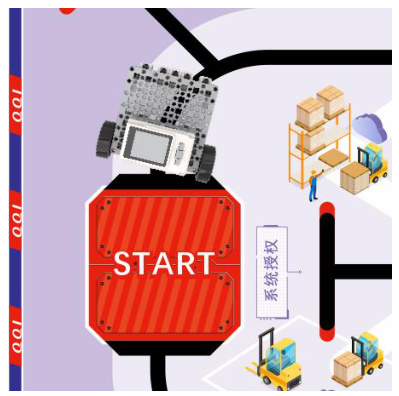  
图2：机器人出发完成状态  

2.收工返回  

任务描述：机器人完成任务后自主返回出发区或休整区并控制机器人发出长鸣响声，完成此任务则结束本场比赛。  

完成任务的标志：机器人部分垂直投影接触出发区（红色区域）或休整区（红色区域）并发出不少于1 秒的长鸣响声，得40 分。  

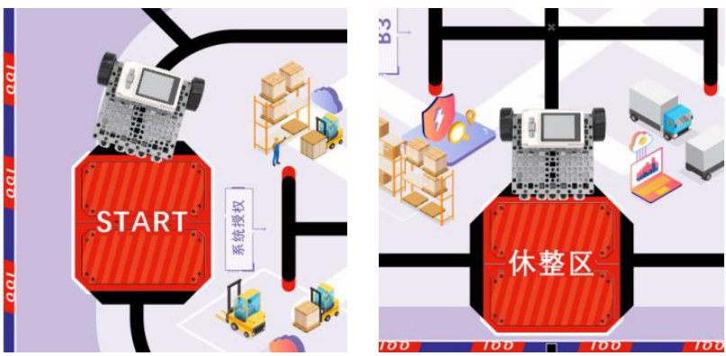  
图3：收工返回完成状态  

# 3.系统授权  

任务描述：系统授权模型放置在模型框，感应机放置于面向轨迹线的右边，机器人通过授权芯片数据给系统授权，当未得到授权时，点阵屏上显示 $^{66}\times\ '$ ，系统授权成功后，点阵屏上显示显示“！”。机器人必须系统授权成功后，方可进入休整区调整机器人。  

任务位置：固定  

任务完成标志：机器人授权成功点阵屏上显示“！”得80 分。每台机器人只记录一次授权成功。激活系统授权的机器人可选择在出发区或休整区待命准备下一次出发。未激活系统授权的机器人不得进入休整区，否则视为1 次重置。  

  
图4：系统授权成功前后状态  

# 4.收件信息  

任务描述：地图模型框放置一个获取收件信息模型，操作杆初始位置位于模型最左边，机器人需要往右推动操作杆，使存储信息的转盘旋转，机器人需识别转盘上的收件信息ID（ID1-ID4）。  

任务位置：随机  

任务完成标志：操作杆与监控器主体接触，机器人识别转盘朝机器人一面的收件信息后，用彩灯或者屏幕显示相应颜色（显示时长不少于2 秒，红色ID1、绿色 ID2、蓝色ID3、黄色ID4），正确显示 ID 所对应的颜色得80 分。  

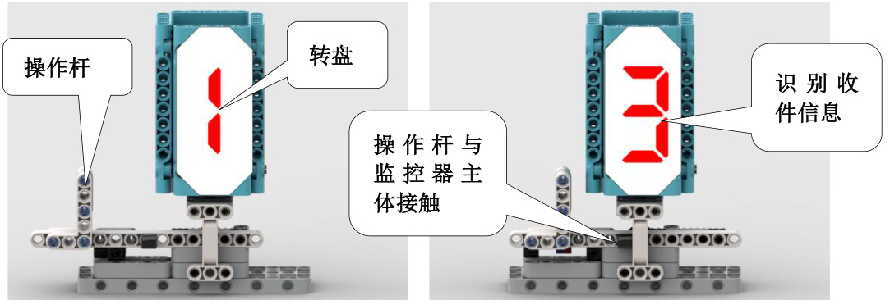  
图5：收件信息初始状态及完成状态  

5.上门收件  

任务描述：四个待收取快件任务模型（分别对应四个ID）固定在场地上四个位置，机器人需要根据“收件信息”任务中获取到的收件信息ID，来收取对应的快件。  

任务位置：固定  

任务完成标志：机器人根据获取到的收件信息 ID，取走对应快件，使快件脱离平台，并且取走过程中快件不得与场地接触，得 80 分。完成“收件信息”后，机器人在完成“上门收件”任务的过程中，中途可完成其他任务，若此过程中发生重置或自主返回出发区或休整区，则“上门收件”任务失效。再次“上门收件”需要重新进行获取“收件信息”的信息扫描。  

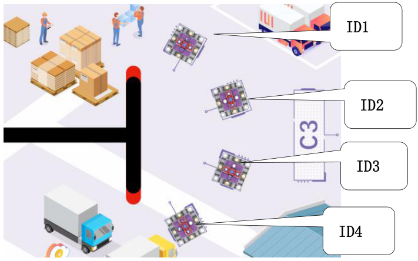  
图6：快件固定位置  

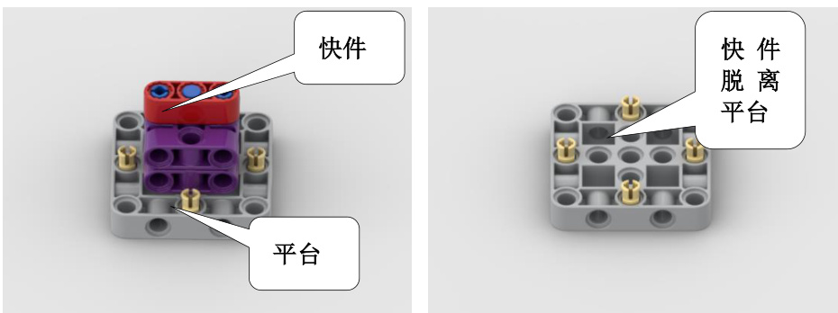  
图7：上门收件初始状态及完成状态  

# 6.快件中转  

任务描述：地图模型框放置一个中转站模型，中转站属于空闲状态，机器人将“上门收件”任务中获取到的快件，运送到中转站，然后将快件放入中转站。  

任务位置：固定  

任务完成标志：快件脱离机器人进入中转站内，并保持至比赛结束，得 80 分。必须完成“上门收件”任务后，才可进行“快件中转”任务。如果在“上门收件”任务收取快件后回到出发区或休整区，可将快件手动放在机器人上再次出发完成此任务。  

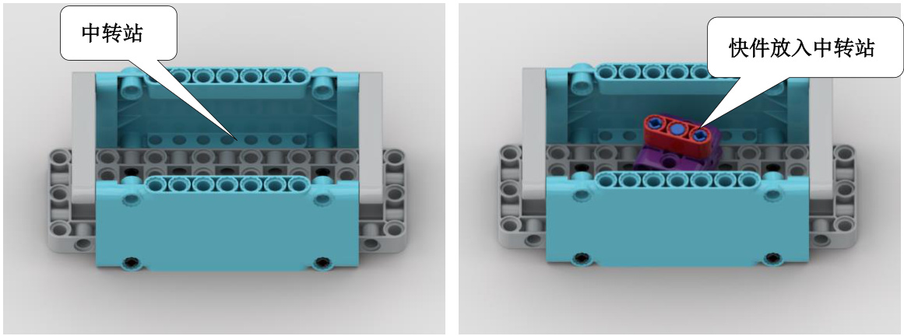  
图8：快件中转初始状态及完成状态  

7.自动打包  

任务描述：地图模型框放置一个打包机模型，操作转柄初始位置垂直于地面，两个待处理快件位于打包机平台上，机器人转动转柄使打包好的快件落下脱离打包机平台。  

任务位置：随机  

任务完成标志：机器人必须以旋转转柄的方式使得打包好后的快件脱离打包机平台，一个快件脱离得40 分，两个脱离得80 分。  

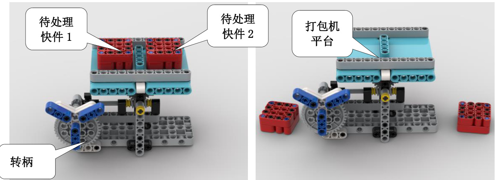  
图 9：自动打包初始状态及完成状态  

# 8.客服连线  

任务描述：地图模型框放置一个客服连线模型，机器人需要旋转人物模型，再翻转信息显示屏，使信息显示屏垂直竖立于场地。  

任务位置：随机  

任务完成标志：信息显示屏垂直竖立于场地并保持到比赛结束，得80 分。  

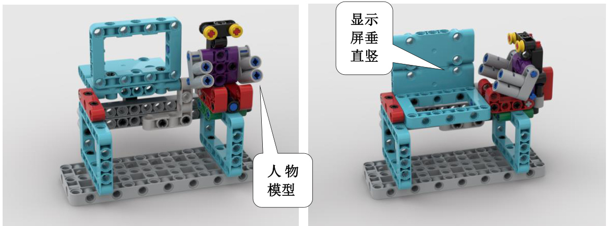  
图10：客服连线初始状态及完成状态  

# 9.处理违禁品  

任务描述：地图模型框放置有违禁物品模型，机器人需操纵两个作杆，使违禁品在未接触机器人的情况下，落入隔离箱。  

任务位置：随机  

完成标志：操作杆1 完全被抽出脱离任务模型主体，得 40 分，推动操作杆2 使得违禁品落入隔离箱，再得 40 分，总分80 分。  

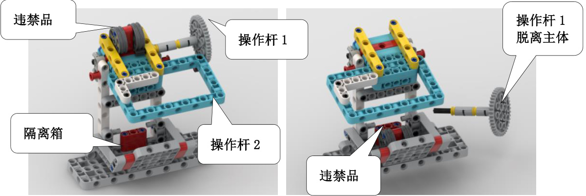  
图11：处理违禁品初始状态及完成状态  

# 10.无人机配送  

任务描述：地图模型框放置无人机模型，机器人要将无人机放置到起降台上。  

任务位置：随机  

完成标志：无人机成功放置在起降台上并保持直立状态到比赛结束，得 80 分。  

  
图12：无人配送初始状态及完成状态  

11.自动卸货  

任务描述：地图模型框放置卸货机模型 ，操作转柄初始位置垂直于地面，机器人来回旋转转柄，使货物脱离卸货机。  

任务位置：随机  

任务完成标志：货物脱离卸货机，并保持至比赛结束，得 80 分。  

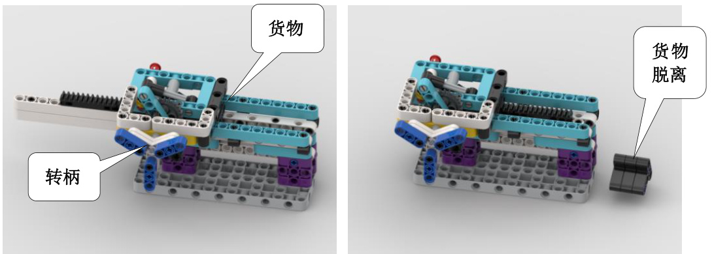  
图13：自动卸货初始状态及完成状态  

# 12.货物称重  

任务描述：地图模型框放置天平秤模型 ，左托盘上放置被称的快件包裹，机器人从休整区携带砝码到达任务区并将砝码放置到天平秤的右托盘上，使天平横梁与底座分离。  

任务位置：随机  

任务完成标志：砝码成功放置到右托盘上且天平的横梁不与底座接触保持至比赛结束，得 80 分。  

  
图14：货物称重初始状态及完成状态  

# （五）竞赛流程  

比赛调试开始前，由裁判组或组委会抽签决定任务道具的摆放位置，任务道具主体框架参考任务说明示意图，实际比赛道具搭建可能有所出  

入，例如实际使用的梁、销等结构颜色不同，或尺寸、高度稍有不同。参赛选手应具备根据实际情况调整的能力，模型所在的位置一旦确定，各场次的比赛均尽量做到相同。  

# 1.比赛顺序  

赛前会将所有参赛队抽签排序，所有选手严格按照抽签确定的顺序进行比赛。比赛中，上一队开始比赛时，会通知下一队候场准备。在规定时间内没有到场的队伍，将视为放弃比赛资格。  

# 2.搭建与编程  

参赛队在第一轮开始前至少有 90 分钟的机器人搭建和程序调试时间。第一轮结束后，至少有 60 分钟的时间进行第二轮调试。裁判组可根据实际情况调整调试时间，并在每一轮的调试前向所有参赛队伍宣布。  

参赛选手需要按照赛场秩序，有序地排队进行编程及调试，不遵守秩序的参赛队可能会被取消参赛资格。编程调试结束后，机器人由裁判封存，参赛选手未经允许不得再接触机器人，否则将被取消参赛资格。  

裁判示意比赛开始后，仍没有准备好的参赛队将丧失本轮比赛机会，但不影响下一轮的比赛。  

# 3.选手比赛  

参赛选手在正式比赛前有 1 分钟的准备时间。选手需在准备时间内恢复并确认场地任务，准备好上场机器人。选手准备完毕向裁判示意可以开始比赛。  

# 4.正式比赛  

场地上分布有不规则的轨迹线。机器人需以自主控制的方式从出发区出发，必须沿着轨迹线抵达任务点完成对应的任务，以获得相应的分数。完成任务的机器人能自主返回出发区或休整区。机器人可在出发区  

或休整区调整结构后再次启动。  

比赛共分两轮，单轮比赛时间为 180 秒。参赛队的机器人出现下列情况，将停止计时并结束本场比赛，并记录时间数据。  

（1）机器人任务失败且无法继续执行后续任务；（2）参赛队完成“收工返回”任务；（3）计时到达180 秒;（4）参赛队主动结束比赛(选手需举手示意并说出“结束比赛”，否则可能被裁判判定重置从而延后停止计时）。  

# 5.重置  

以下情况需要将机器人重置回出发区或者休整区（需完成系统授权任务后方能重置回修整区）：  

（1）选手向裁判申请重置的；  
（2）机器人完成任务时形成卡死状态的；  
（3）机器人脱线或脱离比赛场地的；  
（4）选手未经允许接触任务道具或机器人的；  
（5）机器人破坏任务装置的。  

每发生一次重置，总分减 10 分，最高减 100 分，重置过程中不会停止计时。  

机器人垂直投影接触出发区或者休整区（需完成系统授权任务后方能重置回休整区）后，选手方可接触机器人，并在出发区或者休整区内更换零件。若选手在出发区或者休整区以外的区域接触机器人，则判定为 1 次重置。若选手在基地以外接触任务模型，则该任务失效不能再继续完成，并计 0 分（即使该任务已完成），并判定 1 次重置。若机器人破坏任务装置，该任务不得分（即使该任务已完成），并判定 1 次重置。  

若出现以上情况需重置，选手需举手示意并说出“申请重置”，否则可能被裁判判定为结束比赛。  

# 6.任务随机性  

比赛分两轮进行，在每一轮调试开始前每个组别会抽签确定任务和放置位置，任务和位置一旦确定，所有场地的任务模型和位置在本轮保持一致。  

比赛现场可能会出一个附加任务，附加任务在调试前公布。附加任务要求参赛机器人能够实现基本的推、拉、转、抓取、放置、携带等功能。附加任务将随机替代“自动打包”、“客服连线”、“处理违禁品”、“无人机配送”、“自动卸货”、“货物称重”被抽选的选做任务中的某一个。附加任务的分值与被替代任务分值相同，同组别的附加任务将保持一致。  

# （六）竞赛评分  

竞赛期间，规则中如有未尽事项以竞赛裁判委员会现场公布为准。  

# 1.竞赛得分  

最终得分 $\O=$ 任务得分 $^{+}$ 时间得分 $+$ 连击得分-重置分  

# 2.时间得分  

在规定时间内机器人完成各组别应完成的全部任务并获取分数，可获得时间得分。比赛结束后，选手应立即示意裁判停止计时。剩余时间按区间获得时间加分。（取剩余时间的整数部分四舍五入计算，2.97 秒取 3 秒，10.3 秒取 10 秒）  

（1）剩余时间<3 秒，时间分为0；  
（2）3 秒 $\scriptstyle\left<=$ 剩余时间<10 秒，加5 分；  
（3）10 秒 $\langle=$ 剩余时间<20 秒，加10 分；（4）20 秒 $\langle=$ 剩余时间<30 秒，加15 分；  
（5）剩余时间 $\scriptstyle\gamma=30$ 秒，加20 分。  

# 3.连击得分  

为了表彰参赛队编程能力和创新思维，特设置连击得分，机器人从出发区或者休整区（需完成“系统授权”任务后才能重置回休整区）出发，在自主返回或重置发生前完成 2 个以上任务的，达成连击条件。在此过程中，完成 2 个任务，加 20 分；完成 3 个任务，加 30 分；完成 4个任务，加40 分，以此类推，但“机器人出发”和“收工返回”不算在连击序列中。如果机器人接触出发区或休整区或发生重置行为，则连击中断，每场比赛的连击得分只记录最多的一次连击状态。  

4.排名  

竞赛成绩取两轮的总和为最终比赛成绩。如果总成绩相同时，按以下顺序决定排名：  

（1）单轮成绩较高者排名靠前。  
（2）两轮用时总和较少者排名靠前。  
（3）重置次数较少者排名靠前。  

# 5.评分表  

具体评分表见表 2，比赛现场可以打印出来使用。  

# 表2：机器人工程设计专项赛“智能物流”评分表  

参赛队（编号）： 组别：  

<html><body><table><tr><td>任务名称</td><td>分值</td><td>第一轮</td><td>第二轮</td></tr><tr><td>机器人出发</td><td>30分</td><td></td><td></td></tr><tr><td>收工返回</td><td>40分</td><td></td><td></td></tr><tr><td>系统授权</td><td>80分</td><td></td><td></td></tr><tr><td>收件信息</td><td>80分</td><td></td><td></td></tr><tr><td>上门收件</td><td>80分</td><td></td><td></td></tr><tr><td>快件中转</td><td>80分</td><td></td><td></td></tr><tr><td>自动打包</td><td>40分/80分</td><td></td><td></td></tr><tr><td>客服连线</td><td>80分</td><td></td><td></td></tr><tr><td>无人机配送</td><td>80分</td><td></td><td></td></tr><tr><td>处理违禁品</td><td>40分/80分</td><td></td><td></td></tr><tr><td>自动卸货</td><td>80分</td><td></td><td></td></tr><tr><td>货物称重</td><td>80分</td><td></td><td></td></tr><tr><td colspan="2">附加任务</td><td></td><td></td></tr><tr><td colspan="2">剩余时间 (秒)</td><td></td><td></td></tr><tr><td colspan="2">时间得分</td><td></td><td></td></tr><tr><td colspan="2">连击得分 最高连击次数×10分</td><td></td><td></td></tr><tr><td colspan="2">重置分 重置次数×10分</td><td></td><td></td></tr><tr><td colspan="2">单轮总分 任务得分+时间得分+连击得分-重置分</td><td></td><td></td></tr><tr><td colspan="2">两轮总分</td><td colspan="2"></td></tr></table></body></html>  

裁判员： 参赛队员：  

# 五、视频连线选拔赛规则  

（一）视频连线选拔赛规则、器材设置等与线下选拔赛规则一致。  
（二）比赛流程。  

# 1. 赛前组织  

（1）由监考员建立监考钉钉群，并根据组委会安排，分别联络监考工作人员、各队参赛队指导教师进入钉钉群。（2）由监考钉钉群公告竞赛具体开展流程、日程安排及比赛考题（包括随机任务位置信息）。（3）各参赛队根据网络竞赛监考平台操作指南要求，搭建线下竞赛场地，并安装调试各项网络监考平台及设备。（4）监考工作群将在竞赛正式开始前，按照正式比赛流程开展监考演练，各参赛队应及时关注工作群通知并提前做好准备。（5）在监考演练中发现的各项问题，监考工作人员及各参赛队应及时协调并优化相应流程。  

# 2. 赛中监考  

上午比赛时间  

<html><body><table><tr><td>9 :30</td><td>进入监考平台直播视频会议提前测试。测试网络环境及摄像头 位置，保证场地内容、选手及桌椅清晰可见。</td></tr><tr><td>10:00</td><td>正式开始比赛，网络直播监考。</td></tr><tr><td>10:30</td><td>可以发送比赛视频，比赛视频以邮件形式发送，视频提交邮箱： 本场赛事的评委邮箱，比赛开始前通知。</td></tr></table></body></html>  

<html><body><table><tr><td></td><td>（需修改文件名为学校名称+参赛队员姓名，并留意发送时间）。</td></tr><tr><td>11: 45</td><td>发送时间10:30 前和 11:45 后的将不予评分。</td></tr></table></body></html>  

下午比赛时间  

<html><body><table><tr><td>14:30</td><td>进入监考平台直播视频会议提前测试。测试网络环境及摄像头 位置，保证场地内容、选手及桌椅清晰可见。</td></tr><tr><td>15:00</td><td>正式开始比赛，网络直播监考。</td></tr><tr><td>15:30</td><td>可以发送比赛视频，比赛视频以邮件形式发送，视频提交邮箱： 本场赛事的评委邮箱，比赛开始前通知。 （需修改文件名为学校名称+参赛队员姓名，并留意发送时间）。</td></tr><tr><td>16:45</td><td>发送时间15:30 前和16:45后的将不予评分。</td></tr></table></body></html>  

# 3. 赛后总结  

监考工作人员在监考钉钉群接收各参赛队上传的比赛视频，进行确认及核对。  

# （三）网络竞赛监考平台  

1. 参赛需要准备的设备  

（1）两台带高清摄像头的电脑和一台手机，或三台手机；（2）所有参赛选手的身份证（没有身份证的参赛选手需准备能够证明身份的证件如：户口本、学生证、护照、港澳通行证等证件）；  

# 2. 监考平台机位设置  

（1）竞赛监考平台采用双机位设置，两个机位互为备份。（2）竞赛监考平台“直播”机位采用已安装“钉钉”视频会议软件且配置有高清摄像头的智能设备（电脑或手机）。“钉钉”下载链接：https://page.dingtalk.com/wow/z/dingtalk/default/dddownload-index?from $\circleddash$ zebra:offline  

（3）竞赛监考平台“录制”机位采用手机录制“比赛视频”。  

# 3.“直播”机位要求  

（1）“直播”机位的摄像头视角内必须全程并完整展示比赛场地、参赛选手、及手持“录制”机位的辅助人员。  

（2）比赛当天仅需连线一个钉钉账号，赛前参赛队需在“直播”机位上运行并登录钉钉软件（需修改账号昵称为学校名称 $+$ 全体参赛队员姓名，在【我的】- 【设置】-【我的信息】-【昵称】修改）。如一个学校有多个赛队，需提前告知监考老师，按照监考老师要求进行调整。  

（3）正式比赛期间需保持网络稳定，若掉线超过两次，或单次黑屏（包括遮挡屏幕）超过 3 分钟视为违规，将取消比赛成绩。  

（4）以上内容应严格执行，如有违规者，监考人员无需告知，及时记录并取消成绩。  

# 4.“录制”机位要求  

（1）参赛队伍必须在规定时间内发送比赛视频至指定邮箱。  

（2）录制的比赛视频中，需首先拍摄“直播”机位的视频会议画面，再展示参赛选手在镜头前手持身份证进行自我介绍（姓名、学校）。之后辅助人员手持摄像装置，跟随自动机器人，以俯视视角拍摄自动机器人到达的每一个任务点（视频中还需要体现出具体的计时设备记录比赛时间。）  

（3）在视频中需要保证对任务点的得分项清晰可见（例如道具是否归位，彩灯显示等，若缺失内容，则该任务将作为 0 分处理）。  

（4）全程要求一镜到底（中间不得中断或者存在剪辑痕迹，否则按照0 分处理）。  

（5）视频名称须标明：学校名称＋全体参赛选手姓名（如未按照要求进行改名，评委老师有权不予评分。）  

（6）视频提交邮箱：本场赛事的评委邮箱，比赛开始前通知。  

5. 其他注意事项：  

（1）选手需准时抵达直播间并开启摄像头，完成比赛并提交录制的比赛视频，否则将视为比赛弃权，将不予评分。  

（2）比赛现场应远离吵杂人员进出频繁的地区。应避免室外光线和吵杂声干扰监考工作人员的视听效果。场地内不要摆放与展示无关的物品。  

（3）所有调试、比赛环节，不允许出现家长、指导老师或非参赛人员（辅助录制人员除外）出现在镜头中，一经发现，将取消比赛资格。  

（4）比赛过程中，全称麦克风保持开麦状态，不允许静音，现场应保持安静。如监考老师进行提问，三次未应答，将做扣30 分处理。  

（5）比赛视频提交：比赛视频在规定时间内发送指定邮箱，注意文件上传所需耗时，规定时间外发送将视为无效文件。如一个赛队在规定时间内有多个邮件，只取第一个邮件的内容，第二个邮件默认为无效视频，所有视频只能在一个邮件内发送，不得分开发送。  

（6）如有无法参赛的队伍，请向监考工作人员提交弃赛说明。赛前会在微信群公布，请注意查看微信群消息。  

# 六、虚拟平台选拔赛规则  

# （一）赛事简介  

智能物流是指通过物联网技术、大数据分析、人工智能等一系列前沿技术，在物流运输过程中实现智能、自动和高效地运作。智能物流具有信息化、自动化、网络化、智能化的特点，将成为物流行业的重要发展方向。  

本次任务的主题为“智能物流”，在比赛现场使用自行设计的机器人，展示自动化设备和机器人等技术，模拟物流运作的自动化处理（包括货物分拣、装卸、运输等环节），思考如何提高整个物流系统的效率，降低成本，增强物流行业的竞争力。  

# （二）竞赛环境  

# 1.比赛场地  

比赛场景由地图和任务模型组成，如图（该图仅供参考用，实际场景以比赛公布为准）。  

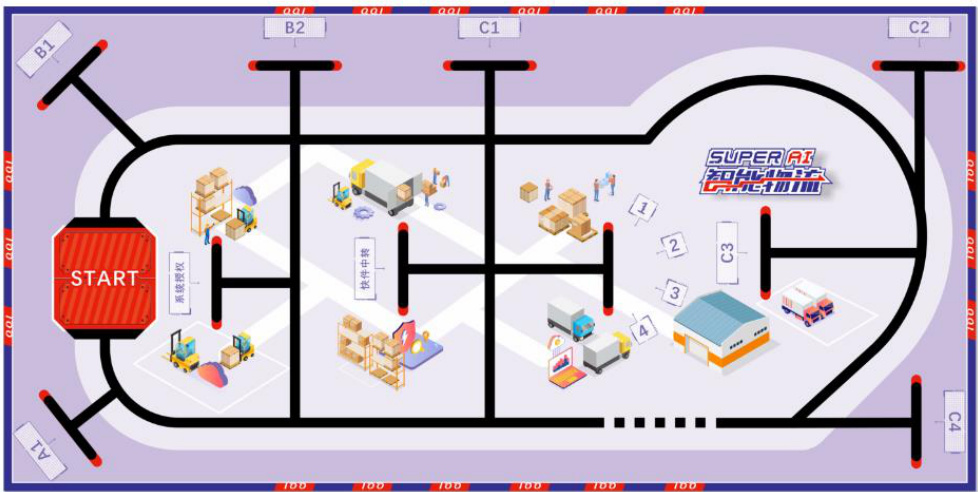  
图15：比赛场景  

2.地图  

机器人比赛场地具体样式以 RoboSim 软件呈现为准。场地中不规则分布有一条黑色的轨迹线，轨迹线是引导机器人移动方向的线路。在比赛场地分别设置有一个红色的启动区，是机器人启动和到达的区域，比赛开始后机器人由启动区出发沿轨迹线行驶，前往各任务区完成相应设置的任务，并最终返回启动区。  

# （三）机器人要求  

本赛项的机器人的要求如下：  

1.学员必须在仿真软件中设计、制作1 台机器人。  
2.机器人的最大尺寸不得超出启动区。  
3.机器人只允许使用 1 个控制器。  
4.机器人只允许有2 个着地的驱动轮。  
5.机器人允许使用的传感器类型、数量及安装位置不限。  
（四）竞赛任务  
本赛项的机器人任务，分必做任务和选做任务。  
任务1 到6：“机器人出发”、“收工返回”、“系统授权”、“  

件信息”、“上门收件”和“快件中转”为必做任务。  

任务7 到12：“自动打包”、“客服连线”、“处理违禁品”、“无人机配送”、“自动卸货”和 “货物称重”为选做任务。  

每个组别从选做任务中随机抽选任务，小学低年级组至少随机抽选2 个，小学高年级组至少随机抽选 3 个任务，初中组至少随机抽选 4 个任务，高中组至少从中随机抽选 5 个任务。各组别所有任务抽选完毕后进行位置抽选。  

1.机器人出发  

任务描述：机器人沿轨迹线离开基地。  

任务完成标志：机器人垂直投影完全离开启动区。  

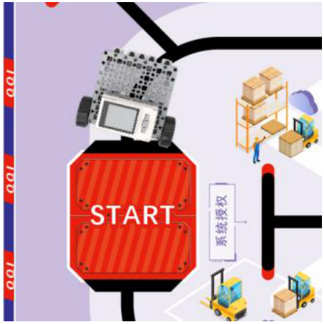  
图16：机器人出发完成状态  

2.收工返回  

任务描述：机器人完成任务后自主返回启动区并控制机器人闪烁指定颜色，完成此任务则结束本场比赛。  

完成任务的标志：机器人部分垂直投影接触启动区，且彩灯间隔0.2秒交替显示红蓝色1 秒以上。  

# 3.系统授权  

任务描述：系统授权模型放置在模型框，感应机放置于面向轨迹线  

的右边，机器人通过授权芯片数据给系统授权，当未得到授权时，点阵屏上显示 $^{66}\times\ '$ ，系统授权成功后，点阵屏上显示显示 “√”。  

任务位置：固定  

任务完成标志：机器人授权成功点阵屏上显示“√”。  

  
图17：系统授权成功前后状态  

# 4.收件信息  

任务描述：地图模型框放置一个获取收件信息模型，操作杆初始位置位于模型最左边，机器人需要往右推动操作杆，使存储信息的转盘旋转，机器人需识别转盘上的收件信息ID（ID1-ID4）。  

任务位置：随机  

任务完成标志：操作杆与监控器主体接触，机器人识别转盘朝机器人一面的收件信息后，用彩灯显示相应颜色（显示时长不少于 2 秒，红色ID1、绿色ID2、蓝色 ID3、黄色ID4），显示其他颜色则不得分。  

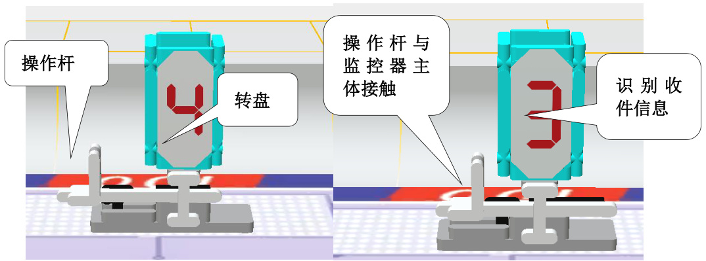  
图 18：收件信息初始状态及完成状态  

5.上门收件  

任务描述：四个待收取快件任务模型（分别对应四个ID）固定在场地上四个位置，机器人需要根据“收件信息”任务中获取到的收件信息ID，来收取对应的快件。  

任务位置：固定  

任务完成标志：机器人根据获取到的收件信息ID，前往并亮绿色彩灯接触对应快件，使快件脱离平台并吸附在与机器人接触的位置。  

完成“收件信息”后，机器人在完成“上门收件”任务的过程中，中途可完成其他任务。  

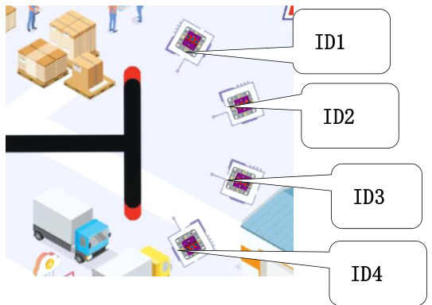  
图19：快件固定位置  

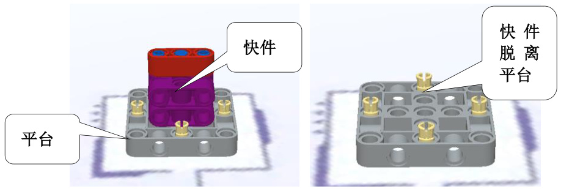  
图 20：上门收件初始状态及完成状态  

# 6.快件中转  

任务描述：地图模型框放置一个中转站模型，中转站属于空闲状态，机器人将“上门收件”任务中获取到的快件，运送到中转站，然后将快件放入中转站。  

任务位置：固定  

任务完成标志：机器人使快件接触中转站并亮红灯，快件即脱离机器人进入中转站内。必须完成“上门收件”任务后，才可进行“快件中转”任务。  

  
图 21：快件中转初始状态及完成状态  

# 7.自动打包  

任务描述：地图模型框放置一个打包机模型，操作转柄初始位置垂直于地面，两个待处理快件位于打包机平台上，机器人转动转柄使打包好的快件落下脱离打包机平台。  

任务位置：随机  

任务完成标志：机器人必须以旋转转柄的方式使得两个快件全部脱离打包机平台。  

  
图 22：自动打包初始状态及完成状态  

# 8.客服连线  

任务描述：地图模型框放置一个客服连线模型，机器人需要旋转人  

物模型，再翻转信息显示屏，使信息显示屏垂直竖立于场地。  

任务位置：随机  

任务完成标志：信息显示屏垂直竖立于场地。  

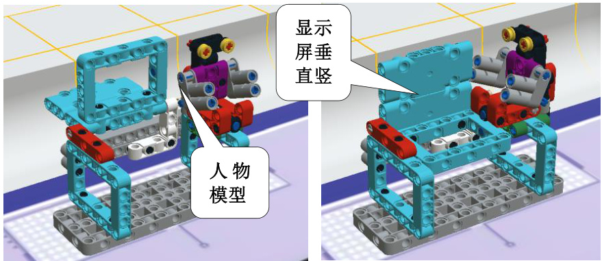  
图 23：客服连线初始状态及完成状态  

9.处理违禁品  

任务描述：地图模型框放置有违禁物品模型，机器人需操纵两个作杆，使违禁品在未接触机器人的情况下，落入隔离箱。  

任务位置：随机  

完成标志：违禁品落入隔离箱。  

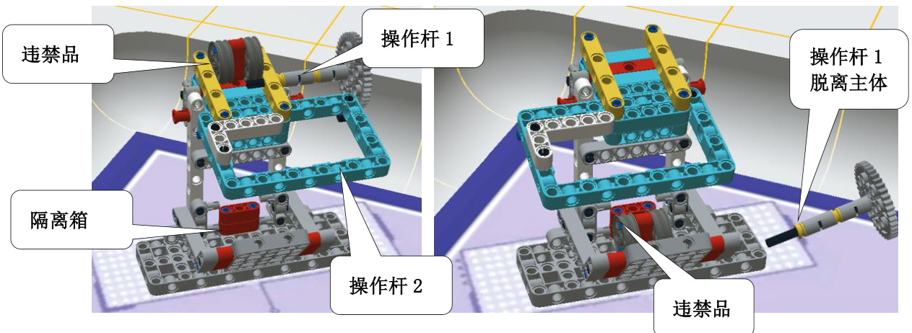  
图 24：处理违禁品初始状态及完成状态  

# 10.无人机配送  

任务描述：地图模型框放置无人机模型，机器人抬起无人机提升一定高度，无人机即可自动吸附到起降台。  

任务位置：随机  

完成标志：无人机成功放置在起降台上并保持直立状态。  

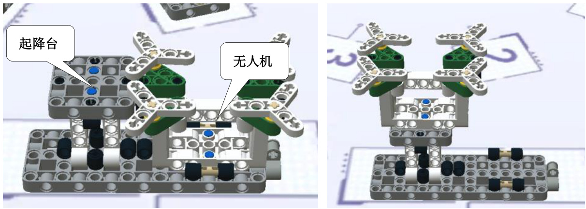  
图 25：无人配送初始状态及完成状态  

11.自动卸货  

任务描述：地图模型框放置卸货机模型 ，操作转柄初始位置垂直于地面，机器人来回旋转转柄，使货物脱离卸货机。  

任务位置：随机  

任务完成标志：货物脱离卸货机。  

  
图 26：自动卸货初始状态及完成状态  

# 12.货物称重  

任务描述：地图模型框放置天平秤模型 ，左托盘上放置被称的快件包裹，砝码放置于天平秤模型前。机器人需要亮黄灯接触砝码以将其吸附在与机器人接触的位置，随后亮蓝灯接触右托盘完成砝码的放置，使  

天平横梁与底座分离。  

任务位置：随机  

任务完成标志：砝码成功放置到右托盘上且天平的横梁不与底座接触。  

  
图 27：货物称重初始状态及完成状态  

# （五）竞赛流程  

# 1.任务时长  

活动时长：指活动整个过程的时长，选手需在此时长内完成搭建机器人、编写控制程序和完成仿真等所有操作。具体活动时长以相应活动通知为准。  

任务限时：指机器人从出发到完成全部任务所用的最长时间，在此时间内未完成的任务自动结束且不得分，任务限时为180 秒。  

任务耗时：指机器人从出发到完成全部任务实际经过的时间。  

# 2.随机性  

路线随机：地图的轨迹线由系统随机决定线路。  

位置随机：不同比赛的任务道具的位置由系统随机决定。同一场比赛的位置均相同。  

任务随机：机器人的任务 4.7 至4.11 随机任务中，小学低年级组至少随机抽选 2 个，小学高年级组至少随机抽选 3 个任务，初中组至少随机抽选4 个任务，高中组至少从中随机抽选 5 个任务。  

# 3.任务中止  

任务中止后，选手可选择是否提交当次仿真的成绩。任务仿真过程中发生以下情况，将导致当次仿真的终止：到达任务限时；机器人完成安全返回任务；机器人接触离子屏障；选手自主结束仿真。  

# 4.脱线行驶  

在任务全程中机器人不允许脱离轨迹线行驶；在任务全程中，机器人的垂直投影需要保持在轨迹线上；若机器人的垂直投影全部脱离轨迹线，则本次任务中止。  

（六）竞赛评分  

1.计分  

每场比赛结束后要计算参赛队的得分。单场比赛的得分为任务分、剩余时间分之和。以比赛结束后任务模型的最终状态，依据任务完成标准计分，详见 四、机器人的任务。剩余时间分需要机器人完成全部应完成的任务才可获得，剩余时间分 $\mathbf{\sigma}=\mathbf{\sigma}$ （180 秒-完成时间） $\ast0.5$ 。比赛结束后，以已提交成绩中的最高分作为参赛队的总得分。总得分是参赛队排名的主要依据。  

2.排名  

某一组别的全部比赛结束后，按参赛队的总得分进行排名。如果出现局部持平，按以下顺序破平：任务完成时间较少者在先；提交成绩总用时较少者在先。  

# 3.评分表  

线上选拔赛具体评分表见表3。  

# 表3：SuperAI“智能物流”线上选拨赛评分表  

参赛队： 组别：  

<html><body><table><tr><td>任务名称</td><td>分值</td><td></td></tr><tr><td>机器人出发</td><td>40分</td><td></td></tr><tr><td>收工返回</td><td>40分</td><td></td></tr><tr><td>系统授权</td><td>80分</td><td></td></tr><tr><td>收件信息</td><td>80分</td><td></td></tr><tr><td>上门收件</td><td>80分</td><td></td></tr><tr><td>快件中转</td><td>80分</td><td></td></tr><tr><td>自动打包</td><td>80分</td><td></td></tr><tr><td>客服连线</td><td>80分</td><td></td></tr><tr><td>无人机配送</td><td>80分</td><td></td></tr><tr><td>处理违禁品</td><td>80分</td><td></td></tr><tr><td>自动卸货</td><td>80分</td><td></td></tr><tr><td>货物称重</td><td>80分</td><td></td></tr><tr><td colspan="3">时间得分【（180秒-完成时间）*0.5，基本任务及随机任 务满分】</td></tr><tr><td colspan="2">最高任务总得分</td><td></td></tr></table></body></html>  

# 七、全国决赛规则  

全国决赛规则、器材设置等与线下选拔赛规则一致。  

# 八、回避范围及方式  

# （一）回避范围  

回避是指评审专家具有法定情形，必须回避，不参与相关作品评审的制度。按照相关规定，结合竞赛活动实际，如果评审专家具备以下情形之一的，应当回避：  

1.是参赛选手的近亲属；  
2.与参赛选手有其他直接利害关系；  
3.担任过参赛选手的辅导老师、指导老师的；  
4.与参赛选手有其他关系，可能影响公正评审的。  

# （二）回避方式  

回避方式有自行回避与申请回避两种：  

# 1.自行回避  

评审专家自行提出回避申请的，应当说明回避的理由，口头提出申请的，应当记录在案。  

评审专家有上述1、2、3、4 情形之一的，应当自行回避。  

评审专家在活动评审过程中，发现有上述 1、2、3、4 情形之一的，应当自行提出回避；没有自行提出回避的，活动组委会应当决定其回避。评审专家自行回避的，可以口头或者书面提出，并说明理由。口头提出申请的，应当记录在案。  

# 2. 申请回避  

参赛选手及评审专家要求其他评审专家参与回避的，应当提出申请，并说明理由。口头提出申请的，应当记录在案。  

# 九、异议处理机制  

1.第七届全国青少年人工智能创新挑战赛接受社会的监督，挑战赛的评审工作实行异议制度。  

2.任何单位或者个人对第七届全国青少年人工智能创新挑战赛参赛选手、参赛单位及其项目的创新性、先进性、实用性及推荐材料真实性、比赛成绩等持有异议的，应当在项目成绩公布之日起 10 日内向活动组委会提出，逾期不予受理。  

3.提出异议的单位或者个人应当提供书面异议材料，并提供必要的证明文件。提出异议的单位、个人应当表明真实身份。个人提出异议的，应当在书面异议材料上签署真实姓名；以单位名义提出异议的，应当加盖本单位公章。以匿名方式提出的异议一般不予受理。  

4.提出异议的单位、个人不得擅自将异议材料直接提交评审组织或者评审专家；专家收到异议材料的，应当及时转交活动组委会，不得提交评审组织讨论和转发其他评审专家。  

5.活动组委会在接到异议材料后应当进行审查，对符合规定并能提供充分证据的异议，应予受理。  

6.为维护异议者的合法权益，活动组委会、推荐单位及其指导老师，以及其他参与异议调查、处理的有关人员应当对异议者的身份予以保密；确实需要公开的，应当事前征求异议者的意见。  

7.涉及参赛选手所完成项目的创新性、先进性、实用性及推荐材料真实性、比赛成绩的真实性等内容的异议由活动组委会负责协调，由有关指导单位或者指导老师协助。参赛选手接到异议通知后，应当在规定的时间内核实异议材料，并将调查、核实情况报送活动组委会审核。必要时，活动组委会可以组织评审专家进行调查，提出处理意见。涉及参赛选手及其排序的异议由指导单位或者指导老师负责协调，提出初步处理意见报送活动组委会审核。参赛选手接到异议材料后，在异议通知规定的时间内未提出调查、核实报告和协调处理意见的，该项目不认可其比赛成绩。  

8.异议处理过程中，涉及异议的任何一方应当积极配合，不得推诿和延误。参赛选手在规定时间内未按要求提供相关证明材料的，视为承认异议内容；提出异议的单位、个人在规定时间内未按要求提供相关证明材料的，视为放弃异议。  

9.异议自异议受理截止之日起60 日内处理完毕的，可以认可其比赛成绩；自异议受理截止之日起一年内处理完毕的，可以直接参加下一年度比赛。  

10.活动组委会应当向活动专家评审委员会报告异议核实情况及处理意见，并将决定意见通知异议方和参赛选手。  

# 十、赛事组委会  

本届挑战赛信息发布平台为：  

“中国少年儿童发展服务中心”微信公众号；  
主办单位网站：http://www.china61.org.cn；  
挑战赛网站：http://aiic.china61.org.cn。  

组委会联系方式：  

联系人：屈老师、辛老师、张老师邮  箱：xiaoyuanshi@163.com电  话：010-65124399  

涉赛违规问题线索专用举报邮箱：ghstfmct@163.com  

赛事技术咨询：联系人：胡老师电话：13680301248  

# 十一、知识产权声明  

挑战赛组委会鼓励并倡导技术创新以及技术开源，并尊重参赛队的知识产权。参赛队伍比赛中开发的所有知识产权均归所在队伍所有，组委会不参与处理队伍内部成员之间的知识产权纠纷，参赛队伍须妥善处理本队内部学校及其他身份的成员之间对知识产权的所有关系。参赛队伍在使用组委会提供的裁判系统及赛事支持物资过程中，须尊重原产品的所有知识产权归属方，不得针对产品进行反向工程、复制、翻译等任何有损于归属方知识产权的行为。  

# 十二、主办单位免责声明  

1.未经主办单位书面授权，任何单位和个人以本赛事名义开展的活动均属假冒、侵权。  

2.主办单位不会以本赛事名义向学生收取任何费用，更不会以本赛事名义举办夏冬令营、培训班，捆绑销售器材商品、书籍材料等。本赛事也不存在任何指定器材、指定培训机构、指定教材等，请参与活动的  

师生和家长朋友们谨防上当受骗。  

3.所有参赛作品，均须为参赛个人原创，不能存在任何侵犯第三方权利的内容，不能违反法律法规的规定。  

4.请参与活动人员妥善保管自己的贵重物品（如现金、笔记本电脑、手机和参赛设备等），避免丢失或损坏。  

# 十三、线下活动注意事项  

1.参与活动人员必须牢固确立“安全第一”的意识，把活动安全放在首要位置。严格注意用电安全，相关机器人设备须提前充好电，准备好备用电池，规范用电，防止触电。严格注意防火安全，禁止携带易燃易爆等危险品和打火机、火柴等进入赛场。严格注意操作安全，活动期间如有发射弹丸、切割材料、器件焊接等危险操作时必须戴好头盔、手套、护目镜等防护措施。活动期间，参与活动人员应熟悉场地环境，若遇紧急情况，严格服从安保人员指挥。  

2.参与活动人员应提前购买保额不低于人民币 50 万元的人身意外伤害保险和意外医疗保险等风险保险。  

3.参与活动人员应遵守场地制度，爱护公共设施，自觉保持公共卫生。  

# 十四、其它  

1.关于挑战赛规则的任何补充、修订，将在中国少年儿童发展服务中心网站及微信公众号上发布。  

2.比赛期间，规则中没有说明的事项由专家评审委员会现场决定。  

3.主办单位和专家评审委员会对规则中未说明及有争议的事项拥有  

最后解释权、补充权和决定权。  