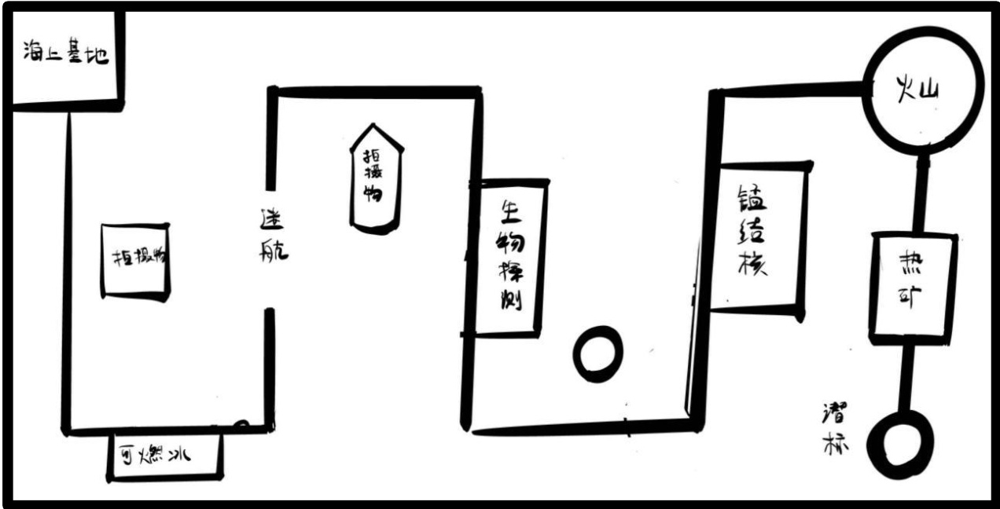
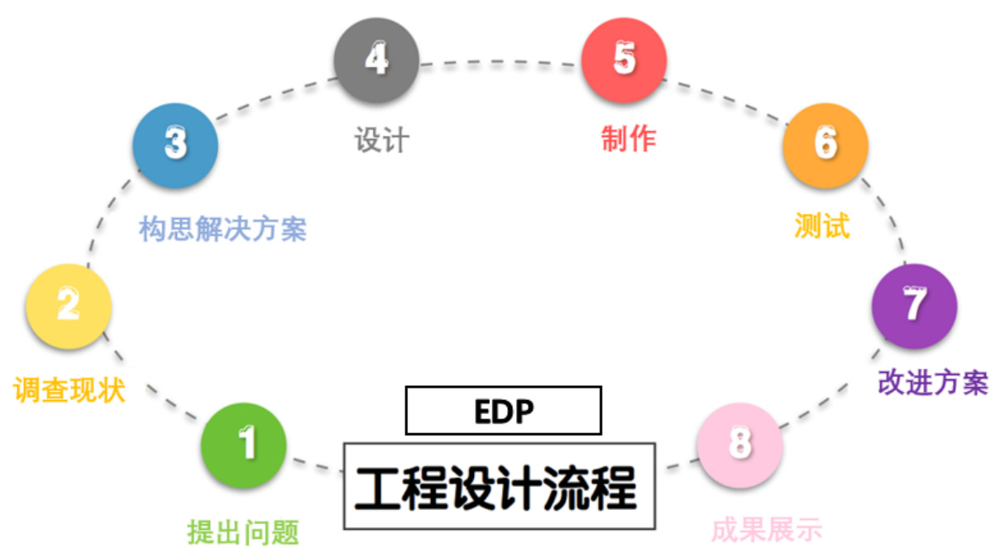
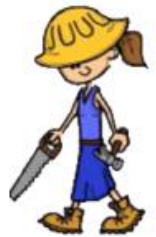

# 第七届全国青少年人工智能创新挑战赛极地资源勘探专项赛  

# 参赛手册  

中国少年儿童发展服务中心2024年4月  

# 一、赛事简介  

人工智能是通过研究人类智能活动的规律，构造出具有一定智能的人工系统的科学，主要研究如何让计算机去完成以往需要人的智力才能胜任的工作，也就是研究如何应用计算机的软硬件来模拟人类某些智能行为的基本理论、方法和技术。为了培养青少年在人工智能的思考能力和动手能力，加强计算机及信息技术和其它学科的融合应用和跨学科学习及解决工程问题的思维意识和能力，我们设立了极地资源勘探专项赛项目。参赛青少年将围绕极地机器人资源勘探这一主题，根据赛事规则，自主设计机器人结构，通过程序编写来实现遥控和程控，使机器人能够完成各项模拟任务。  

本次挑战赛坚持公益性，赛事任何环节，任何单位都不会向学生、学校收取成本费、工本费、活动费、报名费、食宿费、参赛材料费、器材费和其他各种名目的费用，做到“零收费”；不会指定参与竞赛活动时的交通、酒店、餐厅等配套服务；不会通过面向参赛学生组织与竞赛关联的培训、游学、冬令营、夏令营等方式，变相收取费用；不会推销或变相推销资料、书籍、辅助工具、器材、材料等商品；不会面向参赛的学生、家长或老师开展培训；不会借竞赛之名开展等级考试违规收取费用；不会以任何方式向学生或组织学生参赛的学校转嫁竞赛活动成本。本次挑战赛坚持自愿原则，不强迫、诱导任何学校、学生或家长参加竞赛活动。竞赛以及竞赛产生的结果不作为中小学招生入学的依据。赞助单位不得借赞助竞赛活动进行相关营销、促销活动。  

# 二、参赛条件及分组办法  

1.在校小学、初中、高中、中专或职高学生均可参赛。  

2.选手所在学段组别分为：小学组、初中组、高中组(包含中专和职  

高)。  

3.极地资源勘探专项赛为团队赛，团队为 2-4 人一组。  

4.每队最多可有1 名指导老师，多名学生的指导老师可以重复。指导老师作为责任人，有责任监督竞赛期间人身安全保护、财产，指导参赛学生制定学习计划，督促参赛学生顺利完成比赛。  

# 三、赛局说明  

1.赛局整体说明：  

1.1 本竞赛需要参赛选手利用控制器和传感器控制机器人完成各项任务，最后到达终点。考察参赛选手对于人工智能计算机科学以及宇宙探索相关知识的使用以及掌握水平，竞赛分为如下三部分：  

（1）完成相应竞赛任务获得分数。  

（2）答辩评审，裁判根据选手答辩表现进行打分。  

（3）工程师手册评审，裁判根据工程手册评分标准进行打分，以上三部分分数加权计分，总分为该组选手的综合成绩。  

1.2 赛场布置以预选赛或决赛现场布置图为准，但一定会有以下分区：  

（1）检录处：组委会检录参赛选手所使用的竞赛器材是否符合竞赛要求，检录完成后会给予检录通过标志，具有检录标志的器材方可参赛。  

（2）准备区：每个参赛队伍都会有一个准备桌，用于器材摆放以及对参赛机器人进行调整或者搭建，裁判宣布开始后方可开始操作。现场的电源，竞赛现场提供当地标准电源接口，如果参赛队需要任何电压或者频率的转换器，请参赛队自行准备。距离参赛队最近的电源接口可能距离参赛队的准备桌有一定的距离，请参赛队自行准备足够长的电源延长线，在现场使用延长线时请注意固定和安全。  

（3）竞赛区：每个参赛组别根据赛队数量设置竞赛场地，调整结束后，竞赛开始前，参赛选手根据裁判指示按顺序将机器人带到竞赛场地，进行机器人尺寸测量和竞赛。现场的光线，竞赛现场为日常照明，正式竞赛之前参赛选手有时间标定传感器，但是大赛组织方不保证现场光线绝对不变。随着竞赛的进行，现场的阳光可能会有变化。现场可能会有照相机或摄像机的闪光灯、补光灯或者其他赛项的未知光线影响，请参赛选手自行解决。  

2.竞赛关键词定义：  

2.1 遥控方式：通过对机器人和移动设备（遥控机器人的设备，仅限安卓或者华为的平板电脑与手机）的编程设置参数来实现遥控，参赛选手仅可通过摄像装置的视角来观测并完成相应任务。  

2.2 重试：参赛选手示意裁判需要重新出发，经过裁判允许后，自行取回机器人在该机器人任务区域的出发点重新出发。  

2.3 重试次数：参赛选手选择重试的次数，每次重试前已经完成的任务得分清零，重新计分，重试次数最多为 3 次。  

# 2.4 终止竞赛：  

竞赛结束标志为4 种：  

（1）参赛机器人未通过尺寸测量且未能在本轮竞赛开始前调整好，裁判宣布结束竞赛。  

（2）参赛选手示意裁判表示结束竞赛。  

（3）竞赛时间到裁判宣布结束竞赛。  

（4）重试次数超过3 次裁判宣布结束竞赛。  

2.5 竞赛计时：裁判宣布竞赛开始后，计时开始，竞赛中间不停止  

计时，参赛选手未能开始竞赛，需自行决定是否终止竞赛。  

2.6 竞赛计分：在竞赛终止后，由裁判员对当场竞赛实际进行打分，参赛选手未经裁判允许禁止触碰参赛机器人，遇到争议可与裁判交流解释。  

2.7 赛局结束：每局竞赛，在裁判计分结束，参赛选手在签字确认成绩后经得裁判允许后，方可携带竞赛机器人离开竞赛区域。  

2.8 裁判警告：参赛选手在参赛过程中违反竞赛规则，裁判会予以警告，并记录警告次数。  

2.9 取消竞赛资格：参赛队伍中任一参赛选手违反安全要求（见附件），回避要求(见附件)以及裁判警告次数总数超过 2 次，裁判宣布取消该队伍本次竞赛参赛资格。  

2.10 裁判争议：竞赛期间规则中如有未尽事项以竞赛裁判委员会现场公布为准。  

3.竞赛主题以及场地  

# 3.1 竞赛主题  

海洋深处存在大量的矿物资源和生物资源，这些资源及生物有着巨大的科研和经济价值。对于人类而言，即便我们能借助了各种高科技潜水器，但是潜入海底深处，仍然比攀登珠峰，或者飞上太空还要更加困难，深渊恐怖的压强让任何肉体凡胎和钢铁机械都望而生畏，但是这并不能阻止人类想要探索深海的欲望和决心。  

本次竞赛以“极地资源勘探”为主题，要求参赛选手深海下潜与返航的任务。参赛选手将作为深海探险队的成员，驾驶极地资源勘探机器人从海上基地出发，对复杂的深海环境进行探测、分析、研究，寻找有价值的矿产、燃料，研究深海生物，甚至危险的火山地区，并且把勘测地点的位置发送给基地，在返航的途中进行资源的开采收集。面对神秘而危险的深海环境，参赛选手将一一克服困难，最终胜利完成任务成功返回海上基地。  

# 3.2 竞赛场地  

竞赛场地由场地图纸和场地道具组成。比赛场地采用彩色喷绘布，尺寸为 $2400\mathrm{mm}\times1200\mathrm{mm}$ ，如下图。  

  
图示：场地图  

轨迹线：轨迹线为 $20{\pm}1\mathrm{mm}$ 宽的黑线  

下潜：机器人完成相应任务的遥控行程。  
返航：机器人完成相应任务的程控行程。  

海上基地：竞赛下潜行程的起点，也是返航行程的终点。  

# 四、竞赛任务及机器人要求  

根据参赛选手所处组别设置不同难度和数量的任务。  

1.组别具体任务  

1.1 小学组：竞赛时间 15 分钟/场  

启程下潜，深海观测，锰矿发掘，热液矿床，深海潜标，区域迷航， 英雄归来。  

1.2 初中组：竞赛时间 15 分钟/场  

启程下潜，深海观测，生物资源，锰矿发掘，火山避险，热液矿床， 深海潜标，区域迷航，英雄归来。  

1.3 高中组：竞赛时间 15 分钟/场  

启程下潜，深海观测，固体燃料，生物资源，锰矿发掘，火山避险，热液矿床，深海潜标，区域迷航，英雄归来。  

2.任务说明：（任务计分见计分表）  

2.1 启程下潜（小初高中组）：  

任务描述：参赛选手通过摄像装置辅助成功遥控机器人从出发点（海上基地）出发。  

任务完成标志：机器人启动后垂直投影完全脱离出发区域。  

2.2 深海观测（小初高中组）：  

任务描述：遥控机器人通过摄像头在下潜行程寻找并拍摄记录所有给定的特殊物品（物品、位置随机摆放）。  

任务完成标志：机器人上的摄像装置拍摄并保存下潜行程中需要寻找并记录的若干照片。  

2.3 固体燃料（高中组）：  

任务描述：遥控机器人在下潜的过程中发现并识别可燃冰（蓝色物块），在返航的途中将其开采回收。  

任务完成标志：机器人正确识别任务物品（控制器响三声）并且成功将其带回海上基地。  

2.4 生物资源（初高中组）：  

任务描述：遥控机器人在下潜的过程中发现并识别深海生物（黄色物体）并拍照记录。  

任务完成标志：机器人正确识别（控制器响一声）并且完成摄像记录。  

2.5 锰矿发掘（小初高中组）：  

任务描述：遥控机器人在下潜的过程中发现并成功识别锰结核（黑色物块），并且在返航的途中拾取并收回。  

任务完成标志：机器人发现并正确识别任务物品（控制器响两声），返航途中成功拾取并带回海上基地。  

2.6 火山避险（初高中组）：  

任务描述：到达深海活火山区域，为了完成附近的资源回收任务，需要避开危险的高温火山区域（红色区域）。  

任务完成标志：机器人垂直投影完全脱离火山任务区域。  

2.7 热液矿床（小初高中组）：  

任务描述：机器人穿过海底火山，触碰指定位置完成采样，蜂鸣器发射声呐则代表采样成功。  

任务完成标志：机器人触碰指定地点并发出声响。  

2.8 深海潜标（小初高中组）  

任务描述：机器人在下潜行程终点放置设立潜标（从海上基地携带的金属片），开启返航行程。  

任务完成标志：指定任务区成功放置任务物品。  

2.9 区域迷航（小初高中组）：  

任务描述：机器人在 返航途中进入代表信号变弱的无轨迹区域并且重新找到既定的轨迹线。  

任务完成标志：机器人的垂直投影完全进入后续既定的轨迹线。  

2.10 英雄归来（小初高中组）：  

任务描述：机器人成功完成 返航航线回到终点（海上基地），静止于停放区域，标志着全部任务完成。  

任务完成标志：机器人在指定区域完全静止。  

3.参赛模型包括：  

数量：每支参赛队在正式比赛的时候只能携带一台机器人上场比赛。  

尺寸：机器人初始形态的最大尺寸为 $20\mathrm{cm}\times20\mathrm{cm}\times30\mathrm{cm}$ （长 $\times$ 宽$\times$ 高），离开出发区后，机器人的机构可以自由伸展。  

控制器：使用 TR Controller 控制器额定电压为 9V。  

电机：电机额定电压为 9V。  

传感器：机器人允许使用的传感器类型不限。  

结构：机器人必需使用拼接搭建，不得使用胶水、胶带、橡皮筋等辅助连接材料。  

电源：每台机器人电源类型不限，但电源输出电压不得超过 9V。  

# 五、竞赛流程  

# 1.参赛队  

参赛选手所在学段组别分为：小学组、初中组、高中组。  

1.1 每支参赛队应由 2-4 名学生和1 名教练员组成。学生必须是截止到2024 年6 月仍然在校的学生。  

1.2 参赛选手应以积极的心态面对和自主地处理在竞赛中遇到的所有问题，自尊、自重，友善地对待和尊重队友、对手、志愿者、裁判员。  

1.3 每人最多可有 1 名指导老师，多名学生的指导老师可以重复。指导老师作为责任人，有责任监督竞赛期间人身安全保护、财产，指导参赛选手制定学习计划，督促参赛选手顺利完成竞赛。  

2.赛制  

2.1 竞赛按小学、初中、高中三个组别分别进行。  

2.2 竞赛不分初赛与复赛。组委会保证每支参赛队有相同的上场次  
数，每次均记分。2.3 竞赛场地上规定了参赛模型要完成的任务，小学、初中、高中  
三个组别要完成的任务数不同。2.4 参赛选手要在竞赛签到时上交或上传工程师手册，在竞赛调试  
阶段开始前截至提交，裁判会同步为工程师手册进行打分。2.5 竞赛组委会有可能根据参赛报名和场馆的实际情况变更赛制。3.竞赛过程3.1 参赛选手允许携带安装好的模块现场组装。3.2 编程与调试只能在规定区域进行。3.3 参赛选手检录后方能进入准备区。裁判员对参赛队携带的器材  
进行检查，所用器材必须符合组委会相关规定与要求。3.4 参赛选手在竞赛过程中不得上网和下载任何资料，不得使用相  
机等设备拍摄竞赛场地，不得以任何方式与教练员或家长联系。3.5 赛前准备，参赛选手到达指定的准备区，根据现场裁判指挥连  
接电脑电源，摆放竞赛器材等准备工作，等待竞赛开始。3.6 竞赛调试，裁判宣布竞赛调试开始，参赛选手自行调试本赛队  
参赛机器人，裁判会在调试剩余 30、10 分钟提示调试剩余时间。竞赛  
调试时间为2 小时。3.7 开始竞赛，调试结束参赛选手按照竞赛顺序，根据赛场裁判和  
志愿者的指引到达竞赛区，经过模型尺寸测量后开始竞赛（比赛开始前  

未到场或未准备就绪，裁判进行 3 分钟计时，计时结束后不能开始比赛的队伍视为弃权本场比赛，自动跳到下一队伍），弃权队伍后续不能补赛。  

3.8 竞赛中，裁判根据计分表规则记录参赛队伍的任务得分。  

3.9 竞赛结束，裁判根据赛局结束标准，辅助参赛选手完成竞赛。  

3.10 竞赛计分，裁判根据竞赛计分标准，为参赛队伍打分。  

4.评审过程  

裁判按照与参赛顺序相反的顺序进行答辩评审，既第一个参赛最后参加评审，流程如下：  

4.1 参赛组简介机器人的设计来源，需阐述灵感来源、创意实现、机器人功能简介，时间为 3-5 分钟。  

4.2 竞赛时间上限为 20 分钟（包括重试时间），赛前调试时间为20 分钟。  

4.3 评审得分标准见附件。  

5.排名  

5.1 每个组别按照综合成绩排名，其中工程师手册成绩权重 $40\%$ ，竞赛成绩权重 $40\%$ ，答辩成绩权重 $20\%$ ，进行计算综合成绩。  

5.2 局部排名顺序  

（1）工程师手册分数高的队伍排名靠前。  
（2）重试次数少的队伍排名靠前。  
（3）答辩评审分数高的排名靠前。  

# 六、选拔赛参与办法  

# 1.选拔赛报名  

参加活动的青少年通过访问“人工智能创新挑战赛”网站  

https://aiic.china61.org.cn/，在首页点击“选拔赛报名”进行在线报名，详细登记相关信息和报名赛项、组别。  

# 2.参加选拔赛  

根据各地区报名实际情况，本赛项选拔赛设置线上、线下两种形式，线下选拔赛采用现场竞技的方式，线上选拔赛以视频连线完成任务的方式，完成任务的方式，并由专家根据参赛情况进行评判。参赛青少年只能选择参加线上或者线下选拔赛中的一种选拔赛。  

# 3.报名时间  

2024 年 4 月 15 日-5 月 15 日，选拔赛时间为 2024 年 5 月 16 日-7月1 日（具体时间另行通知）。  

参加选拔赛的青少年需通过“人工智能创新挑战赛”网站点击“参加选拔赛”链接，选择“极地资源勘探专项赛”获取线上、线下选拔赛参赛信息。  

4.主办单位将根据选拔赛的成绩，甄选出部分优秀选手入围全国挑战赛决赛。  

5.选拔赛成绩可以在 2024 年 7 月 15 日后，登录“人工智能创新挑战赛”网站进行查询，入围决赛的选手可以参加全国决赛。  

# 七、组委会说明  

# 1.赛事组委会  

本届挑战赛信息发布平台为：  

“中国少年儿童发展服务中心”微信公众号；  
主办单位网站：http://www.china61.org.cn；  
挑战赛网站：http://aiic.china61.org.cn。  

组委会联系方式：  

联系人：屈老师、辛老师  
邮 箱：xiaoyuanshi@163.com  
电 话：010-65124399  
涉赛违规问题线索专用举报邮箱：ghstfmct@163.com  

# 2.知识产权声明  

挑战赛组委会鼓励并倡导技术创新以及技术开源，并尊重参赛队的知识产权。参赛队伍竞赛中开发的所有知识产权均归所在队伍所有，组委会不参与处理队伍内部成员之间的知识产权纠纷，参赛队伍须妥善处理本队内部学校及其他身份的成员之间对知识产权的所有关系。参赛队伍在使用组委会提供的裁判系统及赛事支持物资过程中，须尊重原产品的所有知识产权归属方，不得针对产品进行反向工程、复制、翻译等任何有损于归属方知识产权的行为。  

3.主办单位免责声明  

3.1 未经主办单位书面授权，任何单位和个人以本赛事名义开展的活动均属假冒、侵权。  

3.2 主办单位不会以本赛事名义向学生收取任何费用，更不会以本赛事名义举办夏冬令营、培训班，捆绑销售器材商品、书籍材料等。本赛事也不存在任何指定器材、指定培训机构、指定教材等，请参与活动的师生和家长朋友们谨防上当受骗。  

3.3 所有参赛作品，均须为参赛个人原创，不能存在任何侵犯第三方权利的内容，不能违反法律法规的规定。  

# 4.线下活动注意事项  

4.1 参与活动人员必须牢固确立“安全第一”的意识，把活动安全放在首要位置。严格注意用电安全，相关机器人设备须提前充好电，准备好备用电池，规范用电，防止触电。严格注意防火安全，禁止携带易燃易爆等危险品和打火机、火柴等进入赛场。严格注意操作安全，活动期间如有发射弹丸、切割材料、器件焊接等危险操作时必须戴好头盔、手套、护目镜等防护措施。活动期间，参与活动人员应熟悉场地环境，若遇紧急情况， 严格服从安保人员指挥。  

4.2 参与活动人员应提前购买保额不低于人民币50 万元的人身意外伤害保险和意外医疗保险等风险保险。  

4.3 参与活动人员应遵守场地制度，爱护公共设施，自觉保持公共卫生。  

4.4 请参与活动人员妥善保管自己的贵重物品（如现金、笔记本电脑、手机和参赛设备等），避免丢失或损坏。  

# 5.其它  

5.1 关于挑战赛规则的任何补充、修订，将在中国少年儿童发展服务中心网站及微信公众号上发布。  

5.2 竞赛期间，规则中没有说明的事项由专家评审委员会现场决定。  

5.3 主办单位和专家评审委员会对规则中未说明及有争议的事项拥有最后解释权、补充权和决定权。  

# 附件一评审评分表（样表）  

参赛队（编号）： 组别：  

<html><body><table><tr><td colspan="5">而</td></tr><tr><td colspan="5">评分表-小学组</td></tr><tr><td rowspan="3">评分类别 创新能力 30分</td><td>评分内容 阐述表达能力</td><td>任务描述 简介创意模型的设计来源，需阐述灵感来源、</td><td>分值 0-10</td><td>评分</td></tr><tr><td>模型趣味性</td><td>创意实现、模型功能简介 设计完整且美观,富有想象力</td><td>分 0-10</td><td></td></tr><tr><td>内容原创性</td><td>有初始设计，无抄袭</td><td>分 0-10</td><td></td></tr><tr><td rowspan="7">智能控制 与编程能 力 40分</td><td>启程下潜</td><td>机器人离开海上基地，开始全部任务</td><td>分 6分</td><td></td></tr><tr><td>深海观测</td><td>机器人通过摄像头下潜行程中寻找并拍摄给定 的物品</td><td>5分</td><td></td></tr><tr><td>锰矿发掘</td><td>机器人在下潜行程中识别给定的任务物品，在 返航行程中拾取给定的任务物品</td><td>7分</td><td></td></tr><tr><td>热液矿床</td><td>机器人在下潜的行程中用自身的触碰开关触碰 指定的任务位置</td><td>5分</td><td></td></tr><tr><td>深海潜标</td><td>机器人携带给定的物品到下潜行程的终点并将 其放置于指定任务区域，然后开始返航行程</td><td>7分</td><td></td></tr><tr><td>区域迷航</td><td>机器人进入无轨迹区域并且通过编写的程序 重新找回前进的轨迹</td><td>4分</td><td></td></tr><tr><td>英雄归来</td><td>机器人回到海上基地，静止于停放区域，标志 着全部任务完成。</td><td>6分</td><td></td></tr><tr><td rowspan="2">机器人搭 建能力 20分</td><td>设备稳定</td><td>两台机器人的搭建是否坚固，稳定</td><td>0-10 分</td><td></td></tr><tr><td>造型美观</td><td>两台机器人的造型是否美观</td><td>0-10 分</td><td></td></tr><tr><td rowspan="2">规范性 10分</td><td>尺寸规范</td><td>是否符合比赛要求的尺寸</td><td>0-3分</td><td></td></tr><tr><td>制作过程规范</td><td>是否符合比赛指定的规则</td><td>0-3分</td><td></td></tr></table></body></html>

裁判员： 参赛队员：  

# 附件一评审评分表（样表）  

参赛队（编号）： 组别：  

<html><body><table><tr><td colspan="5">评分表-初中组</td></tr><tr><td rowspan="3">评分类别 创新能力</td><td>评分内容</td><td>任务描述 简介创意模型的设计来源，需阐述灵感来源、</td><td>分值 0-10</td><td>评分</td></tr><tr><td>阐述表达能力 模型趣味性</td><td>创意实现、模型功能简介 设计完整且美观,富有想象力</td><td>分 0-10</td><td></td></tr><tr><td>内容原创性</td><td>有初始设计，无抄袭</td><td>分 0-10</td><td></td></tr><tr><td>智能控制 与编程能 力 40分</td><td></td><td>机器人离开海上基地，开始全部任务</td><td>分 5分</td><td></td></tr><tr><td rowspan="6"></td><td>启程下潜</td><td>机器人通过摄像头下潜行程中寻找并拍摄给定</td><td>3分</td><td></td></tr><tr><td>深海观测</td><td>的物品 机器人在下潜行程中识别给定的任务物品,</td><td></td><td></td></tr><tr><td>生物资源</td><td>并且拍摄保存 机器人在下潜行程中识别给定的任务物品，在</td><td>4分</td><td></td></tr><tr><td>锰矿发掘 火山避险</td><td>返航行程中拾取给定的任务物品 机器人在下潜和返航的行程中识别障碍物以及 附近堵塞区域，制定新的路径并且后续找回既</td><td>6分 4分</td><td></td></tr><tr><td>热液矿床</td><td>定的轨迹 机器人在下潜的行程中用自身的触碰开关触碰 指定的任务位置</td><td>4分</td><td></td></tr><tr><td>深海潜标</td><td>机器人携带给定的物品到下潜行程的终点并将 其放置于指定任务区域，然后开始返航行程</td><td>6分</td><td></td></tr><tr><td>区域迷航</td><td>机器人进入无轨迹区域并且通过编写的程序 重新找回前进的轨迹</td><td>3分</td><td></td></tr><tr><td></td><td>英雄归来</td><td>机器人回到海上基地，静止于停放区域，标志 着全部任务完成。</td><td>5分</td><td></td></tr><tr><td rowspan="2">机器人搭 建能力 20分</td><td>设备稳定</td><td>两台机器人的搭建是否坚固，稳定</td><td>0-10 分</td><td></td></tr><tr><td>造型美观</td><td>两台机器人的造型是否美观</td><td>0-10 分</td><td></td></tr><tr><td rowspan="3">规范性 10分</td><td>尺寸规范</td><td>是否符合比赛要求的尺寸</td><td>0-3分</td><td></td></tr><tr><td>制作过程规范</td><td>是否符合比赛指定的规则</td><td>0-3分</td><td></td></tr><tr><td>作品完整程度</td><td>模型可以按工程手册中描述的展现出来</td><td>0-4分</td><td></td></tr><tr><td>总分</td><td></td><td></td><td>总分 100分</td><td></td></tr></table></body></html>

裁判员： 参赛队员：  

# 附件一评审评分表（样表）  

参赛队（编号）： 组别：  

<html><body><table><tr><td colspan="5">评分表-高中组</td></tr><tr><td>评分类别</td><td>评分内容</td><td>任务描述</td><td>分值</td><td>评分</td></tr><tr><td rowspan="3">创新能力 30分</td><td>阐述表达能力</td><td>简介创意模型的设计来源，需阐述灵感来源、 创意实现、模型功能简介</td><td>0-10 分</td><td></td></tr><tr><td>模型趣味性</td><td>设计完整且美观,富有想象力</td><td>0-10 分</td><td></td></tr><tr><td>内容原创性</td><td>有初始设计，无抄袭</td><td>0-10 分</td><td></td></tr><tr><td rowspan="11">智能控制 与编程能 力 40分</td><td>启程下潜</td><td>机器人离开海上基地，开始全部任务</td><td>4分</td><td></td></tr><tr><td>深海观测</td><td>机器人通过摄像头下潜行程中寻找并拍摄给定</td><td>3分</td><td></td></tr><tr><td>固体燃料</td><td>的物品 机器人在下潜行程中识别给定的任务物品，在 返航行程中拾取给定的任务物品</td><td>5分</td><td></td></tr><tr><td>生物资源</td><td>机器人在下潜行程中识别给定的任务物品，</td><td>4分</td><td></td></tr><tr><td>锰矿发掘</td><td>并且拍摄保存 机器人在下潜行程中识别给定的任务物品，在</td><td>5分</td><td></td></tr><tr><td>火山避险</td><td>返航行程中拾取给定的任务物品 机器人在下潜和返航的行程中识别障碍物以及 附近堵塞区域，制定新的路径并且后续找回既</td><td>4分</td><td></td></tr><tr><td>热液矿床</td><td>定的轨迹 机器人在下潜的行程中用自身的触碰开关触碰</td><td>4分</td><td></td></tr><tr><td>深海潜标</td><td>指定的任务位置 机器人携带给定的物品到下潜行程的终点并将</td><td>5分</td><td></td></tr><tr><td>区域迷航</td><td>其放置于指定任务区域，然后开始返航行程 机器人进入无轨迹区域并且通过编写的程序</td><td>2分</td><td></td></tr><tr><td>英雄归来</td><td>重新找回前进的轨迹 机器人回到海上基地，静止于停放区域，标志</td><td>4分</td><td></td></tr><tr><td>机器人搭 设备稳定</td><td>着全部任务完成。 两台机器人的搭建是否坚固，稳定</td><td>0-10</td><td></td></tr><tr><td rowspan="3">建能力 20分 规范性 10分</td><td>造型美观</td><td>两台机器人的造型是否美观</td><td>分 0-10</td><td></td></tr><tr><td>尺寸规范</td><td>是否符合比赛要求的尺寸</td><td>分 0-3分</td><td></td></tr><tr><td>制作过程规范 作品完整程度</td><td>是否符合比赛指定的规则 模型可以按工程手册中描述的展现出来</td><td>0-3分 0-4分 总分</td><td></td></tr></table></body></html>

裁判员： 参赛队员：  

# 附件二、回避要求与安全要求  

# 一、回避范围  

回避是指评审专家具有法定情形，必须回避，不参与相关作品评审的制度。按照相关规定，结合竞赛活动实际，如果评审专家具备以下情形之一的，应当回避：  

1.是参赛选手的近亲属。  

2.与参赛选手有其他直接利害关系。  

3.担任过参赛选手的辅导老师、指导老师的。  

4.与参赛选手有其他关系，可能影响公正评审的。  

# 二、回避方式  

回避方式有自行回避与申请回避两种：  

1.自行回避  

评审专家自行提出回避申请的，应当说明回避的理由，口头提出申请的，应当记录在案。评审专家有上述 1234 情形之一的，应当自行回避。评审专家在活动评审过程中，发现有上述 1234 情形之一的，应当自行提出回避；没有自行提出回避的，活动组委会应当决定其回避。评审专家自行回避的，可以口头或者书面提出，并说明理由。口头提出申请的，应当记录在案。  

# 2.申请回避  

参赛选手及评审专家要求其他评审专家参与回避的，应当提出申请，并说明理由。口头提出申请的，应当记录在案。  

# 三、异议处理机制  

1.第七届全国青少年人工智能创新挑战赛接受社会的监督，挑战赛的评审工作实行异议制度。  

2.任何单位或者个人对第七届全国青少年人工智能创新挑战赛参赛选手、参赛单位及其项目的创新性、先进性、实用性及推荐材料真实性、竞赛成绩等持有异议的，应当在项目成绩公布之日起 10 日内向活动组委会提出，逾期不予受理。  

3.提出异议的单位或者个人应当提供书面异议材料，并提供必要的证明文件。提出异议的单位、个人应当表明真实身份。个人提出异议的，应当在书面异议材料上签署真实姓名；以单位名义提出异议的，应当加盖本单位公章。以匿名方式提出的异议一般不予受理。  

4.提出异议的单位、个人不得擅自将异议材料直接提交评审组织或者评审专家；专家收到异议材料的，应当及时转交活动组委会，不得提交评审组织讨论和转发其他评审专家。  

5.活动组委会在接到异议材料后应当进行审查，对符合规定并能提供充分证据的异议，应予受理。  

6.为维护异议者的合法权益，活动组委会、推荐单位及其指导老师，以及其他参与异议调查、处理的有关人员应当对异议者的身份予以保密；确实需要公开的，应当事前征求异议者的意见。  

7.涉及参赛选手所完成项目的创新性、先进性、实用性及推荐材料真实性、竞赛成绩的真实性等内容的异议由活动组委会负责协调，由有关指导单位或者指导老师协助。参赛选手接到异议通知后，应当在规定的时间内核实异议材料，并将调查、核实情况报送活动组委会审核。必要时，活动组委会可以组织评审专家进行调查，提出处理意见。涉及参赛选手及其排序的异议由指导单位或者指导老师负责协调，提出初步处理意见报送活动组委会审核。参赛选手接到异议材料后，在异议通知规定的时间内未提出调查、核实报告和协调处理意见的，该项目不认可其竞赛成绩。  

8.异议处理过程中，涉及异议的任何一方应当积极配合，不得推诿和延误。参赛选手在规定时间内未按要求提供相关证明材料的，视为承认异议内容；提出异议的单位、个人在规定时间内未按要求提供相关证明材料的，视为放弃异议。  

9.异议自异议受理截止之日起60 日内处理完毕的，可以认可其竞赛成绩；自异议受理截止之日起一年内处理完毕的，可以直接参加下一年度竞赛。  

10.活动组委会应当向活动专家评审委员会报告异议核实情况及处理意见，并将决定意见通知异议方和参赛选手。  

# 附件三、工程使手册模板  

（建议书写此6 部分）篇幅不限，能够准确说明莫设计均可。  

<html><body><table><tr><td>1．此处进行赛题分析；讲述对于赛题的理解以及制作思路</td><td></td></tr><tr><td>2.此处建议根据工程设计流程或科学探究流程进行设计与制作</td><td></td></tr><tr><td>3.此处进行实验设计描述，与实施过程</td><td></td></tr><tr><td>4.此处建议进行数据对比与分析，产生结论</td><td></td></tr><tr><td>5.此处进行迭代对比，第一二三代模型的性能情况</td><td></td></tr><tr><td>6此处进行团队介绍</td><td></td></tr></table></body></html>  

  
附件四、工程设计流程与角色介绍  

  

# 设计师  

工作描述：  

你的工作是主导小组的设计工作：你要确保在工作开始前，小组成员达成统一的设计方案：你还要确保建设过程中，小组成员都是按照设计蓝图进行的：此外，建设计划如果有任何改动，也需要你来审核并通过设计方案。  

# 记录员  

工作描述：  

在项目的制作过程中，你需要观察小组的工作情况。你需要对项目进展的重要步骤做记录。你也需要记录每一步所使用的材料和工作。此外，你还要记录你的团队所遇到的困难和挫折，以及你们解决这些问题所使用的方法。  

  

  

# 物料管理员  

工作描述：  

你需要管理你们团队所有的材料，包括剪刀、纸笔和其它工具。另外，在建设过程中，如果需要剪裁一些材料，这也是你的工作。  

# 建筑师  

工作描述：  

你的主要工作是完成产品的制作。你需要倾听小组成员的建议和想法，完成你的作品。你也需要安排小组成员帮助你一起完成作品。  

  

  

# 发言人  

工作描述：  

你需要向外部的人员介绍你们的产品和项目，回答其它小组和老师对你们的提问和咨询。  

# 队长  

工作描述：  

你需要和小组成员明确每一次任务的具体内容。在项目进行过程中，你要保证你的团队都遵从协议保持工作的状态。  

  