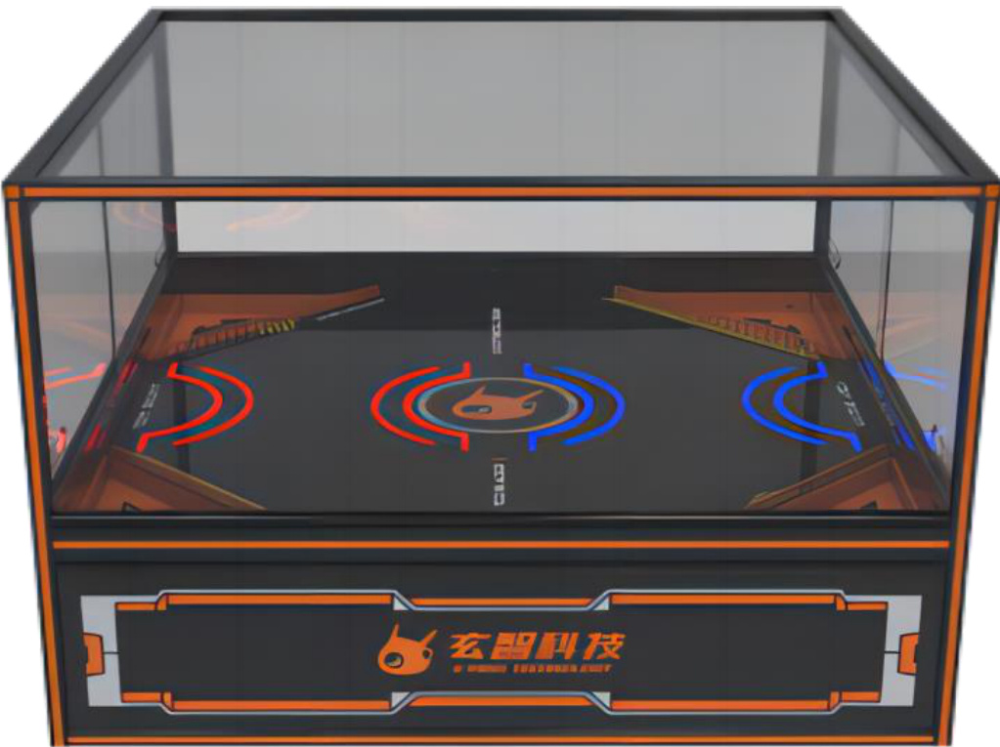
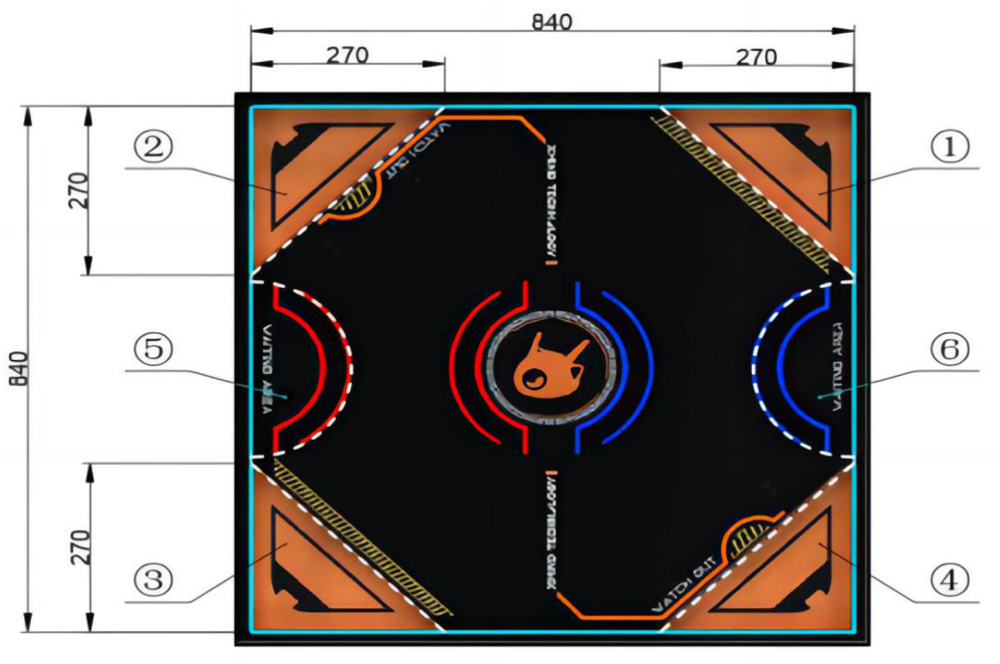

# 第七届全国青少年人工智能创新挑战赛竞技机器人专项赛  

# 参赛手册  

中国少年儿童发展服务中心2024年4月  

# 一、赛事简介  

竞技机器人专项赛，旨在通过激发青少年对机器人技术的兴趣，培养他们的创新能力和解决实际问题的能力，进而推进未来科技创新人才队伍的形成。专项赛中，青少年将面临设计创新、结构优化、动力系统开发、任务执行策略等不同方面的挑战，不仅要求青少年具备一定的理论基础知识和强大的实践能力，还需要做好参赛时的项目管理和时间管理。  

本次挑战赛坚持公益性，赛事任何环节，任何单位都不会向学生、学校收取成本费、工本费、活动费、报名费、食宿费、参赛材料费、器材费和其他各种名目的费用，做到“零收费”；不会指定参与竞赛活动时的交通、酒店、餐厅等配套服务；不会通过面向参赛学生组织与竞赛关联的培训、游学、冬令营、夏令营等方式，变相收取费用；不会推销或变相推销资料、书籍、辅助工具、器材、材料等商品；不会面向参赛的学生、家长或老师开展培训；不会借竞赛之名开展等级考试违规收取费用；不会以任何方式向学生或组织学生参赛的学校转嫁竞赛活动成本。本次挑战赛坚持自愿原则，不强迫、诱导任何学校、学生或家长参加竞赛活动。竞赛以及竞赛产生的结果不作为中小学招生入学的依据。赞助单位不得借赞助竞赛活动进行相关营销、促销活动。  

# 二、参赛条件及分组办法  

1.在校小学、初中、高中、中专或职高学生均可参赛。  

2.选手所在学段组别分为：小学组、初中组、高中组（含中职职高）。  

3.竞技机器人专项赛为个人赛。  

4.每人最多可有 2 名指导老师，多名学生的指导老师可以重复。指导老师作为责任人，有责任监督竞赛期间人身安全保护、财产，指导参  

赛学生制定学习计划，督促参赛学生顺利完成比赛。  

# 三、选拔赛参与办法  

1.选拔赛报名。参加活动的青少年通过访问“人工智能创新挑战赛”网站 https://aiic.china61.org.cn/，在首页点击“选拔赛报名”进行在线报名，详细登记相关信息和报名赛项、组别。  

2.参加选拔赛。本赛项仅设置线下选拔赛，参赛选手需在赛前自行制作符合本赛项的机器人，参加正式比赛时，机器数量至少为 1 台。  

3.报名时间：2024 年 4 月 15 日-5 月 15 日，选拔赛时间为 2024 年5 月16 日-7 月1 日（具体时间另行通知）。  

参加选拔赛的青少年需通过“人工智能创新挑战赛”网站点击“参加选拔赛”链接，选择“竞技机器人专项赛”了解选拔赛详细信息。  

4.主办单位将根据选拔赛成绩，甄选出部分优秀选手入围全国挑战赛决赛。  

5.选拔赛成绩可以在 2024 年 7 月 15 日后，登录“人工智能创新挑战赛”网站进行查询，入围决赛的选手可以参加8 月份的全国决赛。  

# 四、选拔赛规则  

# （一）线下选拔赛参赛要求与赛制  

# 1.线下选拔赛参赛要求  

参赛学生的机器人必须符合机器人制作规范要求（见附件 1），不仅在参加检录时需要交由裁判组检查机器人的总重量和长宽高，机器人还必须拥有符合赛事安全协议的解锁机构卡（简称：赛事卡）和相应的装置设计，赛事卡详细要求见附件 2。  

参赛学生比赛过程中所需使用的开源硬件，由参赛学生自行准备。官方在赛场不提供任何备件供参赛队伍维修机器，参赛学生应在前往赛场前，备齐所需要的配件库以及工具箱，为确保比赛公平性和安全性，参赛学生使用的硬件参数与种类按“主要参数”（见附件 1）要求。制作规范中无指定器材，参赛学生可根据项目在该清单内自行选用器材进行制作。  

# 2.线下选拔赛赛制  

选拔赛比赛时间一般为 1-2 天，竞技机器人专项赛以个人形式进行比赛，采用随机循环赛。比赛一般为 1V1 对战模式，红蓝双方各上场 1名选手和1 台机器人。  

每支战队将随机与 3 支参赛战队进行对抗，每场胜利将获得积分，根据 3 轮比赛累计积分的高低，当每个省份组织的随机循环赛结束时，将产生一定数量的晋级战队进入全国挑战赛决赛。  

# （二）线下选拔赛区域  

比赛现场区域分别为签到区、备场区、检录区、候场区、竞赛区。  

其中竞赛区为选手比赛区域，设置有竞技舱，双方选手在裁判的监督下展开三分钟机器人对抗。以下为竞技舱场地图例。  

  
图1：竞技舱渲染图  

  
图2：竞技舱尺寸图  

竞技舱规格为 $880\times880\times390\mathrm{mm}$ （长宽高）。  

$\textcircled{1}$ 、 $\textcircled{3}$ 为普通淘汰区$\textcircled{2}$ 、 $\textcircled{4}$ 为机关淘汰区$\textcircled{5}$ 、 $\textcircled{6}$ 为红/蓝方准备区  

竞技层铺设厚度3—5mm 的钢化玻璃底板，可显示比赛倒计时；场地内边框为铝合金材质，机关淘汰区围栏为钢材质。  

淘汰区分为普通淘汰区和机关淘汰区。普通淘汰区位于红蓝方区域右侧，围栏高度固定，不可升降；机关淘汰区位于红蓝方区域左侧，围栏可升降。机关淘汰区启动条件：若 120 秒未分出胜负，则场地系统自动开启，机关淘汰区围栏下降至与竞技平台平齐，加快比赛节奏。  

# （三）线下选拔赛流程  

比赛时间为1-2 天，参赛流程如下：  

表1：参赛流程  

<html><body><table><tr><td>环节</td><td>备注</td></tr><tr><td></td><td>签到、入场「参赛团队必须在赛前一天或比赛当天完成签到,随后前往备场区。</td></tr><tr><td>公布纪律</td><td>裁判负责人现场公布比赛纪律。</td></tr><tr><td>备场与维修</td><td>在此区域，选手们可以进行设备调整、测试、维修和充电，并可 在非比赛时间观看比赛直播。备场区配备大型转播屏幕供备场队 伍观赛，选手应时刻关注备场区工作人员通知检录和自己的赛事 「安排。 需要注意的是，选手们在没有被安排比赛的时段里，不得前往比 赛区域，违反此规定将被视作干扰比赛秩序，并可能导致所属团</td></tr><tr><td>赛前检录</td><td>队失去比赛资格。 参赛队伍听从备场场务的引导及时携带机器交由检录员进行检 录，在检录区中，如合格则安排前往候场，参赛队伍等待进场员</td></tr></table></body></html>  

<html><body><table><tr><td>轮空获胜。 程序。 候场 跟当值裁判确认选手信息。 一分钟准备 参赛选手：</td><td>引导至候场区等待比赛开始，无法满足检录标准的参赛队伍需进 行修改，无法及时修改的参赛队伍视为该局比赛弃权，对手队伍 机器人检录及身份绑定验证规则： 身份验证措施:检录通过的每台机器人将被贴上一个独一无二的、 带有该队伍标志或能代表该队伍信息的 PASS 标签贴纸。PASS 标 签特征为破碎贴纸，一旦移除即会损坏，无法复原，确保了贴纸 的一次性使用和防伪性。PASS 贴纸对应签到表上的选手序号，以 此记录机器人的检录状态和身份信息。比赛使用限制：比赛过程 中，队伍只能使用已经检录并贴有PASS 标签的机器人参赛。赛前 检查时，裁判将核对机器人上的 PASS 标签与签到表上的选手序 号，二次确认机器人的身份。违规处理：若发现队伍使用未经检 录的机器人或试图移除、替换PASS 标签参赛，该队伍将面临取消 比赛资格的处罚。该规则确保每台参赛机器人的唯一性和比赛的 公正性。特殊情况处理：若因故障等不可抗力因素需要更换机器 人，必须在比赛前向组委会申报，并经组委会审批同意后，方可 使用备用机器人。备用机器人也需要经过检录和贴上PASS 标签的 红蓝双方参赛队伍应及时通过检录，根据赛务的安排在候场区等 待比赛开始，进场员会随时检查选手是否通过检录和队伍信息是 否符合当前赛程，在上局比赛结束后引导当局队伍在赛场入口等 待比赛，听到放行口令后引导2支参赛队伍到达数智竞技舱，并</td></tr></table></body></html>  

<html><body><table><tr><td>时间</td><td>选手上场后，机器人电源需要处于关闭状态; 选手须按照裁判提示在指定位置等待,机器人移交给该赛场裁判。 执行裁判: 裁判检查机器后让选手打开机器人电源; 裁判此时示意选手，打开遥控器电源连接机器人; 成功连接后，选手必须将遥控器放在裁判指定位置，不允许在比 赛正式开始前再次进行调试，严禁在赛前有如测试位移功能、攻 击功能是否正常的操作; 执行裁判将机器人放入数智竞技舱的红蓝双方准备区内并关闭舱 门； 在机器人未放置、舱门未关闭前，裁判为了确保场上安全，应保</td></tr><tr><td></td><td>机器正确放置，舱门关闭后，将赛事卡交由选手，功率解锁，开 启机器人赛事模式; 倒计时阶段「裁判请双方选手举手示意准备完成，确认双方准备完成后，裁判 口述“比赛开始”同时按下数智竞技舱开始按钮，此时比赛会按</td></tr><tr><td>阶段</td><td>双方机器状态正常，数智竞技舱正常开启； 三分钟比赛「双方参赛选手操作机器人在舱内进行数智竞技对抗; 比赛时间为3 分钟，由 2 分钟一般对战阶段和1 分钟加速淘汰阶 段组成。</td></tr><tr><td>比赛结束</td><td>选手使用遥控器断开连接; 选手归还赛事卡给裁判方可开舱门，取出机器时禁止操作; 裁判宣布比赛胜负结果，请参赛选手确认计分表上成绩;</td></tr></table></body></html>  

<html><body><table><tr><td></td><td>选手退场后，场务须清理赛舱内可能影响对战的异物； 主裁判示意进场员引导下一场选手上场，赛程继续。</td></tr><tr><td>成绩确认</td><td>本场对抗结束，双方前往主裁判席； 对该场比赛结果签字确认成绩; 对结果有异议的需在比赛结束5分钟内提出申诉。</td></tr><tr><td>退场</td><td>已经完成该局比赛的2支参赛队伍需确认已成绩签字，退场员在 出口确认该队伍离开，指引离场队伍前往备赛区进行调试、维修; 参赛队伍返回维修区，在未离开比赛区域之前禁止进行上电操作。</td></tr></table></body></html>  

# （四）线下选拔赛比赛规则与排名积分  

1.选拔赛比赛排名积分：  

选拔赛积分以战队为单位，包括基础胜负积分、时长积分（激励）。  

表2：线下选拔赛评分标准  

<html><body><table><tr><td></td><td>积分形式</td><td>定义</td></tr><tr><td rowspan="3">基础积分</td><td>3分（胜利)</td><td>①K0淘汰：任一方选手的机器人在10秒内无法移动 超过 20 厘米，该选手判定为失败。 ②场外淘汰：任一方选手的机器人在比赛中被击飞 至 0UTA 区，并且在 10 秒内无法返回竞赛区，判定</td></tr><tr><td>0分（失败）</td><td>为失败。 ③严重损毁：若比赛中任一方机器人遭受严重损毁， 可能导致电池或其他易燃物质燃烧，裁判将立即中</td></tr><tr><td>1分 （平局)</td><td>止比赛。遭重损的一方判定为败。 若双方选手在3分钟的比赛时间内均未能分出胜负， 则判定为平局，各自获得1分。</td></tr><tr><td>时长积分</td><td>2分</td><td>如果一方队伍在比赛中获胜并且用时不超过 60秒</td></tr></table></body></html>  

<html><body><table><tr><td rowspan="4"></td><td></td><td>（T≤60”），该胜方队伍将获得2分;</td></tr><tr><td>1分</td><td>如果一方队伍在比赛中获胜并且用时在 60秒到120 秒之间（60”<T≤120”），该胜方队伍将获得1分;</td></tr><tr><td></td><td>如果一方队伍在比赛中获胜但用时超过120秒（T></td></tr><tr><td>0分</td><td>120”），该胜方队伍将不会获得时长积分，得分为 0分。</td></tr></table></body></html>  

2.排名依据：排名首先依据总积分，其次是总用时、胜场数、平局场数。  

·总积分：计算方式为该队伍每场比赛中获得的基础胜负积分和时长积分（激励积分）的总和。  

·总用时：该队伍在所有胜利的比赛中所用时间的总和。  

·胜场数：该队伍胜利的总场次。  

同分破平机制：当总积分相同时，将依次比较总用时、胜场数、平局场数来决定排名。总用时较短者排名靠前；胜场数多或平局场数多者排名靠前。  

# （五）违规与判罚规则  

表3：违规与判罚条例  

<html><body><table><tr><td>条例</td><td>定义</td></tr><tr><td>R01.检录违规</td><td>机器人重量、尺寸超过检录标准，参赛者试图通过各种方式隐 瞒这些违规信息以参加比赛；</td></tr><tr><td>R02.候场迟到</td><td>参赛战队在每场比赛开始前3分钟未到达候场区； 违规判罚：首次警告，第二次违规直接升级判罚，当局成绩判</td></tr><tr><td>R03.违规使用赛</td><td>负。 选手在数智竞技舱外擅自将赛事卡插入遥控器或解锁攻击模</td></tr></table></body></html>  

<html><body><table><tr><td>事卡 式;</td><td>违规判罚：首次警告，第二次违规直接升级判罚，当局成绩判 负。</td></tr><tr><td>R04.超时压制</td><td>某方机器人控制对方机器人使其完全无法移动，压制时间不得 超过10秒，分离后再次控制冷却期为3秒（分离超过3秒则 重新计时）； 违规判罚：如超过10 秒进攻方仍然控制，首次警告，第二次</td></tr><tr><td>R05.提前启动</td><td>违规直接升级判罚，当局成绩判负。 未听口令，提前启动机器人; 违规判罚：首次警告，后续视为情节恶劣后判负。 参赛战队未经主裁授权不得以任何形式触碰数智竞技舱体，或</td></tr><tr><td>R06.不安全行为</td><td>将身体的任何部位置入数智竞技舱内; 违规判罚：首次警告。警告无效造成数智竞技舱损坏的人员须 承担赔偿责任,造成本人或他人受到人身伤害的须承担相关法 律责任。</td></tr><tr><td>R07.不文明比赛 行为</td><td>包括但不限于嘧吐或打骂队友、对手、裁判等人员：故意摔打 己方、对方机器人、情绪失控导致影响比赛进程等； 判负判罚：首次警告，第二次违规直接升级判罚。当局成绩判 负。</td></tr><tr><td>R08.违规指导</td><td>在比赛全过程中，场上选手的家长、指导教师不得通过任何方 式进入赛场区，不得在场外进行任何形式的指导; 违规判罚：首次警告，若拒不改正、言行恶劣的行为，主判有 权当场取消该战队本场比赛资格。</td></tr></table></body></html>  

表4：裁判判罚  

<html><body><table><tr><td>名词</td><td>描述</td></tr><tr><td>口头警告</td><td>首次违规。 场上选手首次出现一般违规行为时，主裁判将对该选手进行口头警 告，以示提醒。 1.警告机会在单局比赛中仅有两次。 2.警告后选手出现任意违规行为，主裁判将根据违规行为性质进行 升级判负。</td></tr><tr><td>违规判负</td><td>严重违规。 1.当选手在比赛场上出现影响比赛进展或直接影响对手或裁判的情 况，主裁判会根据情况作出该局判负的动作。 2.该判罚不影响后续比赛场次战绩。 3.违规行为视为严重程度的情况，主裁判可直接判负。</td></tr></table></body></html>  

# 五、全国挑战赛决赛规则  

# （一）全国总决赛赛程  

1.全国总决赛赛程安排  

全国总决赛将举行两天左右，具体时间将根据选拔情况作出相应调整。国赛的总体规则、机器人设计要求、违规与判罚规则、比赛流程等，均与线下选拔赛保持一致。  

根据实际进入全国赛参赛队伍的总数，在第一阶段（随机循环赛）产生的第二阶段（淘汰赛）晋级队伍数量可能进行相应的调整。在初始规划中，组委会及裁判组预设了 32 强作为淘汰赛的晋级队伍数量，但这一数字并非固定不变。例如，如果最终进入全国总决赛的队伍数量较多，组委会及裁判组可能会调整为64 强开始进行淘汰赛，以确保比赛的包容  

性和竞争性。  

2.赛程设置分为两个阶段：第一阶段和第二阶段，分别为随即循环赛和淘汰赛。  

# （二）第一阶段：随机循环赛细则  

在第一阶段，每支战队将随机与 3 支参赛战队进行对抗，每场胜利将获得积分，根据3 轮比赛累计积分的高低，总积分榜排名靠前的32 支队伍将晋级到第二阶段的淘汰赛。  

# 1.随机循环赛积分  

表5：全国赛第一阶段评分标准  

<html><body><table><tr><td></td><td>积分形式</td><td>定义</td></tr><tr><td rowspan="3">基础积分</td><td>3分（胜利）</td><td>①K0淘汰：任一方选手的机器人在10秒内无法移动 超过 20 厘米，该选手判定为失败。 ②场外淘汰：任一方选手的机器人在比赛中被击飞 至0UTA区，并且在10秒内无法返回竞赛区，判定</td></tr><tr><td>0分（失败）</td><td>为失败。 ③严重损毁：若比赛中任一方机器人遭受严重损毁， 可能导致电池或其他易燃物质燃烧，裁判将立即中</td></tr><tr><td>1分 (平局)</td><td>止比赛。遭重损的一方判定为败。 若双方选手在3分钟的比赛时间内均未能分出胜负， 则判定为平局，各自获得1分。</td></tr><tr><td rowspan="2">时长积分</td><td>2分</td><td>如果一方队伍在比赛中获胜并且用时不超过 60秒 （T≤60”），该胜方队伍将获得2分;</td></tr><tr><td>1分</td><td>如果一方队伍在比赛中获胜并且用时在 60秒到120 秒之间（60”<T≤120”），该胜方队伍将获得1分;</td></tr></table></body></html>  

<html><body><table><tr><td></td><td>0分</td><td>如果一方队伍在比赛中获胜但用时超过120秒（T> 120”），该胜方队伍将不会获得时长积分，得分为</td></tr><tr><td>积分奖励 智慧出舱</td><td>5分</td><td>0分。 该奖励挑战选手在检录环节可尝试获得。 出舱地图官方将在赛前24小时内公布 具体规定如下: 任务描述：“智慧出舱”任务要求机器人从指定的 起点自主导航，沿着预设的线路行驶至终点。全程机 器人需独立完成导航和避障任务，不得有外部控制 或干预，实现该功能的编程软件官方不作限制。 评定标准：机器人必须完全自主行驶，从起点出发并 准确到达终点。全程中，机器人需要遵循赛道限制, 不得偏离预定线路。 积分奖励：成功完成“智慧出舱”任务的队伍将获 得一次性 5分积分奖励。此积分将直接计入队伍的 随机循环赛总积分中，用于第一阶段排名评定。 奖励限制：每支队伍仅有一次机会尝试获得此项积 分奖励。一旦获得，无论在第二次的检录中是否再次 完成相同任务，均不再重复获得积分奖励。</td></tr></table></body></html>  

2.循环积分赛排名依据  

排名依据：排名首先依据总积分，其次是总用时、胜场数、平局场数。  

同分破平机制：当总积分相同时，将依次比较总用时、胜场数、平局场数来决定排名。总用时较短者排名靠前；胜场数多或平局场数多者排  

名靠前。  

如果在应用上述破平机制后，仍然存在两个或两个以上的队伍在总积分、总用时以及胜场数上完全相同，将采用加赛的方式来决定最终排名。  

加赛的具体规则和安排由赛事组织方提前公布。  

在随机循环赛环节中，基础胜平负积分和时长积分（激励）的累计是用来决定进入淘汰赛排名的工具，而非最终淘汰赛的成绩赋分。  

# （三）第二阶段：32 强淘汰赛  

# 1.淘汰赛获胜机制  

晋级的32 支队伍将进入到淘汰赛阶段，为确保比赛的公平性，淘汰赛采用BO3（三局两胜制）形式进行。重要的是，在这一淘汰赛阶段，比赛将不再采用积分制度进行胜负判定。  

这意味着在淘汰赛的每一轮 BO3 对决中，队伍需要在三局两胜的赛制中直接争夺胜利，胜者直接晋级下一轮次，败者直接淘汰。  

淘汰赛的对战安排如下：循环赛阶段总积分排名第 1 的队伍将对阵总积分排名第 16 或第 32 的队伍，总积分排名第 2 的队伍将对阵总积分排名第15 或第31 的队伍，依此类推，确保比赛的激烈性和公平性。  

一局获胜条件包括：KO 淘汰、场外淘汰，以及评分决胜，满足条件之一即可获得胜负积分：  

表6：全国赛第二阶段评分标准  

<html><body><table><tr><td></td><td>积分形式</td><td>定义</td></tr></table></body></html>  

<html><body><table><tr><td rowspan="3">基础积分</td><td>3分 (胜利)</td><td>①KO 淘汰：任一方选手的机器人在10秒内无法移动 超过20厘米，该选手判定为失败。 ②场外淘汰：任一方选手的机器人在比赛中被击飞</td></tr><tr><td>0分 (失败)</td><td>至 OUTA 区，并且在 10 秒内无法返回竞赛区，判定 为失败。 ③严重损毁：若比赛中任一方机器人遭受严重损毁， 可能导致电池或其他易燃物质燃烧，裁判将立即中</td></tr><tr><td>评分决胜</td><td>④评分决胜：若未触发上述条件，时间耗尽时双方并 未分出胜负，此时根据裁判评分细则进行打分，得分 高者获胜。</td></tr></table></body></html>  

2.淘汰赛评分决胜细则  

基于攻击意图、控制能力、攻击效果三个评估标准，每个标准最高5分，共15 分。这一分数仅作为裁判判定胜负时使用，不计入选手的任何比赛积分。  

裁判将根据比赛中参赛选手的表现，按下表分配分数：  

表7：全国赛第二阶段评分决胜  

<html><body><table><tr><td></td><td>评估标准</td><td>评分细则</td></tr><tr><td>评分决胜</td><td>最高5分 (攻击意图)</td><td>目标：评估选手控制机器人的主动进攻行为，包括攻 击的意愿、频率、勇敢程度以及攻击的目的性。 分值分配（示例）： ·甲方5分，乙方0分：甲方全程维持绝对压制性的 进攻态势，乙方仅采取逃避策略，未展示出有效进 攻。</td></tr></table></body></html>  

<html><body><table><tr><td>最高5分 (控制能力)</td><td>·甲方4分，乙方1分：甲方保持积极主动的进攻态 势，乙方主要采取逃避，偶尔尝试进攻。 ·甲方3分，乙方2分：甲乙双方均展示出进攻意 愿，但甲方在进攻的积极程度和效果上略胜一筹。 判断标准: （1）次数：主动发起攻击的次数。考虑进攻的尝试 次数，即使对方采取逃避策略，主动发起攻击也应计 入评分。 （2）效果：攻击的实际效果。评估每次攻击对对手 造成的损伤程度，包括但不限于对方机器人的功能 损失或结构损伤。 （3）勇敢：攻击的风险承担。评价选手是否敢于利 用武器系统进行攻击，即使存在自身受损的风险，而 非仅仅依赖装甲或其他被动防御手段。 （4）意图：攻击的主动性。仅考虑由选手主动发起 的攻击行为，排除非主动的碰撞或对方操作失误导 致的接触。 目标：评估选手操控机器人的能力，包括对机器人的 精准控制、利用机器人特点进行攻防、以及执行特定 策略的能力。 分值分配（示例）： ·甲方5分，乙方0分：甲方全程展示出色的机器人 操控能力，有效利用机器人特性攻击对手，同时避免</td></tr></table></body></html>  

<html><body><table><tr><td></td><td>判断标准:</td><td>·甲方4分，乙方1分：甲方在操控方面明显优于乙 方，能更好地利用机器人特性和执行策略，虽有小幅 度失误，但整体表现较乙方更为出色。 ·甲方3分，乙方2 分：甲方的操控能力略优于乙 方，两者均展示出一定程度的控制技巧，但甲方在执 行策略或利用机器人特性上略胜一筹。 （1）攻击与支配能力：评估选手如何利用自己的机 器人特性攻击对手，包括攻击的精准度、时机选择以 及对对手弱点的利用。 （2）防御与避让能力：考量选手控制机器人避免对 方攻击的能力，包括机动性、反应速度以及预判对方 攻击意图的能力。 （3）场地利用能力：评价选手如何控制机器人避开 或逃离场地上的陷阱和机关，以及利用场地环境对 对手进行战术制约。</td></tr><tr><td>最高5分 (攻击效果）</td><td>（4）策略执行能力：如果选手有特定的战术策略， 评估其如何有效地控制机器人执行这一策略，包括 策略的适时调整和应变能力。 目标：评估选手发起的攻击对对手机器人造成的实 际影响，包括机身结构损伤和功能损失的程度。 分配方式： ·甲方5分，乙方〇分：甲方对乙方进行了多次有效 且显著的攻击，造成了严重的机身结构损伤或功能</td></tr></table></body></html>  

<html><body><table><tr><td></td><td>损失，而乙方对甲方几乎没有进行过有效的攻击。 ·甲方4分，乙方1分：甲方对乙方的攻击较为成功 和有效，造成了明显的机身结构损伤或功能损失，与 乙方相比有明显差距。 ·甲方3分，乙方2分：甲方对乙方的攻击较为成功 和有效，但与乙方的攻击效果相比差距不大。 判断标准： （1）意图性：攻击必须是有意图的，利用自己的武 器或场地机关进行的。无意的碰撞或对手自身操作 失误造成的损伤不计入攻击效果。 （2）特定影响：攻击成功使对手受到了机身结构损 伤或功能损失。这包括但不限于护甲损坏、武器系统 或行驶系统能力下降、短时间内的失控（如掀翻、举 起、脱离地面等）。 （3）伤害评估：根据伤害对机器人功能的影响程度 进行评估。表面划伤不计入有效伤害，而对机器人移 动能力或武器系统造成明显影响的损伤视为更重 要。 （4）功能损伤：评估损伤对机器人特定功能的影响。 单一功能的机器人在功能丧失后受到的惩罚要比多 功能机器人丧失一个功能的惩罚更大。 （5）破坏防御：通过破坏对方的防御结构（如装甲、 楔形铲等)造成的影响。表面划伤或轻微损伤不作为 主要考虑因素。</td></tr></table></body></html>  

表8：第二阶段32 强淘汰赛全赛程  

<html><body><table><tr><td></td><td></td><td>（6）损伤的实际判断：根据材料的特性和实际受损 情况来评估损伤，而非仅凭外观（如火花）判断。</td></tr></table></body></html>  

<html><body><table><tr><td>参赛战队数</td><td>晋级</td><td colspan="2">淘汰赛赛程</td></tr><tr><td>64-119支</td><td>32 支1/16决赛</td><td></td><td>16 强→8 强→4强→半决赛→季 军争夺战→冠军争夺战</td></tr><tr><td>32-63支</td><td>16 支1/8决赛</td><td></td><td>8强→4强→半决赛→季军争夺 战→冠军争夺战</td></tr><tr><td>12-31 支</td><td>8支</td><td>1/4决赛</td><td>4强→半决赛→季军争夺战→冠军 争夺战</td></tr><tr><td></td><td>4支</td><td>半决赛</td><td>决出胜负组 半决赛败者组对抗</td></tr><tr><td></td><td>2支 2支</td><td>决赛之季军争夺战 决赛之冠军争夺战</td><td>半决赛胜者组对抗</td></tr></table></body></html>  

# 六、回避范围及方式  

# （一）回避范围  

回避是指评审专家具有法定情形，必须回避，不参与相关作品评审的制度。按照相关规定，结合竞赛活动实际，如果评审专家具备以下情形之一的，应当回避：  

（1）是参赛选手的近亲属；  
（2）与参赛选手有其他直接利害关系；  
（3）担任过参赛选手的辅导老师、指导老师的；  
（4）与参赛选手有其他关系，可能影响公正评审的。  

# （二）回避方式  

回避方式有自行回避与申请回避两种：  

# 1.自行回避  

评审专家自行提出回避申请的，应当说明回避的理由，口头提出申请的，应当记录在案。  

评审专家有上述（1）（2）（3）（4）情形之一的，应当自行回避。  

评审专家在活动评审过程中，发现有上述（1）（2）（3）（4）情形之一的，应当自行提出回避；没有自行提出回避的，活动组委会应当决定其回避。评审专家自行回避的，可以口头或者书面提出，并说明理由。口头提出申请的，应当记录在案。  

# 2.申请回避  

参赛选手及评审专家要求其他评审专家参与回避的，应当提出申请，并说明理由。口头提出申请的，应当记录在案。  

# 七、异议处理机制  

1.第七届全国青少年人工智能创新挑战赛接受社会的监督，挑战赛的评审工作实行异议制度。  

2.任何单位或者个人对第七届全国青少年人工智能创新挑战赛参赛选手、参赛单位及其项目的创新性、先进性、实用性及推荐材料真实性、比赛成绩等持有异议的，应当在项目成绩公布之日起 10 日内向活动组委会提出，逾期不予受理。  

3.提出异议的单位或者个人应当提供书面异议材料，并提供必要的证明文件。提出异议的单位、个人应当表明真实身份。个人提出异议的，应当在书面异议材料上签署真实姓名；以单位名义提出异议的，应当加盖本单位公章。以匿名方式提出的异议一般不予受理。  

4.提出异议的单位、个人不得擅自将异议材料直接提交评审组织或者评审专家；专家收到异议材料的，应当及时转交活动组委会，不得提交评审组织讨论和转发其他评审专家。  

5.活动组委会在接到异议材料后应当进行审查，对符合规定并能提供充分证据的异议，应予受理。  

6.为维护异议者的合法权益，活动组委会、推荐单位及其指导老师，以及其他参与异议调查、处理的有关人员应当对异议者的身份予以保密；确实需要公开的，应当事前征求异议者的意见。  

7.涉及参赛选手所完成项目的创新性、先进性、实用性及推荐材料真实性、比赛成绩的真实性等内容的异议由活动组委会负责协调，由有关指导单位或者指导老师协助。参赛选手接到异议通知后，应当在规定的时间内核实异议材料，并将调查、核实情况报送活动组委会审核。必要时，活动组委会可以组织评审专家进行调查，提出处理意见。涉及参赛选手及其排序的异议由指导单位或者指导老师负责协调，提出初步处理意见报送活动组委会审核。参赛选手接到异议材料后，在异议通知规定的时间内未提出调查、核实报告和协调处理意见的，该项目不认可其比赛成绩。  

8.异议处理过程中，涉及异议的任何一方应当积极配合，不得推诿和延误。参赛选手在规定时间内未按要求提供相关证明材料的，视为承认异议内容；提出异议的单位、个人在规定时间内未按要求提供相关证明材料的，视为放弃异议。  

9.异议自异议受理截止之日起60 日内处理完毕的，可以认可其比赛成绩；自异议受理截止之日起一年内处理完毕的，可以直接参加下一年度比赛。  

10.活动组委会应当向活动专家评审委员会报告异议核实情况及处理意见，并将决定意见通知异议方和参赛选手。  

# 八、赛事组委会  

本届挑战赛信息发布平台为：  

“中国少年儿童发展服务中心”微信公众号；  
主办单位网站：http://www.china61.org.cn；  
挑战赛网站：http://aiic.china61.org.cn。  

组委会联系方式：  

联系人：屈老师、辛老师邮  箱：xiaoyuanshi@163.com电  话：010-65124399  

涉赛违规问题线索专用举报邮箱：ghstfmct@163.com  

赛事技术咨询：  

联系人：李老师、闫老师电话：19154060135、13025402937  

# 九、知识产权声明  

挑战赛组委会鼓励并倡导技术创新以及技术开源，并尊重参赛队的知识产权。参赛队伍比赛中开发的所有知识产权均归所在队伍所有，组委会不参与处理队伍内部成员之间的知识产权纠纷，参赛队伍须妥善处理本队内部学校及其他身份的成员之间对知识产权的所有关系。参赛队伍在使用组委会提供的裁判系统及赛事支持物资过程中，须尊重原产品的所有知识产权归属方，不得针对产品进行反向工程、复制、翻译等任何有损于归属方知识产权的行为。  

# 十、主办单位免责声明  

1.未经主办单位书面授权，任何单位和个人以本赛事名义开展的活动均属假冒、侵权。  

2.主办单位不会以本赛事名义向学生收取任何费用，更不会以本赛事名义举办夏冬令营、培训班，捆绑销售器材商品、书籍材料等。本赛事也不存在任何指定器材、指定培训机构、指定教材等，请参与活动的师生和家长朋友们谨防上当受骗。  

3.所有参赛作品，均须为参赛个人原创，不能存在任何侵犯第三方权利的内容，不能违反法律法规的规定。  

# 十一、线下活动注意事项  

1.参与活动人员必须牢固确立“安全第一”的意识，把活动安全放在首要位置。严格注意用电安全，相关机器人设备须提前充好电，准备好备用电池，规范用电，防止触电。严格注意防火安全，禁止携带易燃易爆等危险品和打火机、火柴等进入赛场。严格注意操作安全，活动期间如有发射弹丸、切割材料、器件焊接等危险操作时必须戴好头盔、手套、护目镜等防护措施。活动期间，参与活动人员应熟悉场地环境，若遇紧急情况，严格服从安保人员指挥。  

2.参与活动人员应提前购买保额不低于人民币 50 万元的人身意外伤害保险和意外医疗保险等风险保险。3.参与活动人员应遵守场地制度，爱护公共设施，自觉保持公共卫生。4.请参与活动人员妥善保管自己的贵重物品（如现金、笔记本电脑、手机和参赛设备等），避免丢失或损坏。  

# 十二、其它  

1.关于挑战赛规则的任何补充、修订，将在中国少年儿童发展服务中心网站及微信公众号上发布。  

2.比赛期间，规则中没有说明的事项由专家评审委员会现场决定。  

3.主办单位和专家评审委员会对规则中未说明及有争议的事项拥有最后解释权、补充权和决定权。  

附件1：机器人制作规范要求  

# 1.总制作规范要求。  

（1）所有机器人的总重量不能超过300 克（重量不含遥控器），不  
设最低重量。机器在未展开状态下，长宽高不能超过150mm\*150mm\*100mm。（2）机器人在任何情况下，机身电源按钮是唯一激活和关闭机器人  
的开关。（3）机器人具备1 个非动能武器系统或可独立操作的动能武器系统。（使用电机传动介质高速旋转击打对手得分的类型）  

（4）主要制作参数如下：  

表9：机器人制作参数  

<html><body><table><tr><td>模块</td><td>主要参数</td><td>要求</td></tr><tr><td>武器模块</td><td>电机：1806 无刷电机、N130有刷电机或 N260有刷电机 舵机：Mg995标准舵机或同规格产品</td><td>电机和舵机总数不超过 3个</td></tr><tr><td rowspan="2">运动模块</td><td>数量：2个</td><td>无</td></tr><tr><td>输出转速（空载）：480rpm±10%（7.4V)空 载电流：≤0.2A</td><td>无</td></tr><tr><td>锂离子电池</td><td>电池容量：450mAh 额定电压：7.4V</td><td>拥有充放电保护功能， 须通过 USB Type-C 接口</td></tr></table></body></html>  

<html><body><table><tr><td></td><td>充电限制电压：8.56V 电池类型：LiPo2S 最大持续放电电流：20A 最大充电电流：2A</td><td>充电</td></tr><tr><td>遥控器</td><td>工作频段：2.4gHzISM 频段 遥控距离：>5m（空旷无干扰) 延时：<20ms 发射功率：<200dBm</td><td>无</td></tr></table></body></html>  

# 2.机器人制作材料规范  

材料使用基本原则：在比赛时不能对赛场造成污染或其他难以处理的情况，更不能存在造成人身伤害的风险。  

建议使用的材料：3D 打印类材料，例如 PLA、TPU、PU、ABS、光敏树脂等非金属和不含金属成分的材料。螺丝、轴承、模块化机身框等必要零件可以使用金属材料。自制武器不允许使用金属材料。  

禁止使用的材料：  

（1）禁止使用放射性材料。（2）禁止使用危险松散的纤维和粉末及颗粒，如石棉、面粉、钢珠等材料不得用于机器人外壳、气缸、缓冲瓶、储气罐等易破损部位。（3）除电池、电器元件中的微量化合物外，禁止应用有毒或易反应性金属（如镉、汞、锂、铅）。（4）易碎、易燃、燃烧有毒害的塑料，不得应用于外部结构如武器、外壳等，包括但不限于玻璃、陶瓷、金属氧化物等，尼龙、聚碳酸酯、高密度聚乙烯、橡胶、聚四氟乙烯等常规材料可以被应用。  

（5）禁止应用动物及动物制品（皮毛、骨骼、牙齿等）。  

（6）禁止使用永磁体于机器人外部结构，包括但不限于辅助行驶系统增加抓地力的结构、武器吸附结构等。  

（7）其他不适合竞技机器人赛事的装置或机构。  

本规则禁止范围以外的其他易燃、易爆、有腐蚀性、有毒的材料，组委会有权因为安全原因在比赛前将其禁止，如果不确定某种材料是否会被禁止，请与组委会联系报备。  

# 3.机器人武器规范  

武器的定义：武器必须由选手远程操作，独立运动于机器人其他系统；允许机器人具有自动武器系统，但是必须可以由选手通过遥控的方式开启或关闭。参赛机器人必须有至少一个可控制的主动武器，机器可以拥有多个武器。  

# 允许使用的武器  

（1）弹射武器  

弹射武器禁止使用爆炸物、压缩气体作为动力源，建议使用例如舵机、弹簧、皮筋等作为动力源。  

# （2）旋转武器  

要求旋转类武器类型的机器人必须具备以下功能：当机器人失去遥控信号时，旋转格斗武器能够在 10 秒内，由全速旋转到完全停止下来。  

# （3）多个武器  

机器人可以拥有多个武器，但是一定要有一个可动的、能造成伤害、使对方机器人失去一定能力或辅助机器人将对手打击进入淘汰区的武器。  

鼓励使用模块化武器，但任何替换或者备用的武器都需要提前在主办方备案审核。当比赛中有一台机器人出现没有备案的武器时，主办方及裁判有权取消这台机器人的比赛资格。  

# （4）行驶动力作为动力源的武器类型  

允许的情况：依靠机器人的行驶系统动力完成击打动作的攻击方式被认作可控的主动武器，包括但不限于：水平惯性挥击、竖直反扭挥击、原地自转（原地自转的同时必须能够指向性移动）。  

禁止的情况：依靠机器人的行驶系统动力推撞对手的攻击方式将不被认作可控主动武器。  

# 禁止使用的武器  

（1）造成难以清除遗留物的设备，如胶水、渔网，渔线等。（2）喷射液体或液化的气体，如液态氮、水等。（3）EMP 发生器或其他用于损害或干扰对手信号的武器。（4）主动产生烟雾的武器。（5）明亮的灯光、激光等，使用时会对人的视觉造成伤害和影响比  
赛的武器。（6）通过毁灭自己来摧毁对方的武器。（7）铲车禁止没有动力的铲/叉作为机器人主武器。（8）爆炸物、火焰及易燃品。禁止火焰作为武器或以其他形式出现，  
机器人禁止携带任何易燃物、助燃物。（9）其他不适合竞技机器人赛事的装置或机构。  

# 4.外形与安全  

（1）任何有锋利边缘或棱角的机器人，必须设有可移除的保护装置，防止造成伤害，比赛开始准备前移除保护装置。（2）外观上的内容必须符合国家相关法律法规，主办方保留唯一和绝对的决定权，任何时候可以要求更改、删除任何机器人上的设计元素、图形或者措辞。  

# 附件2：符合赛事安全协议的解锁机构  

# 1.安全模式  

在安全模式下，选手的机器人被设计为在相对较低的功率下运行，以确保比赛前和比赛期间的安全。这个模式是在未插入安全控制卡的状态下激活的，安全模式切换需要用有明确的状态指示灯进行反馈。  

以下是安全模式关键说明：  

功率限制：在安全模式下，动能武器的功率被限制为满功率的 $30\%$ 。这意味着武器在限制情况下，能够进行基本操作和演示，低功率状态不足以造成伤害或意外。  

比赛准备阶段的标准：在比赛开始前，所有机器人必须处于安全模式。这确保了在机器人被放置到启动区之前，场地和周围的人员安全。  

减少意外风险：这种模式减少了在准备和调试阶段可能发生的意外和伤害，保障选手和工作人员的安全。  

# 2.赛事模式  

赛事模式是在遥控器插入解锁机构后激活的模式，它允许机器人的动能武器以 $100\%$ 的满功率运转。  

以下是赛事模式关键说明：  

·全力运转：在这个模式下，动能武器可以全功率运转，为机器人提供最大的攻击力和操作灵活性。  

·比赛期间的使用：仅在比赛正式开始后，且在裁判的指引后，选手才能将机器人切换到赛事模式。这确保了比赛的公平性和竞技性。  

·提升竞技性能：赛事模式使机器人能够在竞技场上充分展示其能力，加强了比赛的观赏性和竞争性。  

安全模式和赛事模式共同构成了比赛的安全和公平框架，确保了比  

赛的顺利进行，同时保护了参与者和执裁者的安全。  