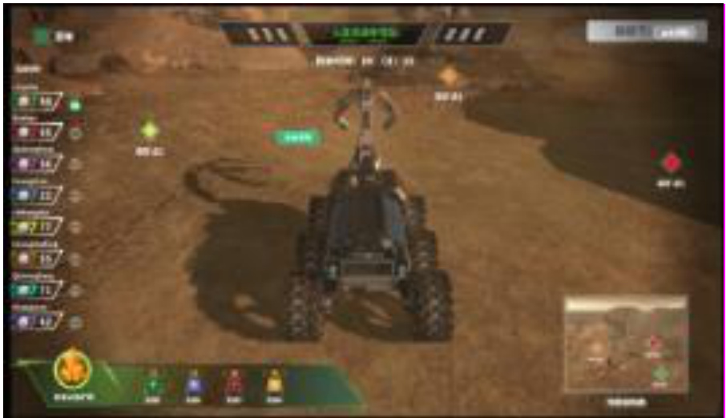

# 第七届全国青少年人工智能创新挑战赛开源鸿蒙机器人专项赛  

# 参赛手册  

中国少年儿童发展服务中心2024年4月  

# 一、赛事简介  

人工智能是通过研究人类智能活动的规律，构造出具有一定智能的人工系统的科学，主要研究如何让计算机去完成以往需要人的智力才能胜任的工作，也就是研究如何应用计算机的软硬件来模拟人类某些智能行为的基本理论、方法和技术。例如，视觉感知、语音及图像识别、在不确定条件下做出决策、学习、大数据分析、语言翻译等。为了培养青少年的创新能力和救援意识，考察其对人工智能、机器人、编程、物联网、元宇宙等有关知识的综合运用情况，我们设立了开源鸿蒙机器人荒漠救援专项赛项目。  

主题背景：在现实世界中，荒漠是一个广阔而艰难逾越的地域，而沙尘暴、高温和干旱等因素使其成为一种具有挑战性的环境。当一场突发的自然灾害导致当地居民陷入危险，荒漠救援机器人接到紧急指令后，机器人穿越被沙尘覆盖的地区，迅速移除沙尘堆积在道路上的障碍物，以确保通畅的通行路线。救援机器人的任务包括搜索受困者，提供急救措施，并实时上报位置信息和救援情况。救援指挥中心通过先进的通信技术与机器人保持联系，实时监测救援进展，并向机器人发送指令以适应不断变化的环境条件。在复杂的荒漠地形中，部分救援地区可能需要基地技术人员暂时接管机器人的操作，以应对更为复杂的救援任务，因此也就形成了荒漠救援的自动控制、近距离无线控制和远距离控制三种控制模式下的荒漠救援挑战。  

参赛青少年将围绕荒漠救援的主题，根据模拟场地的实际情况，设计拼装可以执行任务的机器人模型，并与其他团队进行竞技。每队由 2名队员组成，每支队伍配 1-2 名指导老师，赛事由遥控控制任务、自动控制任务、元宇宙任务组成，比赛结束时，元宇宙任务部分将会在虚拟现实场景中展示比赛得分情况。  

本次挑战赛坚持公益性，赛事任何环节，任何单位都不会向学生、学校收取成本费、工本费、活动费、报名费、食宿费、参赛材料费、器材费和其他各种名目的费用，做到“零收费”；不会指定参与竞赛活动时的交通、酒店、餐厅等配套服务；不会通过面向参赛学生组织与竞赛关联的培训、游学、冬令营、夏令营等方式，变相收取费用；不会推销或变相推销资料、书籍、辅助工具、器材、材料等商品；不会面向参赛的学生、家长或老师开展培训；不会借竞赛之名开展等级考试违规收取费用；不会以任何方式向学生或组织学生参赛的学校转嫁竞赛活动成本。本次挑战赛坚持自愿原则，不强迫、诱导任何学校、学生或家长参加竞赛活动。竞赛以及竞赛产生的结果不作为中小学招生入学的依据。赞助单位不得借赞助竞赛活动进行相关营销、促销活动。  

# 二、参赛条件及分组办法  

1.在校小学、初中、高中、中专或职高学生均可参赛。  

2.选手所在学段组别分为：小学组、初高中组（含中专和职高学生）。  

3.本赛项以团队赛的方式进行，选拔赛团队为 2 人一组（自行组队），决赛团队2 人一组（自行组队）。  

4.每队最多可有2 名指导老师，多名学生的指导老师可以重复。  

指导老师作为责任人，有责任监督竞赛期间人身安全保护、财产，指导参赛学生制定学习计划，督促参赛学生顺利完成比赛。  

# 三、选拔赛参与办法  

1.比赛报名：参加活动的青少年通过访问“人工智能创新挑战赛”网站 https://aiic.china61.org.cn/，在首页点击“选拔赛报名”进行在线报名，详细登记相关信息和报名赛项、组别。  

2.参加比赛：根据各地区报名实际情况，比赛采用现场竞技的方式。  

3.报名时间：2024 年 4 月 15 日-5 月 15 日，选拔赛时间为 2024 年5 月16 日-7 月1 日（具体时间另行通知）。  

参加选拔赛的青少年需通过“人工智能创新挑战赛”网站点击“参加选拔赛”链接，选择“开源鸿蒙机器人专项赛”获取线上、线下选拔赛参赛信息。  

4.主办单位将根据选拔赛的成绩，甄选部分优秀选手入围全国挑战赛决赛。  

5.选拔赛成绩可以在 2024 年 7 月 15 日后，登录“人工智能创新挑战赛”网站进行查询，入围决赛的选手可以参加全国决赛。  

# 四、全国挑战赛决赛规则  

# （一）竞赛主题  

本届机器人挑战赛是以荒漠救援为主题，利用网络通信技术、AI 摄像头识别技术、自动控制技术、NFC 识别、远程控制等技术集成于救援机器人中，结合元宇宙平台搭建虚拟荒漠场景，实现元宇宙场景和现场赛事任务的互联、互通与互动。在比赛中，各队选手要在规定的时间内设计和调试机器人来完成数据传输、图像识别、巡线避障、元宇宙挑战等任务。  

# （二）竞赛场地  

# 1.竞赛场地  

竞赛场地由场地图纸、赛台、场地道具、NFC 识别等组成。比赛场地占地尺寸为 $120\mathrm{cm}{*240\mathrm{cm}}$ ，NFC 识别区域内置于赛台中，场地道具布置于比赛图纸之上。  

轨迹线：轨迹线为 $2\mathrm{cm}\left(\pm10\%\right)$ 宽的黑线，不规则分布在场地中，轨迹线的类型有直线、直角转弯、U 型弯、S 弯等，并在轨迹线下布置nfc识别区域；  

启动区域：启动区是一个边长为 $30\mathrm{cm}*30\mathrm{cm}$ 的正方形区域。它是机器人出发的区域。比赛开始后机器人由此处出发前往各个任务区域；  

落石区域：落石区模拟智能机器人在行进过程中遇到的小型障碍物，该区域有一块 $10\mathrm{{cm}*10\mathrm{{cm}}}$ 的策略物模型；  

放置区域：放置区用于放置落石头，该区域有一块 15cm\*15cm 的放置区域；  

搜索区域：该区域是一个 $40\mathrm{cm}{*}40\mathrm{cm}$ 的长方形区域，此区域内有一个随机摆放的物品，以及 $10\mathrm{{cm}*10\mathrm{{cm}}}$ 的放置区；  

救援区域：该区域是一个 $30\mathrm{cm}*30\mathrm{cm}$ 的正方形区域，在该区域的外围巡线处有三个受伤人员模型；  

医疗区域：该区域是一个 $30\mathrm{cm}{*}40\mathrm{cm}$ 的正方形的长方形区域，此区域内设置一个 $10\mathrm{{cm}*10\mathrm{{cm}}}$ 的人员放置区；  

危险区域：该区域是一个 $30\mathrm{cm}*30\mathrm{cm}$ 的正方形区域；  

维修区域：该区域是一个 $30\mathrm{cm}*50\mathrm{cm}$ 的正方形的维修区，在该区域内放置一个 $20\mathrm{{cm}*10\mathrm{{cm}*30\mathrm{{cm}}}}$ 的配电箱；  

终点区域：终点是模拟待救援的荒漠救援基地中心，该区域是一$30\mathrm{cm}*30\mathrm{cm}$ 的正方形区域。  

2.元宇宙平台  

  
图 1：根据场地地图设计的模拟荒漠场景  

Npc：根据场地地图及赛事任务要求匹配对应的人物、人、落石等挑战任务：内置两款元宇宙支线任务分别有危险逃亡任务—小学组、古国迷宫任务—初高组。  

# （三）竞赛规则  

1.机器人  

数量：每支参赛队伍只允许 1 台机器人在场地内运行，且允许携带备用机（需通过检录）；  

尺寸：机器人在出发区内的最大尺寸为 30cm×30cm×30cm（长 $\times$ 宽×高）；  

机器人操控：允许机器人通过程序自主运行、利用遥控器控制、元宇宙控制的方式；  

传感器：机器人允许使用的传感器类型不限，初高中组推荐使用AI摄像头完成程序设计部分的任务；  

机器人搭建：所有机器人必须在比赛前预先完成搭建和制作，比赛现场不提供制作搭建机器人的时间；  

电源：每台机器人电源类型不限，但电源输出电压不得超过 $12\mathrm{V}$ ；  

# 2. 竞赛任务说明  

荒漠救援任务由两个主线任务加一条支线任务组成，第一部分的主线任务是由参赛选手使用遥控控制机器人完成场地任务，在完成第一部分任务之后可手动切换到第二部分的任务；第二部分的任务为编程控制的任务，选手的机器人需要通过传感器或 AI 摄像头（推荐初高中组）完成后面的任务；支线任务做为比赛中的第三部分任务是元宇宙任务，在地图上的救援区、维修区时，会出现元宇宙任务，小学组的选手是危险逃亡任务，初高组为古国迷宫任务，选手需要在规定时间内尽量的完成元宇宙任务为自己多争取一些成绩，在元宇宙任务时间到了之后选手才能继续场地上的比赛。  

# 第一部分任务：遥控控制任务  

任务一：启动，连接遥控  

机器人从启动区启动，在机器人启动的同时，遥控连接到机器人。  

得分状态：机器人启动，并成功连接小车。最高得分：5 分。  

任务二：发现落石并清理  

遥控控制机器人沿着黑线行走，在行走的路上机器人会遇到落石，玩家需要用遥控控制机器人将落石移动到指定的落石区域，清理完落石之后机器人回到黑线的位置继续前进。  

得分状态：遥控机器人清理落石。得分：落石完全进入到放置区域内圈得10 分，接触放置区域内圈得8 分，接触放置区域外圈得 5 分，其余不得分。最高得分：10 分。  

任务三：搜索区  

遥控控制机器人沿着黑线运动至扫描区，在机器人进入到扫描区时会看到一个 5cm 大小的正方体，机器人完成一次带着正方体的 $360^{\circ}$ 的旋转搜索并将正方体放置到指定区域，在此过程中机器人的结构件不能超出规定的范围，最终放置好正方体之后前往下一个任务地点。  

得分状态：机器人完成 $360^{\circ}$ 的旋转不压线得 5 分，正方体完全进入到放置区域内圈得 10 分，接触放置区域内圈得8 分，接触放置区域外圈得5 分，其余不得分。最高得分：15 分  

任务四：救援区  

机器人运动至救援区，并在运动的过程中发现受伤无法返回的被困者，将其运送至救援区等待救援。  

得分状态：机器人运动至救援区通过蜂鸣器发出求救信号得 2 分，将被困者运送到医疗区。运送三个被困者得 8 分，运送二个被困者得 5分，运送一个被困者得 3 分。最高得分：10 分  

任务五：医疗区  

遥控控制机器人运动至医疗区，在医疗区玩家可以给机器人更换零件以及代码，（也可以直接上备用机，使用备用机的必须要和第一部机器人同时检验和封存）接下来的比赛机器人将实现自动控制，不再是遥控控制。  

得分状态：完成机器人的改装（调换），同时机器人重新启动识别到出发的线路。最高得分：10 分。  

# 第二部分任务：自动编程控制  

任务六：危险区  

机器人完成改装之后运动到危险区，在危险区中发现新的沙尘危险，立马发出危险警报（可以是声音警报也可是灯光警报）并退出危险区赶往下一个区域，元宇宙平台上的机器人同步动作。  

得分状态：机器人识别出危险并发出警报得 5，同时将数据传输到元宇宙平台得5 分。最高得分：10 分。  

任务七：维修区  

机器人运动至维修区，将机器人后端的数据维修端口靠近到配电箱上进行维修（以机器人巡线前进方向相反方向部位定义为机器人后端）同时将数据传输到元宇宙平台，元宇宙平台上的机器人同步对配电箱进行维修。  

得分状态：机器人识别出配电箱，同时机器人后端的数据维修端口靠近到配电箱上，并将数据传输到元宇宙平台，元宇宙平台上的机器人同时动作。分数：10 分（配电箱撞倒不得分）。  

任务八：终点  

机器人离开维修区，通过巡线来到终点，完成最后一次的数据上传到元宇宙平台，在元宇宙平台接到信号后，虚实两个机器人一同关机，并在元宇宙平台上显示“任务圆满完成”的字样。  

得分状态：机器人识别到终点并停止所有动作，同时将数据传输到元宇宙平台，元宇宙平台上的机器人同时动作。最高得分：10 分。  

任务九：行驶路线检查  

在任务进行的时候，由裁判观察机器人的行走路线是否能紧贴着黑线行进，并且每一个 nfc 节点是否都有感应并准确的将数据传输到平台。  

得分状态：线路完整且信号无丢失。最高得分：10 分。  

# 第三部分任务：元宇宙支线任务  

小学组和初高组的参赛队伍行驶至地图上的危险区、维修区时，会出现元宇宙任务，小学组为危险逃亡任务，初高组为古国迷宫任务；在地图上的危险区出现的任务，需要选手在元宇宙平台上完成危险逃亡的  

任务、在地图上的维修区出现的任务，需要选手在元宇宙平台上的废墟迷宫任务，元宇宙部分比赛时间为60s，60s 内没有完成则结束元宇宙任务继续进行后面的任务，得分根据任务进度按比例换算。  

# 危险逃亡任务  

在元宇宙平台上遇到了荒漠地震危险，此时需要选手在元宇宙平台上驾驶元宇宙机器人躲避逃离危险，需要选手熟练的驾驶小车方可在规定的时间内通过该区域。最高得分：10 分。  

# 古国迷宫  

在元宇宙平台上机器人会进入一个被沙尘暴破坏的城镇，由于城镇被风沙破坏，道路变得不可预测，原有的地图已经不能使用，选手想要找到需要维修的机器就需要选手根据最新的卫星地图在救援区找到被困者并成功走出迷宫。最高得分：10 分。  

# 3. 竞赛赛制  

（1）比赛顺序  

赛前会让所有参赛队抽签排序，所有选手严格按照抽签确定的顺序进行比赛。比赛中，上一队开始比赛时，会通知下一队候场准备。在规定时间内没有到场的队伍，将视为放弃比赛资格。  

# （2）搭建与编程  

参赛队在入场前完成机器人的搭建与编程，在入场时机器人需要完成裁判员的检录，检录完成之后可以开始适应性训练 5 分钟，时间一到机器人由裁判封存，选手撤离现场不得再对机器进行调整，参赛队员未经允许不得再接触机器人，否则将被取消参赛资格。在第一轮结束后，开始第二轮比赛，比赛时间由裁判组根据实际情况调整。  

裁判示意比赛开始后，仍没有准备好的参赛队将丧失本轮比赛机会，但不影响下一轮的比赛。  

（3）正式比赛  

# 比赛共分两轮，单轮比赛时间为 210 秒。  

基础任务210 秒计时标准：  

参赛队的机器人出现下列情况，将以裁判哨声为准停止计时，并记录时间分：  

$\textcircled{1}$ 机器人任务失败且无法继续执行后续任务；$\textcircled{2}$ 参赛队完成任务触发“任务圆满完成”；$\textcircled{3}$ 计时到达210 秒；$\textcircled{4}$ 参赛队主动结束比赛；竞赛成绩取两轮的总和为最终比赛成绩。如果总成绩相同时，按以顺序决定排名：  

$\textcircled{1}$ 单轮成绩较高者排名靠前；  
$\textcircled{2}$ 两轮用时总和较少者排名靠前；  
$\textcircled{3}$ 重置次数较少者排名靠前。  

（4）重置  

以下情况需要将机器人重置回启动区：  

$\textcircled{1}$ 选手向裁判申请重置的；  
$\textcircled{2}$ 机器人完成任务时形成卡死状态的；  
$\textcircled{3}$ 机器人脱离比赛场地的；  
$\textcircled{4}$ 选手未经允许接触任务道具或机器人的；  
$\textcircled{5}$ 机器人破坏任务装置的。  
每发生一次重置，总分减 5 分，最高减 30 分（重置不重新计时）。  

# （5）现场环境  

现场的电源：比赛现场提供当地标准电源接口，如果参赛队需要任何电压或者频率的转换器，请参赛队自行准备。距离参赛队最近的电源接口可能距离参赛队的指定调试桌有一定的距离，请参赛队自行准备足够长的电源延长线，同时在现场使用延长线时请注意固定和安全。  

现场的光线：比赛现场为日常照明，正式比赛之前参赛队员有时间标定传感器，但是大赛组织方不保证现场光线绝对不变。随着比赛的进行现场的阳光可能会有变化。现场可能会有照相机或摄像机的闪光灯、补光灯或者其他赛项的未知光线影响，请参赛队员自行解决。  

场地平滑度：现场比赛的场地铺在地面上，组委会会尽力保证场地的平整度，但不排除场地褶皱等情况。  

（6）竞赛争议竞赛期间，规则中如有未尽事项以竞赛裁判委员会现场公布为准。  

# 4. 评分标准  

（1）竞赛评分  

最终得分 $\mathbf{\Psi}=\mathbf{\Psi}$ 任务得分 $+$ 重置分（最终得分相同的情况下两轮总用时较短的队伍获胜）  

# 五、全国挑战赛决赛规则  

全国决赛比赛时间为 2 天，将在竞赛现场公布竞赛主题和要求，其余规则、器材设置等与线下选拔赛规则一致。  

# 六、回避范围及方式  

# （一）回避范围  

回避是指评审专家具有法定情形，必须回避，不参与相关作品评审的制度。按照相关规定，结合竞赛活动实际，如果评审专家具备以下情形之一的，应当回避：  

1.是参赛选手的近亲属；  
2.与参赛选手有其他直接利害关系；  
3.担任过参赛选手的辅导老师、指导老师的；  
4.与参赛选手有其他关系，可能影响公正评审的。  

# （二）回避方式  

回避方式有自行回避与申请回避两种：  

# 1. 自行回避  

评审专家自行提出回避申请的，应当说明回避的理由，口头提出申请的，应当记录在案。评审专家有上述（1）（2）（3）（4）情形之一的，应当自行回避。  

评审专家在活动评审过程中，发现有上述（1）（2）（3）（4）情形之一的，应当自行提出回避；没有自行提出回避的，活动组委会应当决定其回避。评审专家自行回避的，可以口头或者书面提出，并说明理由。口头提出申请的，应当记录在案。  

# 2. 申请回避  

参赛选手及评审专家要求其他评审专家参与回避的，应当提出申请，并说明理由。口头提出申请的，应当记录在案。  

# 七、异议处理机制  

1.第七届全国青少年人工智能创新挑战赛接受社会的监督，挑战赛的评审工作实行异议制度。  

2.任何单位或者个人对第七届全国青少年人工智能创新挑战赛参赛选手、参赛单位及其项目的创新性、先进性、实用性及推荐材料真实性、比赛成绩等持有异议的，应当在项目成绩公布之日起 10 日内向活动组委会提出，逾期不予受理。  

3.提出异议的单位或者个人应当提供书面异议材料，并提供必要的证明文件。提出异议的单位、个人应当表明真实身份。个人提出异议的，应当在书面异议材料上签署真实姓名；以单位名义提出异议的，应当加盖本单位公章。以匿名方式提出的异议一般不予受理。  

4.提出异议的单位、个人不得擅自将异议材料直接提交评审组织或者评审专家；专家收到异议材料的，应当及时转交活动组委会，不得提交评审组织讨论和转发其他评审专家。  

5.活动组委会在接到异议材料后应当进行审查，对符合规定并能提供充分证据的异议，应予受理。  

6.为维护异议者的合法权益，活动组委会、推荐单位及其指导老师，以及其他参与异议调查、处理的有关人员应当对异议者的身份予以保密；确实需要公开的，应当事前征求异议者的意见。  

7.涉及参赛选手所完成项目的创新性、先进性、实用性及推荐材料真实性、比赛成绩的真实性等内容的异议由活动组委会负责协调，由有关指导单位或者指导老师协助。参赛选手接到异议通知后，应当在规定的时间内核实异议材料，并将调查、核实情况报送活动组委会审核。必要时，活动组委会可以组织评审专家进行调查，提出处理意见。涉及参赛选手及其排序的异议由指导单位或者指导老师负责协调，提出初步处理意见报送活动组委会审核。参赛选手接到异议材料后，在异议通知规定的时间内未提出调查、核实报告和协调处理意见的，该项目不认可其比赛成绩。  

8.异议处理过程中，涉及异议的任何一方应当积极配合，不得推诿和延误。参赛选手在规定时间内未按要求提供相关证明材料的，视为承认异议内容；提出异议的单位、个人在规定时间内未按要求提供相关证明材料的，视为放弃异议。  

9.异议自异议受理截止之日起60 日内处理完毕的，可以认可其比赛成绩；自异议受理截止之日起一年内处理完毕的，可以直接参加下一年度比赛。  

10.活动组委会应当向活动专家评审委员会报告异议核实情况及处理意见，并将决定意见通知异议方和参赛选手。  

# 八、赛事组委会  

本届挑战赛信息发布平台为：  

“中国少年儿童发展服务中心”微信公众号；  
主办单位网站：http://www.china61.org.cn；  
挑战赛网站：http://aiic.china61.org.cn。  

组委会联系方式：  

联系人：屈老师、辛老师邮箱：xiaoyuanshi@163.com电话：010-65124399  

涉赛违规问题线索专用举报邮箱：ghstfmct@163.com  

赛事技术咨询  

联系人：丰老师、林老师、刘老师电话：18650718228、15659999606、18950428775  

# 九、知识产权声明  

挑战赛组委会鼓励并倡导技术创新以及技术开源，并尊重参赛队的知识产权。参赛队伍比赛中开发的所有知识产权均归所在队伍所有，组委会不参与处理队伍内部成员之间的知识产权纠纷，参赛队伍须妥善处理本队内部学校及其他身份的成员之间对知识产权的所有关系。参赛队伍在使用组委会提供的裁判系统及赛事支持物资过程中，须尊重原产品的所有知识产权归属方，不得针对产品进行反向工程、复制、翻译等任何有损于归属方知识产权的行为。  

# 十、主办单位免责声明  

1.未经主办单位书面授权，任何单位和个人以本赛事名义开展的活动均属假冒、侵权。2.主办单位不会以本赛事名义向学生收取任何费用，更不会以本赛事名义举办夏冬令营、培训班，捆绑销售器材商品、书籍材料等。本赛事也不存在任何指定器材、指定培训机构、指定教材等，请参与活动的师生和家长朋友们谨防上当受骗。3.所有参赛作品，均须为参赛个人原创，不能存在任何侵犯第三方权利的内容，不能违反法律法规的规定，主办单位对此不承担责任。4.请参与活动人员妥善保管自己的贵重物品（如现金、笔记本电脑、手机和参赛设备等），避免丢失或损坏，主办单位对此不承担责任。  

# 十一、注意事项  

1.参与活动人员必须牢固确立“安全第一”的意识，把活动安全放在首要位置。严格注意用电安全，相关机器人设备须提前充好电，准备好备用电池，规范用电，防止触电。严格注意防火安全，禁止携带易燃易爆等危险品和打火机、火柴等进入赛场。严格注意操作安全，活动期间如有发射弹丸、切割材料、器件焊接等危险操作时必须戴好头盔、手套、护目镜等防护措施。活动期间，参与活动人员应熟悉场地环境，若遇紧急情况，严格服从安保人员指挥。  

2.参与活动人员应提前购买保额不低于人民币 50 万元的人身意外伤害保险和意外医疗保险等风险保险。  

3.参与活动人员应遵守场地制度，爱护公共设施，自觉保持公共卫生。  

# 十二、其它  

1.关于挑战赛规则的任何补充、修订，将在中国少年儿童发展服务中心网站 http://www.china61.org.cn 和挑战赛专题网站上发布。  

2.比赛期间，凡是规则中没有说明的事项由专家评审委员会现场决定。  

3.主办单位对凡是规则中未说明及有争议的事项拥有最后解释权、补充权和决定权。  