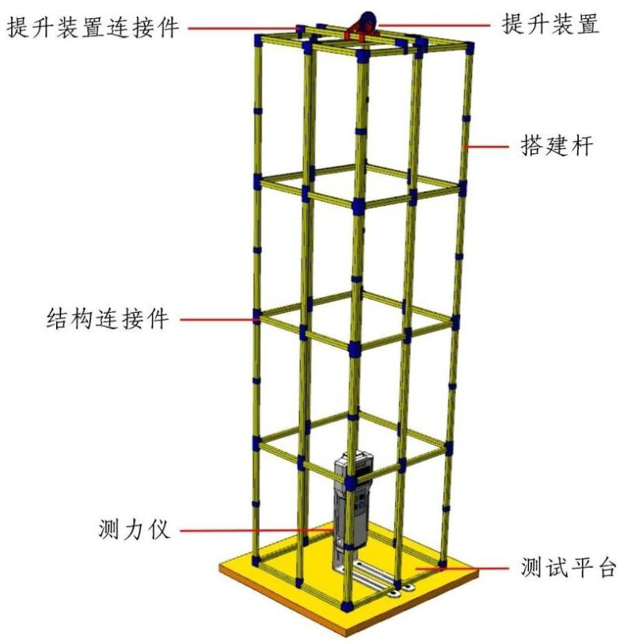

# 第七届全国青少年人工智能创新挑战赛太空电梯工程设计专项赛  

# 参赛手册  

中国少年儿童发展服务中心2024年4月  

# 一、赛事简介  

人工智能是通过研究人类智能活动的规律，构造出具有一定智能的人工系统的科学，主要研究如何让计算机去完成以往需要人的智力才能胜任的工作。也就是研究如何应用计算机的软硬件来模拟人类某些行为的基本理论、方法和技术。例如：视觉感知、语音及图像识别，在不确定条件下做出决策、学习、大数据分析、语言翻译等。将计算机技术与多种智能芯片、传感器和电子件相结合，通过创新创意，就可以设计开发出多种多样的人工智能产品，使其更好地服务于我们的学习生活。  

为了助力培养青少年的创造能力，以人工智能为导向，程序控制为基础，我们设立了太空电梯工程设计专项赛。赛项分为准备和评测两个环节，准备环节中选手需要将自己设计的电梯、提升装置、吊框进行现场组装、调试。电子件与提升机构连接，通过程序控制完成重物的定点提升和降落的运行过程，及最终的极限拉力测试。评测环节裁判员依据评分细则对选手现场搭建调试好的电梯进行评测。  

本次挑战赛坚持公益性，赛事任何环节、任何单位都不会向学生、学校收取成本费、工本费、活动费、报名费、食宿费、参赛材料费、器材费和其他各种项目的费用，做到“零收费”；不会指定参与竞赛活动时的交通、酒店、餐厅等配套服务；不会通过面向参赛学生组织与竞赛关联的培训、游学、冬令营、夏令营等方式，变相收取费用；不会推销或变相推销资料、书籍、辅助工具、器材、材料等商品；不会面向参赛的学生、家长或老师开展培训；不会借竞赛之名开展等级考试违规收取费用；不会以任何方式向学生或组织学生参赛的学校转嫁竞赛活动成本。本次挑战赛坚持自愿原则，不强迫、诱导任何学校、学生或家长参加竞赛活动。竞赛以及竞赛产生的结果不作为中小学招生入学的依据。赞助单位不得借赞助竞赛活动进行相关营销、促销活动。  

# 二、参赛条件及分组办法  

1.凡在 2023 年 7 月前，在校小学、初中、高中、中专或职高学生均可参赛。2.选手所在学段组别分为：小学组、初中组、高中组(含中专、职高)。3.太空电梯工程设计专项赛为团队赛，团队为 2 人一组(自行组队，不可跨学段)。4.每队最多可有 1 名指导老师，多支参赛队伍的指导老师可以重复。指导老师作为责任人，有责任监督竞赛期间参赛选手人身、财产安全，指导参赛选手制定学习计划，督促参赛选手顺利完成比赛。  

# 三、选拔赛参与办法  

1.选拔赛报名。参加活动的青少年通过访问赛事专题网站(https:/http://aiic.china61.org.cn/)，在首页点击“第七届人工智能创新挑战赛报名”进行在线报名，详细填写报名赛项、组别等相关信息。  

2.参加选拔赛，采取线下或线上两种选拔方法进行。有明确地方选拔赛的区域，按照地方选拔赛要求进行现场选拔，无地方选拔赛的区域统一进行线上选拔。参赛选手只能选取一种方式参与。  

3.线上选拔赛以提交相关材料，并由专家评审的形式举办。参赛选手需通过“人工智能创新挑战赛”专题页面点击“参加选拔赛”，选择“太空电梯工程设计专项赛”，并凭报名登记过的“手机号码”和“身份证号后6 位”进入线上竞赛系统参赛。  

4.主办单位将根据选拔赛成绩，甄选部分优秀选手入围全国挑战赛决赛。  

5.选拔赛成绩可以在2024年7月15日后，登录“人工智能创新挑战赛”网站进行查询，入围决赛的选手可以参加8月份的全国决赛。  

# 四、选拔赛规则  

选拔赛分为技能任务和知识任务，参赛队伍需（线下赛为 2 小时，不含评测时间）使用规定器材及工具完成相应比赛内容。参赛队伍可自愿参与全部任务或某项任务进行竞技。比赛成绩以所有任务分数汇总后的总分进行排名。  

参赛队伍在参赛过程中需使用自备器材清单中的材料进行比赛，使用工具根据自身需求选带。清单如下：  

<html><body><table><tr><td colspan="2">自备器材清单</td></tr><tr><td>一</td><td>电脑：品牌不限；系统要求Windows7以上；支持OpenGL3.2以上</td></tr><tr><td>2</td><td>比赛建议使用软件：青少年三维创意设计软件</td></tr><tr><td>3</td><td>连接件：自行设计并提前打印(打印材料光敏树脂、ABS或PLA)</td></tr><tr><td>4</td><td>搭建杆:5mm×5mm×250mm，壁厚0.5mm（空心；材质ABS)</td></tr><tr><td>5</td><td>吊装线：自行配备吊装线，材料、规格、品牌不限</td></tr><tr><td>6</td><td>马达：编码电机(减速比 1：90双轴，工作电压 3-6V；6pin XH2.45直针接口)</td></tr><tr><td>7</td><td>自动控制装置：中央处理器、控制模块、电机过载保护模块、≤5V(2A)电源、 连接线(品牌不限)</td></tr><tr><td>8</td><td>提升装置：自行设计并提前打印(打印材料为光敏树脂、ABS或PLA)</td></tr><tr><td>9</td><td>人工智能模块：根据任务要求自行选配，相关软件需自行安装 10 测量工具：计时器、卷尺、拉力评测工具和电子秤</td></tr></table></body></html>  

# （一）技能任务  

# 1.太空电梯整体设计  

参赛队伍根据规则要求，提前设计、制作本队伍的太空电梯模型整体结构及其相关零部件。  

# 2.太空电梯组装调试  

（1）搭建太空电梯  

参赛选手使用提前设计并打印的连接件、电子件与其它材料搭建太空电梯模型。搭建过程中选手可根据设计的太空电梯结构自行截断或拼接搭建杆。  

# （2）组装提升装置  

参赛选手使用提前设计打印的提升装置配件进行组装，并与电梯进行装配。  

# 3.电梯程序编写  

参赛选手需要完成智能控制程序的编写(编程平台不限)，中央处理器、人工智能模块可以放置在太空电梯上，也可以放置在地上，通过加长的连接线与提升装置的马达连接。电梯模型的启动（可手动启动）、运行和停止必须通过自动控制来实现。  

# 4.技能评测  

参赛队伍需要利用本队伍搭建的太空电梯完成技能评测。  

（1）一致性及基础检测$\textcircled{1}$ 太空电梯、提升装置实物模型与电子模型一致性评判。$\textcircled{2}$ 太空电梯质量及高度测量。  

（2）极限拉力测评  

该环节需要参赛队伍在30s内完成极限拉力的测试。本环节主要测试在太空电梯模型崩塌、吊装线断裂、提升装置打滑、拉不动等情况时，拉力评测工具的峰值拉力读数。  

# （二）选拔赛评分细则  

<html><body><table><tr><td>环节</td><td>项目</td><td>内容</td><td>评分标准</td></tr><tr><td>评测 资格</td><td>赛项 成绩 无效</td><td>1.使用不符合规定的搭建材料； 2.吊装线用于捆扎搭建杆等非起吊用途； 3.参赛队作品上使用橡皮筋、胶水、胶</td><td>0 （总成绩归零）</td></tr></table></body></html>  

<html><body><table><tr><td></td><td></td><td>带等； 4.参赛队伍作品程序运行开始后，选手 利用身体任何部位或借助其他工具碰触 搭建的太空电梯； 5.参赛队伍使用其它3D打印设备进行打 印和修补打印件; 6.使用2个及以上的马达</td><td></td></tr><tr><td rowspan="2">一致性 检测</td><td rowspan="2">外观 评分</td><td>自行设计的太空电梯实物模型与电子模 型一致得分</td><td>50</td></tr><tr><td>自行设计的提升装置实物模型与电子模 型一致得分</td><td>50</td></tr><tr><td rowspan="3">技能 评测</td><td>基础 测量</td><td>电梯整体重量(不包含电机、中央处理器 、电源等质量)以360g为基准，超1g扣2 分，低1g加2分 电梯搭建高度（电梯最低点到提升装置最</td><td>2× (360-电梯重量)</td></tr><tr><td>极限</td><td>低点)不得低于75cm，超出部分以cm计算 ，不足1cm，按1cm计算，超1cm得2分 最终拉力峰值不得低于3kg（含3kg），</td><td>2× (搭建高度-75) 200*［（拉力峰值-3</td></tr><tr><td>拉力 任务</td><td>超出部分以kg计算，并转换出得分 1.电梯出现崩塌、吊装线断裂等无法进 行拉力测试情况;</td><td>）/5]~(1/2)</td></tr><tr><td></td><td>成绩 无效</td><td>2.电梯搭建未达到75cm; 3.极限拉力不足3kg; 4.极限拉力运行时间超过30s</td><td>0 (此环节成绩归零)</td></tr></table></body></html>  

# （三）选拔赛文件提报要求  

参与线下区域选拔赛的队伍需将表格中“模型”和“程序”按要求命名后保存到电脑桌面上，以便裁判评审。  

参与线上统一选拔赛的队伍需在规定时间内将表格中要求的资料提交到选拔赛指定网站的“作品提交”页面，最终评测成绩以提交的视频和文件为准。  

<html><body><table><tr><td>类型</td><td>名称</td><td>要求</td><td>格式</td></tr><tr><td rowspan="2">模型</td><td>电梯 模型</td><td>1.整体模型，包括整体结构、搭建杆、连接件（含固定提升 装置的连接件）； 2.文件命名为“学校-姓名-太空电梯”</td><td>z1</td></tr><tr><td>提升 装置</td><td>1.提升装置所有零件都要设计出来，不需要设计出相配合的 电子件;</td><td>z1</td></tr></table></body></html>  

<html><body><table><tr><td></td><td></td><td>2.文件命名为“学校-姓名-提升装置”</td><td></td></tr><tr><td>程序</td><td>控制 程序</td><td>1.电梯运行程序的纯文本代码; 2.文件命名为“学校-姓名-控制程序”； 3.多个程序，命名后用序号区分</td><td>不限</td></tr><tr><td rowspan="2">整体 视频</td><td>整体 环境</td><td>1.录制完整的评测过程，视频一镜到底，不能编辑视频； 2.固定机位，无需移动； 3.整体评测环境、作品、工具、人员全部在视频中呈现，视 频需录制声音; 4.除比赛选手外，其他与比赛无关人员不得在视频中出现</td><td>mp4 或 flv</td></tr><tr><td colspan="2">1.时长不超过10min，大小不超过100MB; 2.文件命名为“学校-姓名-整体视频”</td><td></td></tr><tr><td rowspan="3">局部 视频</td><td>质量 尺寸 测量</td><td>1.电梯称重环节读数必须清晰可见（不包含电机、中央处理 器、电源等质量); 2.电梯的高度需通过全景进行展示，拉近时测量人员及测量 尺应保持不动，测量高度数值必须清晰可见</td><td rowspan="3">mp4 或 flv</td></tr><tr><td>技能 评测</td><td>1.需清晰录制启动以及极限拉力时的峰值，通过语音识别或 图像识别启动的过程也需清晰录制; 2.计时时间清晰可见(可用电脑显示计时时间);</td></tr><tr><td colspan="2">3.运行过程须一镜到底，不能编辑视频 1.时长不超过10min，大小不超过100MB; 2.文件命名为“学校-姓名-局部视频”</td></tr><tr><td colspan="6">注：1.模型文件、程序和视频放在一个文件夹内，并对文件夹进行压缩处理; 2.压缩文件包命名为“学校-姓名-太空电梯”； 3.运行时间以视频时间为准</td></tr></table></body></html>  

# 五、全国挑战赛规则  

全国挑战赛参赛队伍需在2个小时（不含评测时间）内使用规定器材及工具完成相应比赛内容。参赛队伍可自愿参与全部任务或某项任务进行竞技。比赛成绩以所有任务分数汇总后的总分进行排名。  

参赛队伍在参赛过程中需使用自备器材清单中的材料进行比赛，使用工具根据自身需求选带。清单如下：  

<html><body><table><tr><td colspan="2">自备器材清单</td></tr><tr><td>1</td><td>电脑：品牌不限；系统要求Windows7以上；支持OpenGL3.2以上</td></tr><tr><td>2</td><td>比赛建议使用软件：青少年三维创意设计软件</td></tr><tr><td>3</td><td>连接件：自行设计并提前打印(打印材料光敏树脂、ABS或PLA)</td></tr><tr><td>4</td><td>吊装线：自行配备吊装线，材料、规格、品牌不限</td></tr><tr><td>５</td><td>自动控制装置：中央处理器、控制模块、电机过载保护模块、≤5V(2A)电源、 连接线（品牌不限）</td></tr></table></body></html>  

<html><body><table><tr><td>6</td><td>提升装置：自行设计并提前打印(打印材料为光敏树脂、ABS或PLA)</td></tr><tr><td>7</td><td>人工智能模块：根据任务要求自行选配，相关软件需自行安装</td></tr><tr><td>8</td><td>测量工具：计时器、卷尺、拉力评测工具和电子秤</td></tr><tr><td>现场提供器材清单</td><td></td></tr><tr><td>1</td><td>搭建杆：5mm×5mm×250mm，壁厚0.5mm(空心；材质ABS)</td></tr><tr><td>2</td><td>马达：编码电机(减速比 1：90双轴，工作电压 3-6V；6pin XH2.45直针接口)</td></tr><tr><td>3</td><td>桌椅：1套/队</td></tr><tr><td>4</td><td>电源：220V</td></tr><tr><td>5</td><td>测量工具、电子秤和卷尺 (裁判评测用)</td></tr></table></body></html>  

# （一）技能任务  

# 1.太空电梯组装调试  

（1）搭建太空电梯  

参赛选手自备提前设计并打印的连接件、电子件与其它材料搭建太空电梯模型。搭建过程中选手可根据设计的太空电梯结构自行截断或拼接搭建杆。  

（2）组装提升装置  

参赛选手自备前设计打印的提升装置配件进行组装，并与电梯进行装配。  

# 2.电梯程序编写  

参赛选手需要完成智能控制程序的编写(编程平台不限)，中央处理器、人工智能模块可以放置在太空电梯上，也可以放置在地上，通过加长的连接线与提升装置的马达连接。电梯模型的启动（可手动启动）、运行和停止必须通过自动控制来实现。  

# 3.技能评测  

参赛队伍需要利用本队伍搭建的太空电梯完成基础任务评测。  

（1）一致性及基础检测  

$\textcircled{1}$ 太空电梯、提升装置实物模型与电子模型一致性评判。  

$\textcircled{2}$ 太空电梯质量及高度测量。  

（2）极限拉力测评  

该环节需要参赛队伍在30s内完成极限承载力的测试。本环节主要测试在太空电梯模型崩塌、吊装线断裂、提升装置打滑、拉不动等情况时，拉力评测工具的峰值拉力读数。  

# （二）知识任务  

1.参赛选手需要在现场公布的比赛任务书中选择1-3个不同的任务进行现场设计。  

2.现场设计任务与太空电梯组装调试任务同时进行，不单独设立环节，选手需自主协调分工，确保任务与时间的合理分配。  

3.设计任务时长为1.5小时，计时结束时，裁判将统一收集参赛队伍的模型文件。  

# （三）全国挑战赛评分细则  

<html><body><table><tr><td>环节</td><td>项目</td><td>内容</td><td>评分标准</td></tr><tr><td>评测 资格</td><td>赛项 成绩 无效</td><td>1.使用不符合规定的搭建材料; 2.吊装线用于捆扎搭建杆等非起吊用途; 3.参赛队作品上使用橡皮筋、胶水、胶 带等； 4.参赛队伍作品程序运行开始后，选手 利用身体任何部位或借助其他工具碰触 搭建的太空电梯; 5.参赛队伍使用其它3D打印设备进行打 印和修补打印件; 6.使用2个及以上的马达 自行设计的太空电梯实物模型与电子模</td><td>0 (总成绩归零)</td></tr><tr><td rowspan="2">一致性 检测</td><td>外观 评分</td><td>型一致得分 自行设计的提升装置实物模型与电子模</td><td>50</td></tr><tr><td></td><td>型一致得分 电梯整体重量(不包含电机、中央处理器</td><td>50</td></tr><tr><td>技能 评测</td><td>基础 测量</td><td>、电源等质量)以360g为基准，超1g扣2 分，低1g加2分</td><td>2×(360-电梯重量)</td></tr></table></body></html>  

<html><body><table><tr><td rowspan="3"></td><td></td><td>电梯搭建高度(电梯最低点到提升装置最 低点)不得低于75cm，超出部分以cm计算 ，不足1cm，按1cm计算，超1cm得2分</td><td>2× (搭建高度-75)</td></tr><tr><td>极限 拉力</td><td>最终拉力峰值不得低于3kg（含3kg）， 超出部分以kg计算，并转换出得分</td><td>200*［（拉力峰值-3 ） /5]~(1/2)</td></tr><tr><td>任务 成绩 无效</td><td>1.电梯出现崩塌、吊装线断裂等无法进 行拉力测试情况; 2.电梯搭建未达到75cm; 3.极限拉力不足3kg; 4.极限拉力运行时间超过30s</td><td>0 (此环节成绩归零)</td></tr><tr><td rowspan="2">知识</td><td rowspan="2">现场 设计</td><td>任务1：按任务要求设计模型，得分以任 务评分表为准(任务满分100分)</td><td>任务1评分</td></tr><tr><td>任务2：按任务要求设计模型，得分以任 务评分表为准(任务满分100分）</td><td>任务1评分</td></tr><tr><td>评测</td><td></td><td>任务3：按任务要求设计模型，得分以任 务评分表为准(任务满分100分)</td><td>任务1评分</td></tr></table></body></html>  

# （四）全国挑战赛展示文件要求  

<html><body><table><tr><td>类型</td><td>名称</td><td>要求</td><td>格式</td></tr><tr><td rowspan="2">模型</td><td>电梯 模型</td><td>1.整体模型，包括整体结构、搭建杆、连接件（含固 定提升装置的连接件）； 2.文件命名为“学校-姓名-太空电梯”</td><td>z1</td></tr><tr><td>提升 装置</td><td>1.提升装置所有零件都要设计出来，不需要设计出相 配合的电子件; 2.文件名称为“学校-姓名-提升装置”</td><td>z1</td></tr><tr><td>程序</td><td>控制 程序</td><td>1.电梯运行程序的纯文本代码; 2.文件命名为“学校-姓名-控制程序”; 3.多个程序，命名后用序号区分</td><td>不限</td></tr><tr><td rowspan="3">现场设 计</td><td>任务 1</td><td>1.按任务要求设计模型; 2.文件命名为“学校-姓名-任务1”</td><td>z1</td></tr><tr><td>任务 2</td><td>1.按任务要求设计模型; 2.文件命名为“学校-姓名-任务2”</td><td>z1</td></tr><tr><td>任务 3</td><td>1.按任务要求设计模型; 2.文件命名为“学校-姓名-任务3”</td><td>z1</td></tr><tr><td colspan="6">注：程序需保存在电脑桌面 (具体要求以现场为准)</td></tr></table></body></html>  

# （五）奖项设置  

以大赛组委会公布为准。  

# 六、图例解释  

  
图例只做参考  

  

# 七、回避范围及方式  

# （一）回避范围  

回避是指评审专家具有法定情形，必须回避，不参与相关作品评审的制度。按照相关规定，结合竞赛活动实际，如果评审专家具备以下情形之一的，应当回避：  

1.是参赛选手的近亲属；  
2.与参赛选手有其他直接利害关系；  
3.担任过参赛选手的辅导老师、指导老师的；  
4.与参赛选手有其他关系，可能影响公正评审的。  

# （二）回避方式  

回避方式有自行回避与申请回避两种：  

# 1.自行回避  

评审专家自行提出回避申请的，应当说明回避的理由，口头提出申请的，应当记录在案。  

评审专家有上述(1)(2)(3)(4)情形之一的，应当自行回避。  

评审专家在活动评审过程中，发现上述(1)(2)(3)(4)情形之一的，应当自行提出回避；没有自行提出回避的，活动组委会应当决定其回避。评审专家自行回避的，可以口头或者书面提出，并说明理由。口头提出申请的，应当记录在案。  

# 2.申请回避  

参赛选手及评审专家要求其他评审专家参与回避的，应当提出申请，并说明理由。口头提出申请的，应当记录在案。  

# 八、异议处理机制  

1.第七届全国青少年人工智能创新挑战赛接受社会的监督，挑战赛的评审工作实行异议制度。  

2.任何单位或者个人对第七届全国青少年人工智能创新挑战赛参赛选手、参赛单位及其项目的创新性、先进性、实用性及推荐材料真实性、比赛成绩等持有异议的，应当在项目成绩公布之日起10日内向活动组委会提出，逾期不予受理。  

3.提出异议的单位或者个人应当提供书面异议材料，并提供必要的证明文件。提出异议的单位、个人应当表明真实身份。个人提出异议的，应当在书面异议材料上签署真实姓名；以单位名义提出异议的，应当加盖本单位公章。以匿名方式提出的异议一般不予受理。  

4.提出异议的单位、个人不得擅自将异议材料直接提交评审组织或者评审专家；专家收到异议材料的，应当及时转交活动组委会，不得提交评审组织讨论和转发其他评审专家。  

5.活动组委会在接到异议材料后应当进行审查，对符合规定并能提供充分证据的异议，应予受理。  

6.为维护异议者的合法权益，活动组委会、推荐单位及其指导老师，以及其他参与异议调查、处理的有关人员应当对异议者的身份予以保密；确实需要公开的，应当事前征求异议者的意见。  

7.涉及参赛选手所完成项目的创新性、先进性、实用性及推荐材料真实性、比赛成绩的真实性等内容的异议由活动组委会负责协调，由有关指导单位或者指导老师协助。参赛选手接到异议通知后，应当在规定的时间内核实异议材料，并将调查、核实情况报送活动组委会审核。必要时，活动组委会可以组织评审专家进行调查，提出处理意见。涉及参赛选手及其排序的异议由指导单位或者指导老师负责协调，提出初步处理意见报送活动组委会审核。参赛选手接到异议材料后，在异议通知规定的时间内未提出调查、核实报告和协调处理意见的，该项目不认可其比赛成绩。  

8.异议处理过程中，涉及异议的任何一方应当积极配合，不得推诿和延误。参赛选手在规定时间内未按要求提供相关证明材料的，视为承认异议内容；提出异议的单位、个人在规定时间内未按要求提供相关证明材料的，视为放弃异议。  

9.异议自异议受理截止之日起60日内处理完毕的，可以认可其比赛成绩；自异议受理截止之日起一年内处理完毕的，可以直接参加下一年度比赛。10.活动组委会应当向活动专家评审委员会报告异议核实情况及处理意见，并将决定意见通知异议方和参赛选手。  

# 九、赛事组委会  

本届挑战赛信息发布平台为：“中国少年儿童发展服务中心”微信公众号；主办单位网站：http://www.china61.org.cn；挑战赛网站：http://aiic.china61.org.cn。  

组委会联系方式：  

联系人：屈老师、辛老师邮  箱：xiaoyuanshi@163.com电  话：010-65124399  

涉赛违规问题线索专用举报邮箱：ghstfmct@163.com  

赛事技术咨询：  

联系人：孙老师联系方式：13581750997 (sunhongbo@zwsoft.com)  

# 十、知识产权声明  

挑战赛组委会鼓励并倡导技术创新以及技术开源，并尊重参赛队伍的知识产权。参赛队伍比赛中开发的所有知识产权均归所在队伍所有，组委会不参与处理队伍内部成员之间的知识产权纠纷，参赛队伍须妥善处理本队内部学校及其他身份的成员之间对知识产权的所有关系。参赛队伍在使用组委会提供的裁判系统及赛事支持物资过程中，须尊重原产品的所有知识产权归属方，不得针对产品进行反向工程、复制、翻译等任何有损于归属方知识产权的行为。  

# 十一、主办单位免责声明  

1.未经主办单位书面授权，任何单位和个人以本赛事名义开展的活动均属假冒、侵权。  

2.主办单位不会以本赛事名义向学生收取任何费用，更不会以本赛事名义举办夏冬令营、培训班，捆绑销售器材商品、书籍材料等。本赛事也不存在任何指定器材、指定培训机构、指定教材等，请参与活动的师生和家长朋友们谨防上当受骗。  

3.所有参赛作品，均须为参赛个人原创，不能存在任何侵犯第三方权利的内容，不能违反法律法规的规定。  

# 十二、线下活动注意事项  

1.参与活动人员必须牢固树立“安全第一”的意识，把活动安全放在首要位置。严格注意用电安全，相关机器人设备须提前充好电，准备好备用电池，规范用电，防止触电。严格注意防火安全，禁止携带易燃易爆等危险品和打火机、火柴等进入赛场。严格注意操作安全，活动期间如有发射弹丸、切割材料、器件焊接等危险操作时必须戴好头盔、手套、护目镜等防护措施。活动期间，参与活动人员应熟悉场地环境，若遇紧急情况，严格服从安保人员指挥。  

2.参与活动人员应提前购买保额不低于人民币50万元的人身意外伤害保险和意外医疗保险等风险保险。  

3.参与活动人员应遵守场地制度，爱护公共设施，自觉保持公共卫生。  

4.请参与活动人员妥善保管自己的贵重物品（如现金、笔记本电脑、手机和参赛设备等），避免丢失或损坏。  

# 十三、其他  

1.关于挑战赛规则的任何补充、修订，将在中国少年儿童发展服务中心网站及微信公众号上发布。2.比赛期间，凡是规则中没有说明的事项由专家评审委员会现场决定。3.主办单位凡是对规则中未说明及有争议的事项拥有最终解释权、补充权和决定权。  