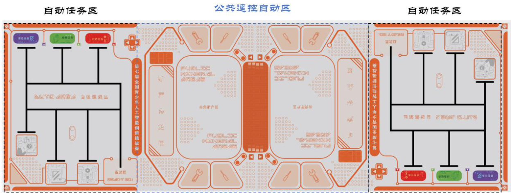
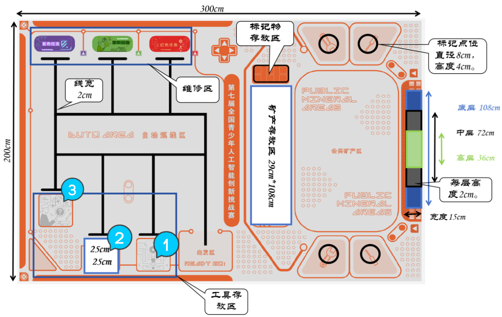

# 第七届全国青少年人工智能创新挑战赛太空探索智能机器人专项赛  

# 参赛手册  

中国少年儿童发展服务中心2024年4月  

# 一、赛事简介  

人工智能是通过研究人类智能活动的规律，构造出具有一定智能的人工系统的科学，主要研究如何让计算机去完成以往需要人的智力才能胜任的工作，也就是研究如何应用计算机的软硬件来模拟人类某些智能行为的基本理论、方法和技术。例如，视觉感知、语音及图像识别、在不确定条件下做出决策、学习、大数据分析、语言翻译等。人工智能关键技术的每一次突破，都将促进智能机器人的性能上一台阶，同理，智能机器人性能的每一次提高，也将推动人工智能关键技术的一大进步。  

随着社会的发展，提高智能机器人的智能化水平、环境自适应性与决策自主性将是机器人技术突破的关键。为了培养青少年的创新能力，考察其对人工智能、机器人、电子技术、编程设计等有关知识的综合运用情况，我们设立了太空探索智能机器人专项赛项目。  

本次挑战赛坚持公益性，赛事任何环节，任何单位都不会向学生、学校收取成本费、工本费、活动费、报名费、食宿费、参赛材料费、器材费和其他各种名目的费用，做到“零收费”；不会指定参与竞赛活动时的交通、酒店、餐厅等配套服务；不会通过面向参赛学生组织与竞赛关联的培训、游学、冬令营、夏令营等方式，变相收取费用；不会推销或变相推销资料、书籍、辅助工具、器材、材料等商品；不会面向参赛的学生、家长或老师开展培训；不会借竞赛之名开展等级考试违规收取费用；不会以任何方式向学生或组织学生参赛的学校转嫁竞赛活动成本。本次挑战赛坚持自愿原则，不强迫、诱导任何学校、学生或家长参加竞赛活动。竞赛以及竞赛产生的结果不作为中小学招生入学的依据。赞助单位不得借赞助竞赛活动进行相关营销、促销活动。  

# 二、参赛条件及分组办法  

1.凡在2024 年7 月前，在校小学、初中、高中、中专或职高学生均可参赛。2.选手所在组别分为：小学低年级组（1-3 年级）、小学高年级组（4-6 年级）、初中组、高中组、中专职高组。3.每队最多可有 2 名指导老师，不同队伍指导老师可以重复。指导老师作为团队责任人，负责保障竞赛期间队员的财产、人身安全，积极参与参赛团队的建设和管理，指导参赛队的队员制定学习计划、解决团队配合问题等，协助参赛队伍顺利完成比赛。4.本赛项以团队赛的方式进行，团队人员配备情况如下：小学低年级组（1-3 年级）：2 人/组；小学高年级组（4-6 年级）：2 人/组：初中组：2 人/组；高中组：2 人/组；中专职高组：2 人/组。每个学校可以派出多支参赛队伍，参赛学生不可跨学段组队。  

# 三、选拔赛参与办法  

1.选拔赛报名。参加活动的青少年通过访问“人工智能创新挑战赛”网站 https://aiic.china61.org.cn/，在首页点击“选拔赛报名”进行在线报名，详细登记相关信息和报名赛项、组别。  

2.参加选拔赛。根据各地区报名实际情况，本赛项选拔赛设置线上、线下两种形式，线下选拔赛采用现场赛的赛制规则，线上选拔赛以线上申报参赛作品，并由专家对作品进行盲评的形式举办。参赛青少年只能选择参加线上或者线下选拔赛中的一种选拔赛。  

3.报名时间：2024 年 4 月 15 日-5 月 15 日，选拔赛时间为 2024 年5 月16 日-7 月1 日（具体时间另行通知）。  

参加选拔赛的青少年需通过“人工智能创新挑战赛”专题网站点击击“参加选拔赛”链接，选择“太空探索智能机器人专项赛”了解选拔赛详细信息。  

4.主办单位将根据选拔赛成绩，甄选出部分优秀选手入围全国挑战赛决赛。  

5.选拔赛成绩可以在 2024 年 7 月 15 日后，登录“人工智能创新挑战赛”网站进行查询，入围决赛的选手可以参加8 月份的全国决赛。  

# 四、选拔赛规则  

（一）线上选拔赛规则。  

1.线上选拔赛简介  

线上选拔赛以线上申报参赛作品，并由专家对作品进行盲评的形式举办。参加活动的青少年需通过“人工智能创新挑战赛”网站点击“参加选拔赛”链接，选择“太空探索智能机器人专项赛”并凭报名信息进入线上竞赛系统参赛。  

参赛学生团队根据比赛主题，使用完整作品尺寸长宽高不可超$250\mathrm{mm}$ (长) $\ast250\mathrm{mm}$ (宽) $\ast250\mathrm{mm}$ (高),重量 3kg 及以下。  

设 备 控 制 处 理 器 采 用 Kendryte210+ESP32+Atemga328 芯 片 或STM32F407 芯片，编程环境使用代码或模块化软件。  

工作电压不超过 9V，电机总数不超过 4 个。  

通过电脑编程、硬件搭建、造型设计等创作实物模型作品，将作品说明内容、作品演示视频、接线图等上传至赛事网站进行参赛。  

# 2.线上选拔赛流程  

线上选拔赛分为报名阶段、作品上传阶段、作品评审阶段。具体比赛日期另行通知。  

表1：线上选拔赛流程  

<html><body><table><tr><td>阶段</td><td>环节</td></tr><tr><td>报名阶段</td><td>参赛学生自行组队 在赛事平台上完成个人信息注册与组队报名</td></tr><tr><td>作品上传阶段</td><td>作品上传阶段开始时，赛事平台将公布作品设计主题 参赛学生需在该阶段，根据作品设计主题，创作智能实物作品， 按照赛事平台要求完成作品说明内容、作品演示视频、接线图 等内容的上传</td></tr><tr><td>作品评审阶段</td><td>参赛学生提交作品将由太空探索智能机器人专项赛专家评审委 员会进行作品盲审或答辩，并甄选出部分优秀参赛学生入围全 国挑战赛</td></tr></table></body></html>  

# 3.线上选拔赛评分标准  

表2：线上选拔赛小学组评分标准  

<html><body><table><tr><td>分数占比</td><td>指标</td><td>描述</td></tr><tr><td rowspan="2">创新性 (30%)</td><td>整体设计有新意(17%)</td><td>功能、结构等具有新意，有一定的实用价值</td></tr><tr><td>细节功能有新意(13%)</td><td>功能细节实现方法有新意 功能设计能突破原有元器件的应用习惯</td></tr><tr><td rowspan="4">人工智能 技术应用 (30%)</td><td>软件实现(8%)</td><td>软件设计功能明确、结构合理、代码优化、易 于调试</td></tr><tr><td>硬件功能实现(12%)</td><td>使用相关元器件等实现的硬件功能具有一定的 科学性、复杂性，有技术含量</td></tr><tr><td>人工智能感知与识别 (6%)</td><td>作品能够模拟人的某种感知和识别能力</td></tr><tr><td>人机交互(4%)</td><td>作品能够实现简单的语音或体感交互的应用</td></tr><tr><td rowspan="2">结构设计 (20%)</td><td>工业设计(8%)</td><td>整体结构设计合理 设计具有美感，并能将美学与实用性相结合</td></tr><tr><td>艺术表现力(12%)</td><td>作品具有一定想象力和个性表现力，能够表达 作者的设计理念</td></tr><tr><td>规范性 (20%)</td><td>设计方案规范性(6%)</td><td>有初始设计，设计方案完备，有作品功能、结 构、相关器件使用等内容</td></tr></table></body></html>  

表3：线上选拔赛初中组评分标准  

<html><body><table><tr><td rowspan="2"></td><td>制作过程规范性(6%)</td><td>制作过程中工具和相关器材使用规范 有详细的器材清单、作品源代码注释规范</td></tr><tr><td>作品完成度(8%)</td><td>作品完成团队初始设计方案的程度 各功能实现的有效程度 作品的成品化程度，包括外观、封装，及整体 的牢固程度、人机交互等界面友好等</td></tr></table></body></html>  

表4：线上选拔赛高中、中专、职高组评分标准  

<html><body><table><tr><td>分数占比</td><td>指标</td><td>描述</td></tr><tr><td rowspan="2">创新性 (30%)</td><td>整体设计有新意(17%)</td><td>功能、结构等具有新意，有一定的实用价值</td></tr><tr><td>细节功能有新意(13%)</td><td>功能细节实现方法有新意 功能设计能突破原有元器件的应用习惯</td></tr><tr><td rowspan="4">人工智能 技术应用 (30%)</td><td>软件实现(6%)</td><td>软件设计功能明确、结构合理、代码优化、易 于调试</td></tr><tr><td>硬件功能实现(10%)</td><td>使用相关元器件等实现的硬件功能具有一定的 科学性、复杂性，有技术含量</td></tr><tr><td>人工智能感知与识别 (8%)</td><td>作品能针对某一具体应用，利用人工智能感知 与识别技术设计方案，模拟和识别的能力</td></tr><tr><td>人机交互(6%)</td><td>针对具体场景，能够实现自然、方便、高效的 人机交互</td></tr><tr><td rowspan="2">结构设计 (20%)</td><td>工业设计(12%)</td><td>设计具有美感，体结构设计合与实用性相结合</td></tr><tr><td>艺术表现力(8%)</td><td>作品具有一定想象力和个性表现力，能够表达 作者的设计理念</td></tr><tr><td rowspan="3">规范性 (20%)</td><td>设计方案规范性(6%)</td><td>有初始设计，设计方案完备，有作品功能、结 构、相关器件使用等内容</td></tr><tr><td>制作过程规范性(6%)</td><td>制作过程中工具和相关器材使用规范 有详细的器材清单、作品源代码注释规范</td></tr><tr><td>作品完成度(8%)</td><td>作品完成团队初始设计方案的程度 各功能实现的有效程度 作品的成品化程度，包括外观、封装，及整体 的牢固程度、人机交互等界面友好等</td></tr></table></body></html>  

<html><body><table><tr><td>分数占比</td><td>指标</td><td>描述</td></tr><tr><td rowspan="2">创新性 (30%)</td><td>整体设计有新意(17%)</td><td>功能、结构等具有新意，有一定的实用价值</td></tr><tr><td>细节功能有新意(13%)</td><td>功能细节实现方法有新意 功能设计能突破原有元器件的应用习惯</td></tr><tr><td>人工智能 技术应用</td><td>软硬件功能实现(5%)</td><td>使用相关元器件实现的硬件相关功能，功能具 有一定的科学性。</td></tr></table></body></html>  

<html><body><table><tr><td rowspan="5">(30%)</td><td></td><td>通过编程实现相关功能、会运用常用的算法。 代码结构合理、具有可读性。</td></tr><tr><td>项目完成度(8%)</td><td>作品按设计方案中描述的功能，可以完整将功 能实现。</td></tr><tr><td>人工智能感知与识别 (9%)</td><td>作品能够实现系统性的人工智能感知与识别 学生能够评估整体感知系统，并提出改进意见</td></tr><tr><td>人机交互(8%)</td><td>作品具有多种人机交互的方式 学生能对制作的人工智能系统进行评估，提出 改进意见</td></tr><tr><td>工业设计(15%)</td><td>整体结构设计合理 设计具有美感，并能将美学与实用性相结合</td></tr><tr><td rowspan="2">(20%) 工程领域</td><td>艺术表现力(5%)</td><td>作品具有一定想象力和个性表现力，能够表达 作者的设计理念</td></tr><tr><td>设计方案应用性(12%)</td><td>设计方案有明确的设计需求，以解决某一个实 际问题提出细化的解决方案。 设计方案具有实际应用价值，可运用于家庭</td></tr><tr><td rowspan="2">应用性及 可实现性 (20%)</td><td>可产品化(8%)</td><td>生活、社会等。 设计方案具有可被产品化的潜力，有从实际产</td></tr></table></body></html>  

如评审委员会发现并最终认定参赛作品存在抄袭、雷同、替做等违反规则情况，将视情节严重扣减作品分数，甚至取消参赛资格。  

# （二）线下选拔赛规则  

# 1.线下选拔赛简介  

参赛学生团队根据比赛主题，使用完整作品尺寸长宽高不可超250mm(长) $\ast250\mathrm{mm}$ (宽) $\ast250\mathrm{mm}$ (高),重量 3kg 及以下。  

设 备 控 制 处 理 器 采 用 Kendryte210+ESP32+Atemga328 芯 片 或STM32F407 芯片，编程环境使用代码或模块化软件。  

工作电压不超过 9V，电机总数不超过 4 个。  

通过电脑编程、硬件搭建、造型设计等创作实物模型作品，现场完成线下选拔赛场地任务。  

# 2.线下选拔赛流程  

比赛时间为1-2 天，流程如下：  

表5：线下选拔赛流程  

<html><body><table><tr><td>环节</td><td>备注</td></tr><tr><td>签到、入场</td><td></td></tr><tr><td>公布纪律</td><td>专家评委现场公布比赛纪律。</td></tr><tr><td>现场创作</td><td>参赛学生需根据竞赛规则，搭建机器人，并加程序编译完成。</td></tr><tr><td>现场竞赛</td><td>竞赛开始前，裁判会进行现场各组抽签，抽中的选手队伍, 两组根据线下选拔赛规则同场竞技，并将成绩记录在册。</td></tr></table></body></html>  

3.太空探索智能机器人专项赛选拔赛详细规则：  

选拔赛任务分为两个环节：自动任务环节、手动任务环节。  

选拔赛总时长为 6 分钟，自动任务环节 120 秒，设备改造时间 120秒，手动任务环节120 秒。  

每支队伍共有两名参赛者，每组参赛选手操作一台设备，每支队伍的指导教师不得超过两名，指导教师不得参与比赛过程。  

场地及道具：  

  
图1：全场地图  

  
图2：半场地图  

竞赛场地图为 $200\mathrm{cm}\times600\mathrm{cm}$ ，场地划分为自动任务区、公共遥控任务区域。场地中的黑色巡线线条宽度为 2cm，零件以及太空能量块均为尺寸 $4\mathrm{cm}\times4\mathrm{cm}\times4\mathrm{cm}$ 的 EVA 材质立方体。太空资源分为能源矿产（红色立方体）、金属矿产（紫色立方体）、 绿色稀有矿产（绿色立方体），场地中矿产资源置物架每层高2cm，最高为三层高度。 标记物尺寸 4cm$\times4\mathrm{cm}\times4\mathrm{cm}$ 的 EVA 材质白色立方体，待标记区的标记点为直径为8cm，高度为4cm 的圆形桶柱。  

竞赛详细规则：  

各环节比赛要求适用于：小学低年级（1-3 年级）、小学高年级（4-6年级）、初中、高中、职高  

自动环节要求：  

设备全自动巡线运行，此环节不得使用任何形式的遥控器，启动后不可再次碰触设备，直至自动环节任务完成或自动环节时间截至。  

同场竞技的两队选手同为一个年级组，场地两端各设有一个出发点，比赛前从裁判处抽签决定左右半场出发点。出发后机器人需要先行进至工具区，识别不同颜色的方块后让机器人亮出对应颜色的灯光，通过自动巡线方式到达指定维修区并放置该零件，完成任务后需回到终点。  

三个零件颜色分别是红色、紫色、绿色；  

小学低年级（1-3 年级）组不需要识别颜色，从起点出发后进入第一工具区，选择工具区的任意一个方块带回并放置至任意维修区，最终回到起点即完成任务。  

小学高年级（4-6 年级）组从起点出发后进入第一工具区，识别相应方块颜色，机器人亮出对应颜色灯光，将该颜色块带回至维修区所对应颜色的区域，最终回到起点即完成任务。  

初中组：机器人自动进入工具区后，机器人需随机识别两个方块并亮出对应颜色灯光，将该方块放置对应的维修区域，最终回到起点即完成任务。  

高中组：机器人自动进入工具区后，机器人需识别红色和绿色（裁判随机位置放置）颜色方块并亮出对应颜色灯光，将该方块放置对应的维修区域，最终回到起点即完成任务。  

得分设置：每成功识别一个颜色亮起相同颜色灯光获得 100 分，每成功完成一个任务获得 200 分，顺利返回到起点获得100 分。  

遥控环节要求：  

设备经过 120 秒的改造后，在各自出发点出发获取公共开采区的矿产，公共区域矿产资源分布在置物架或地面上。  

获取后放置在己方矿产存放区内才算成功，不得进入对方矿产存放区获取矿产。  

绿色稀有矿产放置在 6cm 高的置物架上共 20 个，每获取 1 个得 50分；红色能源矿产放置在 4cm 高的置物架上共 30 个，每获取 1 个得 30分；紫色金属矿产放置在 2cm 高的置物架 20 个、随机分布在遥控区地面上30 个，每获取1 个得20 分。  

每一方在标记物处有 6 个白色标记物，在公共任务区有 8 个放置区（高度为 4CM 内直径为 8CM 的桶柱），每放置一个则获得 100 分。已被标记区域不可重复标记，更不可破坏已标记位置。  

机器人遥控方式不限，设备一旦开启后，不得碰触设备。  

比赛注意事项：  

听从裁判指令，不得私自移动、启动设备，不得碰触场上道具设备。不得恶意阻挡、碰撞对方机器人。  

比赛期间，若设备出现故障，经裁判同意后，可将设备修整后重新出发，计时不停止。  

不可使用其他组设备或未经检录合格的设备，不得中途更换选手或替赛。  

警告 3 次裁判有权终止该队比赛资格。  

对参赛队伍的比赛总得分（包括选拔赛得分和答辩得分）进行排序，在平分的情况下，并列排名。  

其他事项  

答辩需由两名组队选手一同参加，若其中一名选手未按时参赛，包含迟到15 分钟以上的参赛队，视为答辩环节弃权，得分为 0。  

比赛期间，规则中未尽事项由裁判委员会决定。竞赛组委会授权裁判委员会对比赛规则进行解释。  

本规则是实施裁判工作的依据。竞赛中如遇争议，裁判委员会通过复查比赛过程做出最终裁决。涉及裁决的任何异议需由参赛选手在比赛期间向裁判委员会提出。  

<html><body><table><tr><td colspan="8">全国青少年人工智能创新挑战赛-太空探索智能机器人专项赛评分表 （小学低年级组1-3年级）</td></tr><tr><td rowspan="2">参赛 队伍 名称</td><td rowspan="2">姓名</td><td colspan="2">自动任务</td><td colspan="3">遥控任务</td><td rowspan="2">总分</td></tr><tr><td>完成任 务（200 分/个)</td><td>回到起点 (100 分）</td><td>绿色矿 产（50 分/个)</td><td>红色矿 产（30 分/个)</td><td>紫色矿产 标记物 (20分/ （100分 个）</td></tr><tr><td></td><td></td><td></td><td></td><td></td><td></td><td>/个)</td><td></td></tr></table></body></html>  

表6：选拔赛评分表  

<html><body><table><tr><td colspan="9">全国青少年人工智能创新挑战赛-太空探索智能机器人专项赛评分表 （小学低年级组4-6年级）</td></tr><tr><td rowspan="2">参赛 队伍 名称</td><td rowspan="2">姓名</td><td colspan="3">自动任务</td><td colspan="3">遥控任务</td><td rowspan="2">标记物 总 （100 分</td></tr><tr><td>识别颜 色（100 分/个)</td><td>完成任 务（200 分/个)</td><td>回到起 点（100 分）</td><td>绿色 矿产 (50 分/个)</td><td>红色矿 产（30 分/个)</td><td>紫色 矿产 (20 分/ 分/个)</td></tr><tr><td></td><td></td><td></td><td></td><td></td><td></td><td></td><td>个)</td><td></td><td></td></tr></table></body></html>  

<html><body><table><tr><td colspan="10">全国青少年人工智能创新挑战赛-太空探索智能机器人专项赛评分表 （初中组）</td></tr><tr><td rowspan="2">参赛 队伍 名称</td><td rowspan="2">姓名</td><td colspan="3">自动任务</td><td colspan="3">遥控任务</td><td></td><td rowspan="2">总 分</td></tr><tr><td>识别颜 色（100 分/个)</td><td>完成任 务（200 分/个)</td><td>回到起 点（100 分）</td><td>绿色 矿产 （50 分/个)</td><td>红色矿 产（30 分/个)</td><td>紫色 矿产 (20 分/</td><td>标记物 （100 分/个)</td></tr><tr><td></td><td></td><td></td><td></td><td></td><td></td><td></td><td>个)</td><td></td><td></td></tr></table></body></html>  

<html><body><table><tr><td colspan="9">全国青少年人工智能创新挑战赛-太空探索智能机器人专项赛评分表 （高中组）</td></tr><tr><td rowspan="2">参赛 队伍 名称</td><td rowspan="2">姓名</td><td colspan="3">自动任务</td><td colspan="3">遥控任务</td><td rowspan="2">标记物 总 （100 分</td></tr><tr><td>识别颜 色（100 分/个)</td><td>完成任 务（200 分/个)</td><td>回到起 点（100 分）</td><td>绿色 矿产 (50 分/个)</td><td>红色矿 产（30 分/个)</td><td>紫色 矿产 (20 分/ 分/个) 个)</td></tr><tr><td></td><td></td><td></td><td></td><td></td><td></td><td></td><td></td><td></td><td></td></tr></table></body></html>  

# 五、全国挑战赛决赛规则  

全国决赛比赛时间为 2 天，将在竞赛抽签情况；其余规则、器材设置等与线下选拔赛规则一致，在完成现场赛之后，增加答辩环节。  

答辩评审原则及要求适用于：小学低年级（1-3 年级）、小学高年级（4-6 年级）、初中、高中、职高。  

此环节为创意创新设计赛，该环节是为了考察学生的创新能力、逻辑思维能力与解决问题的能力。参赛选手可以根据自己的喜好或者是对日常事物的观察，结合相关科技和自然知识，发挥自身创造性，创造或改造出具有一定人工智能（AI）元素的作品。  

在比赛过程中，选手需要给出最终的设计成品和创意创新过程中的设计思路，并且通过现场演示、现场解说与回答问题的形式得到专家评委的打分。本环节没有固定的创意创 新范围，选手可以根据自己的想法进行创新设计。每支参赛队中的两名选手共同完成一个作品。  

选题：创作思路或想法必须是选手本人提出的。  

设计和创作：设计中的创造性贡献必须是选手本人构思和完成。主要设计点的论据必须是选手通过观察、考察、实验等探索方法亲自获得的。选手本人必须参与作品的制作。  

创新性原则：创新是技术活动的本质所在，在设计作品时，选手应根据日常生活经验，展开丰富、科学的联想，并积极附注于实践。创造新方法、新成果、新价值。  

可行性原则：所设计的作品应具备良好的科学性、可操作性和安全性。作品完成后，既有科学依据，也可以完成某一项或几项功能与任务。鼓励选手利用现有资源，整合身边可取的材料完成相关创作。  

趣味性原则：选手应该结合自己年龄特点和任务过程及完成情况，使作品具有一定的知识性和趣味性。使评委能对该作品产生浓厚的兴趣，给予足够的关注。  

可发展性原则：一个好的创新作品应该是有生长点的。  

选手可以在知识与能力的拓展后，继续完善其作品，使之具有更好的性能。  

答辩过程：  

每组选手的汇报时间为 3-5 分钟，过程只有一次，无任何重赛原则，如有特殊情况比赛期间及时向组委会反应。  

在答辩过程中需保持良好的答辩环境，无回音、无噪音。  

在结束自己的答辩后，选手在网络会议中需保持安静，等待主持人/评委下一步指令。如严重扰乱答辩或者影响他人答辩的选手，取消其比赛资格或成绩清零。  

表:7：答辩评分表：  

<html><body><table><tr><td>参赛队伍 及姓名</td><td></td><td>总 分</td><td></td></tr><tr><td>作品名称</td><td></td><td></td><td></td></tr><tr><td colspan="4">评分标准</td></tr><tr><td>评分类别</td><td>评分内容</td><td>考评」得 标准</td><td>分</td></tr></table></body></html>  

<html><body><table><tr><td rowspan="6">主题创意 （20分） 紧扣赛事 主题且创 意新颖 展示效果 (20分）</td><td>新颖性和独创性 (参考评审原则说明)</td><td>0-5</td></tr><tr><td>可行性 (参考评审原则说明)</td><td>0-5</td></tr><tr><td>趣味性 (参考评审原则说明)</td><td>0-5</td></tr><tr><td>可发展性 (参考评审原则说明)</td><td>0-5</td></tr><tr><td>资料的完整性、包括《项目说明书》、视频说明是否完整</td><td>0-5</td></tr><tr><td>考察参赛 说明书及视频表达准确清晰、没有歧义、便于阅读和理解</td><td>0-5</td></tr><tr><td>作品的功 能、操作、 资料内容要求是否满足，</td><td>0-5</td></tr><tr><td rowspan="6">以及表现 完整流畅 作品实现 部分 (20分） 考察参赛 作品技术 难度或工 艺技巧， 作品完成</td><td>视频说明中，作品制作过程相对完整，功能演示实现顺利</td><td>0-5</td></tr><tr><td>主题贴合程度、是否贴合太空探索+AI智能主题</td><td>0-5</td></tr><tr><td>作品功能的实现、是否满足设计思路、功能实现的程度</td><td>0-5</td></tr><tr><td>科学性的应用、应用场景及作品制作设计的理论原理是否 科学</td><td>0-5</td></tr><tr><td>技术、技能的应用难度、实现难度</td><td>0-5</td></tr><tr><td>作品的整体结构和外观是否完整</td><td>0-5</td></tr><tr><td rowspan="3">设计美化 (20分） 考察作品 的外观、 结构、创 意设计等</td><td>设计外观或硬件的结构创作，是否符合设计原理</td><td>0-5</td></tr><tr><td>设计材料的使用是否无毒、无害、无污染</td><td>0-5</td></tr><tr><td>作品美观度，色彩与造型是否和谐、细节是否精致</td><td>0-5</td></tr><tr><td rowspan="4">现场答辩 （20分） 考察选手 答辩的反 应、表述、 逻辑、知 识面等</td><td>表达能力、是否表达清晰，观点明确，表述清楚</td><td>0-5</td></tr><tr><td>逻辑能力、条理清楚，紧扣主题、</td><td>0-5</td></tr><tr><td>反应能力、简洁明确，对答如流、</td><td>0-5</td></tr><tr><td>知识储备、是否对自己作品涉及内容了解全面，有针对性</td><td>0-5</td></tr></table></body></html>  

# 六、回避范围及方式  

# （一）回避范围  

回避是指评审专家具有法定情形，必须回避，不参与相关作品评审的制度。按照相关规定，结合竞赛活动实际，如果评审专家具备以下情形之一的，应当回避：  

（1）是参赛选手的近亲属；  
（2）与参赛选手有其他直接利害关系；  
（3）担任过参赛选手的辅导老师、指导老师的；  
（4）与参赛选手有其他关系，可能影响公正评审的。  

# （二）回避方式  

回避方式有自行回避与申请回避两种：  

1.自行回避  

评审专家自行提出回避申请的，应当说明回避的理由，口头提出申请的，应当记录在案。  

评审专家有上述（1）（2）（3）（4）情形之一的，应当自行回避。  

评审专家在活动评审过程中，发现有上述（1）（2）（3）（4）情形之一的，应当自行提出回避；没有自行提出回避的，活动组委会应当决定其回避。评审专家自行回避的，可以口头或者书面提出，并说明理由。口头提出申请的，应当记录在案。  

# 2.申请回避  

参赛选手及评审专家要求其他评审专家参与回避的，应当提出申请，并说明理由。口头提出申请的，应当记录在案。  

# 七、异议处理机制  

1.第七届全国青少年人工智能创新挑战赛接受社会的监督，挑战赛  

的评审工作实行异议制度。  

2.任何单位或者个人对第七届全国青少年人工智能创新挑战赛参赛选手、参赛单位及其项目的创新性、先进性、实用性及推荐材料真实性、比赛成绩等持有异议的，应当在项目成绩公布之日起 10 日内向活动组委会提出，逾期不予受理。  

3.提出异议的单位或者个人应当提供书面异议材料，并提供必要的证明文件。提出异议的单位、个人应当表明真实身份。个人提出异议的，应当在书面异议材料上签署真实姓名；以单位名义提出异议的，应当加盖本单位公章。以匿名方式提出的异议一般不予受理。  

4.提出异议的单位、个人不得擅自将异议材料直接提交评审组织或者评审专家；专家收到异议材料的，应当及时转交活动组委会，不得提交评审组织讨论和转发其他评审专家。  

5.活动组委会在接到异议材料后应当进行审查，对符合规定并能提供充分证据的异议，应予受理。  

6.为维护异议者的合法权益，活动组委会、推荐单位及其指导老师，以及其他参与异议调查、处理的有关人员应当对异议者的身份予以保密；确实需要公开的，应当事前征求异议者的意见。  

7.涉及参赛选手所完成项目的创新性、先进性、实用性及推荐材料真实性、比赛成绩的真实性等内容的异议由活动组委会负责协调，由有关指导单位或者指导老师协助。参赛选手接到异议通知后，应当在规定的时间内核实异议材料，并将调查、核实情况报送活动组委会审核。必要时，活动组委会可以组织评审专家进行调查，提出处理意见。涉及参赛选手及其排序的异议由指导单位或者指导老师负责协调，提出初步处理意见报送活动组委会审核。参赛选手接到异议材料后，在异议通知规定的时间内未提出调查、核实报告和协调处理意见的，该项目不认可其比赛成绩。  

8.异议处理过程中，涉及异议的任何一方应当积极配合，不得推诿和延误。参赛选手在规定时间内未按要求提供相关证明材料的，视为承认异议内容；提出异议的单位、个人在规定时间内未按要求提供相关证明材料的，视为放弃异议。  

9.异议自异议受理截止之日起60 日内处理完毕的，可以认可其比赛成绩；自异议受理截止之日起一年内处理完毕的，可以直接参加下一年度比赛。  

10.活动组委会应当向活动专家评审委员会报告异议核实情况及处理意见，并将决定意见通知异议方和参赛选手。  

# 八、赛事组委会  

本届挑战赛信息发布平台为：  

“中国少年儿童发展服务中心”微信公众号；  
主办单位网站：http://www.china61.org.cn；  
挑战赛网站：http://aiic.china61.org.cn。  

组委会联系方式：  

联系人：屈老师、辛老师邮  箱：xiaoyuanshi@163.com电  话：010-65124399  

涉赛违规问题线索专用举报邮箱：ghstfmct@163.com赛事技术咨询：  

联系人：郅威 电话：18614068638  

# 九、知识产权声明  

挑战赛组委会鼓励并倡导技术创新以及技术开源，并尊重参赛队的知识产权。参赛队伍比赛中开发的所有知识产权均归所在队伍所有，组委会不参与处理队伍内部成员之间的知识产权纠纷，参赛队伍须妥善处理本队内部学校及其他身份的成员之间对知识产权的所有关系。参赛队伍在使用组委会提供的裁判系统及赛事支持物资过程中，须尊重原产品的所有知识产权归属方，不得针对产品进行反向工程、复制、翻译等任何有损于归属方知识产权的行为。  

# 十、主办单位免责声明  

1.未经主办单位书面授权，任何单位和个人以本赛事名义开展的活动均属假冒、侵权。  

2.主办单位不会以本赛事名义向学生收取任何费用，更不会以本赛事名义举办夏冬令营、培训班，捆绑销售器材商品、书籍材料等。本赛事也不存在任何指定器材、指定培训机构、指定教材等，请参与活动的师生和家长朋友们谨防上当受骗。  

3.所有参赛作品，均须为参赛个人原创，不能存在任何侵犯第三方权利的内容，不能违反法律法规的规定。  

# 十一、线下活动注意事项  

1.参与活动人员必须牢固确立“安全第一”的意识，把活动安全放在首要位置。严格注意用电安全，相关机器人设备须提前充好电，准备好备用电池，规范用电，防止触电。严格注意防火安全，禁止携带易燃易爆等危险品和打火机、火柴等进入赛场。严格注意操作安全，活动期间如有发射弹丸、切割材料、器件焊接等危险操作时必须戴好头盔、手套、护目镜等防护措施。活动期间，参与活动人员应熟悉场地环境，若遇紧急情况，严格服从安保人员指挥。  

2.参与活动人员应提前购买保额不低于人民币 50 万元的人身意外伤害保险和意外医疗保险等风险保险。3.参与活动人员应遵守场地制度，爱护公共设施，自觉保持公共卫生。4.请参与活动人员妥善保管自己的贵重物品（如现金、笔记本电脑、手机和参赛设备等），避免丢失或损坏。  

# 十二、其它  

1.关于挑战赛规则的任何补充、修订，将在中国少年儿童发展服务中心网站及微信公众号上发布。2.比赛期间，规则中没有说明的事项由专家评审委员会现场决定。3.主办单位和专家评审委员会对规则中未说明及有争议的事项拥有最后解释权、补充权和决定权。  