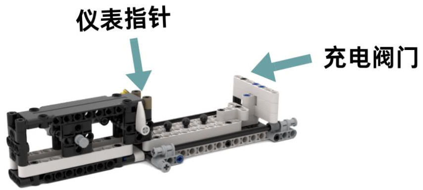

# 第七届全国青少年人工智能创新挑战赛无人驾驶智能车专项赛  

# 参赛手册  

中国少年儿童发展服务中心2024年4月  

# 一、赛事简介  

人工智能是通过研究人类智能活动的规律，构造出具有一定智能的人工系统的科学，主要研究如何让计算机去完成以往需要人的智力才能胜任的工作，也就是研究如何应用计算机的软硬件来模拟人类某些智能行为的基本理论、方法和技术。在此基础上，以“电动化、智能化、网联化”等为特征的新能源智能网联汽车，正在颠覆我们的出行体验。更聪明的车、更网联的路，会造就更美好的城市、更便捷的出行。  

为了培养青少年的创造能力，考察其对人工智能、机器人、自动驾驶等有关知识的综合运用情况，我们设立了无人驾驶智能车专项赛项目。参赛青少年将在限定的时间内，在模拟场地上按照规则进行竞技。项目从我国智能网联、新能源汽车、燃料电池示范城市、智慧城市协同等实际场景出发，设计了一系列具有知识性、互动性、参与性的挑战项目，考察学生在人工智能原理、程序编写、机器人搭建与控制、智能网联技术应用等方面的实践能力。  

本次挑战赛坚持公益性，赛事任何环节，任何单位都不会向学生、学校收取成本费、工本费、活动费、报名费、食宿费、参赛材料费、器材费和其他各种名目的费用，做到“零收费”；不会指定参与竞赛活动时的交通、酒店、餐厅等配套服务；不会通过面向参赛学生组织与竞赛关联的培训、游学、冬令营、夏令营等方式，变相收取费用；不会推销或变相推销资料、书籍、辅助工具、器材、材料等商品；不会面向参赛的学生、家长或老师开展培训；不会借竞赛之名开展等级考试违规收取费用；不会以任何方式向学生或组织学生参赛的学校转嫁竞赛活动成本。本次挑战赛坚持自愿原则，不强迫、诱导任何学校、学生或家长参加竞赛活动。竞赛以及竞赛产生的结果不作为中小学招生入学的依据。赞助单位不得借赞助竞赛活动进行相关营销、促销活动。  

# 二、参赛条件及分组办法  

1.在校小学、初中、高中、中专或职高学生均可参赛。  

2.选手所在学段组别分为：小学低年级组、小学高年级组、初中组、高中组、中职职高组。  

3.无人驾驶智能车专项赛分个人赛和团队赛两种，个人赛为 1 人，团队赛为2-3 人（自行组队）。  

4.每人/队最多可有 2 名指导老师，多名学生的指导老师可以重复。指导老师作为责任人，有责任监督竞赛期间人身安全、保护财产，指导参赛学生制定学习计划，督促参赛学生顺利完成比赛。  

# 三、选拔赛参与办法  

1.选拔赛报名。参加活动的青少年通过访问“全国青少年人工智能创新挑战赛”网站 http://aiic.china61.org.cn/，在首页点击“选拔赛报名”进行在线报名，详细登记相关信息和报名赛项、组别。  

2.参加选拔赛。根据各地区报名实际情况，本赛项选拔赛设置线上、线下两种形式，线下选拔赛采用现场搭建和完成指定任务的方式，线上选拔赛以提交选手搭建及完成指定任务过程的不间断记录视频的方式，并由专家根据选手参赛情况进行评判。参赛青少年只能选择参加线上或者线下选拔赛中的一种选拔赛。  

3.报名时间：2024 年 4 月 15 日-5 月 15 日，选拔赛时间为 2024 年5 月16 日-7 月1 日（具体时间另行通知）。  

参加选拔赛的青少年需通过“全国青少年人工智能创新挑战赛”网站点击“参加选拔赛”链接，选择“无人驾驶智能车专项赛”了解选拔赛详细信息。  

4.主办单位将根据选拔赛的成绩，甄选部分优秀选手入围全国挑战赛决赛。  
5.选拔赛成绩可以在 2024 年 7 月 15 日后，登录“全国青少年人工智能创新挑战赛”网站进行查询，入围决赛的选手可以参加全国决赛。  

# 四、参赛器材要求  

1.无人驾驶智能车专项赛原则上不限制参赛选手参赛器材，但应注意禁止使用高度集成模块化器材。  

2.参赛车辆应为轮式机器人类型，且只允许使用一个控制器，主控电压不高于 $9\mathrm{V}$ 。  

3.无人车最多可以使用 4 枚电机，种类不限。无人车不限制使用传感器数量。  

4.现场比赛开始编程前，车辆控制器中不得存储任何程序。  

5.在启动“任务”之前，车辆的最大尺寸必须在 $250\mathrm{mm}\times250\mathrm{mm}\times250\mathrm{mm}$ 以内，车辆离开“出发区”后尺寸无限制。  

6.如果队伍需要使用零件搭建扩展工具，在“出发区”对无人车出发前的姿态进行校准，则工具的大小不得超出“出发区”。  

7.未连接至车辆的额外控制器不允许使用。无人车必须依靠程序自主完成“任务”，不允许使用任何“非自主”的方式对无人车进行控制（例如无线电通讯、遥控或有线控制系统）。  

# 五、竞赛场地  

  
图1：竞赛场地地图示例  

1.比赛场地地图尺寸为 2360x1141mm；  

2.用于放置场地地图的赛桌内部尺寸应与地图一致或各维度误差不超过±5mm；  

3.赛桌围挡高度为 $80\pm10\mathrm{mm}$ ，厚度不限；  

4.比赛场地地图表变应印有哑光面或覆盖层（无反射色）。  

# 六、赛制规则  

（一）任务概述说明。  

1.车辆出发（满分10 分）  

每轮比赛开始前，车辆垂直投影应完全位于“出发区”内，在离开出发区前需完成警示任务，完成方法二选一：  

A.控制LED 灯闪烁两次，灯光颜色不限，但闪烁间隔时间不短于 0.2秒。B.车辆在“出发区”内前轮左右摆动两次后回正，左右的摆动夹角  

幅度不低于90 度。  

※注意：“出发区”的黑色边线不包括在“出发区”内，比赛开始时车辆线材也会计入无人车的最大尺寸，因此线材也需要位于“出发区”内。  

  
图2：出发区域示例  

2.断路警示（满分10 分）  

车辆行至断路前，推动断路警示灯滑杆将断路警示灯由绿灯状态旋转至红灯状态，以提醒其他车辆注意。  

  
图3：断路警示灯绿灯状态  

  
图4：断路警示灯红灯状态  

3.礼让行人（满分10 分）  

车辆识别“斑马线”，在等候位置静止 2s，并完全通过斑马线，方式二选一：  

A.车辆在斑马线等候位置鸣笛两声“观察行人”，之后完全通过斑马线区域。B.车辆在斑马线等候位置前轮左右摆动两次后回正“观察行人”，左右的摆动夹角幅度不低于90 度，之后完全通过斑马线区域。  

  
图5：车辆未通过斑马线状态  

  
图6：车辆已通过斑马线状态  

※注意：车辆完成“观察行人”任务后，方可通过。  

4.激活信号（满分10 分）  

车辆行至通讯基站前，拉动基站拉杆将基站“信号发射天线”升起状态改为下降姿态。  

  
图7：“信号发射天线”升起状态  

  
图8：“信号发射天线”下降状态  

5.搜集碎石（满分10 分）  

将高空装置中的五块碎石通过拉动传动杆，转移到碎石收集车中，成功收集1 块碎石获得 2 分。  

  
图9：碎石收集前状态  

  
图10：碎石收集后状态  

6.转移碎石（满分10 分）  

车辆收集完成后，将碎石收集车从 B 虚线区域拉动到 A 虚线区域，此区域为碎石收集区。  

  
图11：碎石转移位置区域示例  

7.获得电池（满分10 分）  

通过按压风能电池装置连柄，将高空中的风能电池取下，装载运送回终点，取下风能电池获得5 分，装载运送回终点获得5 分。  

  
图12：风能电池装置示例  

8.回收电池（满分10 分）  

车辆随机将黄、绿、蓝三个电池回收箱中的指定“电池模组”进行释放回收，并带回“终点区”。“回收电池模组”任务区域有黄、绿、蓝三种颜色的“回收箱”，比赛现场选手在裁判处抽签，以确定任务对应“回收箱”的颜色，选手准确回收抽签指定颜色“回收箱”内的电池模组视为完成任务。  

  
图13：电池回收箱初始状态  

  
图14：电池回收箱释放状态  

9.快速充电（满分10 分）  

车辆行驶至充电站，推动充电阀门，将“仪表指针”旋转至底部，完成充电。  

  
图15：充电站未充电状态  

  
图16：充电站完成充电状态  

10.接送或避让学生（满分10 分）  

小学组与初中组规则：将路边等待的两名学生，安全的接送到终点区即为完成任务。任务完成后车辆应进入“终点区”完全静止，且车辆垂直投影应完全位于“终点区”内（线材允许位于“终点区”外）。  

高中组规则：车辆在行驶过程中遇到两名学生穿行马路，车辆自动识别到前方学生，应用 AI 算法设计使车辆自主判断，并减速避让后进入终点区即为完成任务。任务完成后车辆应进入“终点区”完全静止，且车辆垂直投影应完全位于“终点区”内（线材允许位于“终点区”外）。任务完成后，高中组参赛选手应针对车辆识别目标后的算法应用及程序设计进行阐述，包括算法模型种类、传感器数据收集方式、车辆避让及行驶轨迹预测依据、任务实现步骤及逻辑等。  

  
图17：学生等待区域示例  

  
图18：学生穿行马路示例  

  
图19：终点区域示例  

# （二）选拔赛分组任务说明。  

1.小学低年级组别（1-3 年级）任务：  

选拔赛任务：为检验参赛选手对于参赛设备硬件结构的认知水平，同时鼓励选手的自主创新意识，由参赛选手依据无人车特性应用手中硬件自主搭建出一台能够完成自主巡线、行驶平稳、能够自动识别结束点标记的无人车。并且完成自动巡线行驶和终点识别停车等任务。（无人车现场搭建50 分；自动平稳巡线行驶25 分，识别终点停车 25 分，满分  

# 100 分）  

2.小学高年级组别（4-6 年级）任务：  

选拔赛任务：为检验参赛选手对于参赛设备硬件结构的认知水平，同时鼓励选手的自主创新意识，由参赛选手依据无人车特性应用手中硬件自主搭建出一台能够完成自主巡线、行驶平稳、能够自动识别斑马线、识别结束点标记的无人车。并且完成自动巡线行驶、斑马线停车等待、终点识别停车等任务。（无人车现场搭建 40 分；自动平稳巡线行驶 20分，斑马线停车等待 20 分，识别终点停车 20 分，满分100 分）  

# 3. 初中组别（7-9 年级）任务：  

选拔赛任务：为检验参赛选手对于参赛设备硬件结构的认知水平，同时鼓励选手的自主创新意识，由参赛选手依据无人车特性应用手中硬件自主搭建出一台工程用无人驾驶汽车，可自动识别并清除路障，根据路障的大小采用合理的清理措施，能够完成自主巡线、行驶平稳、障碍物识别及清理等任务。（无人车现场搭建 40 分；自动平稳巡线行驶 20分，识别并清理路障 20 分，识别终点停车 20 分，满分100 分）  

4. 高中组别任务：  

选拔赛任务：为检验参赛选手对于参赛设备硬件结构的认知水平，同时鼓励选手的自主创新意识，由参赛选手依据无人车特性应用手中硬件自主搭建出一台工程用无人驾驶汽车，可自动识别并清除路障，根据路障的大小采用合理的清理措施，能够完成自主巡线、行驶平稳、障碍物识别、清理或躲避等任务。（无人车现场搭建40 分；自动平稳巡线行驶10 分，识别并清理 A 路障20 分，识别并躲避B 路障20 分，识别终点停车10 分，满分100 分）  

# （三）总决赛分组任务说明。  

1.小学低年级组别（1-3 年级）任务：  

总决赛任务：车辆由“出发区”出发，分别完成场地中的1、2、3 任务，并最终返回“终点区”静止。（每项任务 10 分，返回终点 10 分，满分40 分）  

2.小学高年级组别（4-6 年级）任务：  

总决赛任务：车辆由“出发区”出发，分别完成场地中的1、2、3、10 任务，并最终返回“终点区”静止。（每项任务 10 分，满分 40 分）  

3.初中组别（7-9 年级）任务：  

总决赛任务：车辆由“出发区”出发，分别完成场地中的 1、2、3、4、5、6、7、8、10 任务，并最终返回“终点区”静止，其中 8 号任务为抽签回收指定电池模组。（每项任务10 分，满分90 分）  

4.高中组别任务：  

总决赛任务：车辆由“出发区”出发，分别完成场地中的全部任务，并最终返回“终点区”静止，其中 8 号任务为抽签回收指定电池模组。  

（每项任务10 分，满分 100 分）  

（四）比赛用时与实操次数。  

表1：选拔赛用时与实操次数  

<html><body><table><tr><td colspan="2">组别</td><td>搭建调试时间</td><td>任务时长</td><td>实操次数</td></tr><tr><td colspan="2" rowspan="3">小学组</td><td rowspan="3">搭建 30 分钟 调试15 分钟</td><td>120秒/次</td></tr><tr><td></td></tr><tr><td>180秒/次</td></tr><tr><td colspan="4">1) 搭建调试时间：在 30 分钟时间内，参赛队伍完成搭建，由裁判进行设计评分。 搭建评分完成后，参赛队伍依次进入场地，在15分钟内完成设备调试。 2）任务时长：规定时长内选手必须完成本轮比赛，未在规定时间内完成比赛裁</td></tr></table></body></html>  

判员将强制结束本轮比赛。3) 车辆在完成不同关卡任务过程中，可以选择返回至出发点更换外部挂件，也可以一次性完成全部关卡任务。  

表2：总决赛用时与实操次数  

<html><body><table><tr><td>组别</td><td>调试时间</td><td>任务时长</td><td>实操次数</td></tr><tr><td>小学组</td><td rowspan="2">30分钟</td><td>180秒/次</td><td rowspan="2">共2次</td></tr><tr><td>初中组</td><td>240秒/次</td></tr><tr><td>高中组 1)</td><td colspan="3">调试时间：在此时间内，每个参赛队伍依次轮流进行设备调试。 任务时长：规定时长内选手必须完成本轮比赛，未在规定时间内完成比赛裁</td></tr></table></body></html>  

# （五）竞赛成绩计算。  

1.选拔赛成绩计算：  

（1）实操环节取2 次实操中最高分数作为“实操分数”。（2）每支参赛队伍的最终成绩为：无人车搭建分数 $^+$ 实操分数 $+$ 任务剩余时长（剩余时长折算成 1 分/秒）的总和，依据总体分数进行排名。  

2.总决赛成绩计算：  

（1）实操环节取 2 次实操中最高分数作为“实操分数”。（2）每支参赛队伍的最终成绩为：实操分数 $+$ 任务剩余时长（剩余时长折算成1 分/秒）的总和，依据总体分数进行排名。  

# 七、回避范围及方式  

# （一）回避范围  

回避是指评审专家具有法定情形，必须回避，不参与相关作品评审的制度。按照相关规定，结合竞赛活动实际，如果评审专家具备以下情形之一的，应当回避：  

（1）是参赛选手的近亲属；  
（2）与参赛选手有其他直接利害关系；  
（3）担任过参赛选手的辅导老师、指导老师的；  
（4）与参赛选手有其他关系，可能影响公正评审的。  

# （二）回避方式  

回避方式有自行回避与申请回避两种：  

1.自行回避  

评审专家自行提出回避申请的，应当说明回避的理由，口头提出申请的，应当记录在案。  

评审专家有上述（1）（2）（3）（4）情形之一的，应当自行回避。  

评审专家在活动评审过程中，发现有上述（1）（2）（3）（4）情形之一的，应当自行提出回避；没有自行提出回避的，活动组委会应当决定其回避。评审专家自行回避的，可以口头或者书面提出，并说明理由。口头提出申请的，应当记录在案。  

# 2.申请回避  

参赛选手及评审专家要求其他评审专家参与回避的，应当提出申请，并说明理由。口头提出申请的，应当记录在案。  

# 八、异议处理机制  

1.第七届全国青少年人工智能创新挑战赛接受社会的监督，挑战赛  

的评审工作实行异议制度。  

2.任何单位或者个人对第七届全国青少年人工智能创新挑战赛参赛选手、参赛单位及其项目的创新性、先进性、实用性及推荐材料真实性、比赛成绩等持有异议的，应当在项目成绩公布之日起 10 日内向活动组委会提出，逾期不予受理。  

3.提出异议的单位或者个人应当提供书面异议材料，并提供必要的证明文件。提出异议的单位、个人应当表明真实身份。个人提出异议的，应当在书面异议材料上签署真实姓名；以单位名义提出异议的，应当加盖本单位公章。以匿名方式提出的异议一般不予受理。  

4.提出异议的单位、个人不得擅自将异议材料直接提交评审组织或者评审专家；专家收到异议材料的，应当及时转交活动组委会，不得提交评审组织讨论和转发其他评审专家。  

5.活动组委会在接到异议材料后应当进行审查，对符合规定并能提供充分证据的异议，应予受理。  

6.为维护异议者的合法权益，活动组委会、推荐单位及其指导老师，以及其他参与异议调查、处理的有关人员应当对异议者的身份予以保密；确实需要公开的，应当事前征求异议者的意见。  

7.涉及参赛选手所完成项目的创新性、先进性、实用性及推荐材料真实性、比赛成绩的真实性等内容的异议由活动组委会负责协调，由有关指导单位或者指导老师协助。参赛选手接到异议通知后，应当在规定的时间内核实异议材料，并将调查、核实情况报送活动组委会审核。必要时，活动组委会可以组织评审专家进行调查，提出处理意见。涉及参赛选手及其排序的异议由指导单位或者指导老师负责协调，提出初步处理意见报送活动组委会审核。参赛选手接到异议材料后，在异议通知规定的时间内未提出调查、核实报告和协调处理意见的，该项目不认可其比赛成绩。  

8.异议处理过程中，涉及异议的任何一方应当积极配合，不得推诿和延误。参赛选手在规定时间内未按要求提供相关证明材料的，视为承认异议内容；提出异议的单位、个人在规定时间内未按要求提供相关证明材料的，视为放弃异议。  

9.异议自异议受理截止之日起60 日内处理完毕的，可以认可其比赛成绩；自异议受理截止之日起一年内处理完毕的，可以直接参加下一年度比赛。  

10.活动组委会应当向活动专家评审委员会报告异议核实情况及处理意见，并将决定意见通知异议方和参赛选手。  

# 九、赛事组委会  

本届挑战赛信息发布平台为：  

“中国少年儿童发展服务中心”微信公众号；  
主办单位网站：http://www.china61.org.cn；  
挑战赛网站：http://aiic.china61.org.cn。  

组委会联系方式：  

联系人：屈老师、辛老师邮  箱：xiaoyuanshi@163.com电  话：010-65124399  

涉赛违规问题线索专用举报邮箱：ghstfmct@163.com  

赛事技术咨询：  

联系人：任老师、朱老师电话：18510128772、15840804450  

# 十、知识产权声明  

挑战赛组委会鼓励并倡导技术创新以及技术开源，并尊重参赛队的知识产权。参赛队伍比赛中开发的所有知识产权均归所在队伍所有，组委会不参与处理队伍内部成员之间的知识产权纠纷，参赛队伍须妥善处理本队内部学校及其他身份的成员之间对知识产权的所有关系。参赛队伍在使用组委会提供的裁判系统及赛事支持物资过程中，须尊重原产品的所有知识产权归属方，不得针对产品进行反向工程、复制、翻译等任何有损于归属方知识产权的行为。  

# 十一、主办单位免责声明  

1.未经主办单位书面授权，任何单位和个人以本赛事名义开展的活动均属假冒、侵权。  

2.主办单位不会以本赛事名义向学生收取任何费用，更不会以本赛事名义举办夏冬令营、培训班，捆绑销售器材商品、书籍材料等。本赛事也不存在任何指定器材、指定培训机构、指定教材等，请参与活动的师生和家长朋友们谨防上当受骗。  

3.所有参赛作品，均须为参赛个人原创，不能存在任何侵犯第三方权利的内容，不能违反法律法规的规定。  

# 十二、线下活动注意事项  

1.参与活动人员必须牢固确立“安全第一”的意识，把活动安全放在首要位置。严格注意用电安全，相关用电设备须提前充好电，准备好备用电池，规范用电，防止触电。严格注意防火安全，禁止携带易燃易爆等危险品和打火机、火柴等进入赛场。严格注意操作安全，活动期间如有发射弹丸、切割材料、器件焊接等危险操作时必须戴好头盔、手套、护目镜等防护措施。活动期间，参与活动人员应熟悉场地环境，若遇紧  

急情况，严格服从安保人员指挥。  

2.参与活动人员应提前购买保额不低于人民币 50 万元的人身意外伤害保险和意外医疗保险等风险保险。3.参与活动人员应遵守场地制度，爱护公共设施，自觉保持公共卫生。4.请参与活动人员妥善保管自己的贵重物品（如现金、笔记本电脑、手机和参赛设备等），避免丢失或损坏。  

# 十三、其它  

1.关于挑战赛规则的任何补充、修订，将在中国少年儿童发展服务中心网站及微信公众号上发布。2.比赛期间，规则中没有说明的事项由专家评审委员会现场决定。3.主办单位和专家评审委员会对规则中未说明及有争议的事项拥有最后解释权、补充权和决定权。  