# 第七届全国青少年人工智能创新挑战赛虚拟仿真平台创新设计专项赛  

# 参赛手册  

中国少年儿童发展服务中心2024年4月  

# 一、赛事简介  

虚拟仿真平台创新设计专项赛利用先进的人工智能算法和图像处理技术，模拟真实世界中的各种复杂情境，为参赛者创造了一个沉浸式的三维虚拟仿真平台。这一环境不仅逼真还能实时响应参赛者的行为和决策，从而提供了一个无与伦比的人工智能交互式学习体验环境。赛事的显著特点是将复杂的人工智能理论知识和实际应用场景相结合，参赛者能够在解决问题的过程中深入理解人工智能概念，从而实现人工智能知识的实践转化。  

本次赛事的主题为“人工智能助手”，参赛选手基于人工智能三维仿真软件编写程序并控制机器人运动，在虚拟场景内进行各项任务模拟和训练，完成如“训练模型”“协同抓取训练”“人机交互训练”等任务，通过数据训练使人工智能助手能更好的模拟人的操作。  

本次挑战赛坚持公益性，赛事任何环节，任何单位都不会向学生、学校收取成本费、工本费、活动费、报名费、食宿费、参赛材料费、器材费和其他各种名目的费用，做到“零收费”；不会指定参与竞赛活动时的交通、酒店、餐厅等配套服务；不会通过面向参赛学生组织与竞赛关联的培训、游学、冬令营、夏令营等方式，变相收取费用；不会推销或变相推销资料、书籍、辅助工具、器材、材料等商品；不会面向参赛的学生、家长或老师开展培训；不会借竞赛之名开展等级考试违规收取费用；不会以任何方式向学生或组织学生参赛的学校转嫁竞赛活动成本。本次挑战赛坚持自愿原则，不强迫、诱导任何学校、学生或家长参加竞赛活动。竞赛以及竞赛产生的结果不作为中小学招生入学的依据。赞助单位不得借赞助竞赛活动进行相关营销、促销活动。  

# 二、参赛条件及分组办法  

# （一）参赛要求  

1.在校小学、初中、高中、中专或职高学生均可参赛。2.选手所在学段组别分为：小学低龄组、小学高龄组、初中组、高中组(含中专、职高)。3.虚拟仿真平台创新设计专项赛为单人赛，每位参赛选手对应一位指导教师；一位指导教师可对应多位学生。4.指导老师作为责任人，有责任监督竞赛期间人身安全保护、财产，指导参赛学生制定学习计划，督促参赛学生顺利完成比赛。  

# （二）比赛环境  

参赛选手需使用电脑，在人工智能三维仿真软件中进入场景完成任务，参赛所需环境要求如下：  

1.软件环境  

操作系统：Win7 / Win10 64 位的操作系统。  
竞赛平台：人工智能三维仿真软件。  

# 2.硬件环境  

参赛者应自备计算机，品牌不限，推荐配置如下。  

a)处理器：CPU 核心数量不少于2 个，主频不低于2.2GHz。  

b)显卡：支持 Microsoft DirectX® 9 及以上、OpenGL 3.2 及以上的独立显卡、显存2G 以上（显卡发售日期在 2012 年后）。  

c)内存：8GB 以上、虚拟内存2GB 以上。  

d)硬盘：可用空间不少于 10GB 的本地硬盘。  

# 3.监控环境  

监控设备（手机、平板或带有摄像头的移动设备）可联网并能够登录监控会议室。  

# （三）竞赛方式  

1.比赛形式为虚拟竞赛，总时长为90 分钟。2.提交分数后系统会自行记录，并统计参赛选手得分情况。3.每次仿真由比赛平台自动计时，单次仿真时长为200 秒，超过 200秒后将不再得分，但可提交成绩。4.选手可编写程序自动或手动操控机器人完成任务。自动控制说明：启动仿真后智能机器人能自动运行完成任务。手动操控说明：通过键盘操控智能机器人来完成任务。  

# 三、赛项参与办法  

1.选拔赛报名。参加活动的青少年通过访问“人工智能创新挑战赛”网站 https://aiic.china61.org.cn/，在首页点击“选拔赛报名”进行在线报名，详细登记相关信息和报名赛项、组别。  

2.参加选拔赛。根据各地区报名实际情况，本赛项选拔赛为线上选拔赛，以竞赛系统评测和网络直播的方式进行。  

3.报名时间：2024 年 4 月 15 日-5 月 15 日，选拔赛时间为 2024 年5 月16 日-7 月1 日（具体时间另行通知）。  

参加选拔赛的青少年需通过“人工智能创新挑战赛”网站点击“参加选拔赛”链接，选择“虚拟仿真平台创新设计专项赛”了解选拔赛详细信息。  

4.主办单位将根据线上选拔赛的成绩，甄选出部分优秀选手入围全国挑战赛决赛。  

5.选拔赛成绩可以在 2024 年 7 月 15 日后，登录“人工智能创新挑战赛”网站进行查询，入围决赛的选手可以参加全国决赛。  

# 四、竞赛规则  

# （一）虚拟场地介绍  

1. 人工智能虚拟仿真场景三维示意图如图1 所示。  

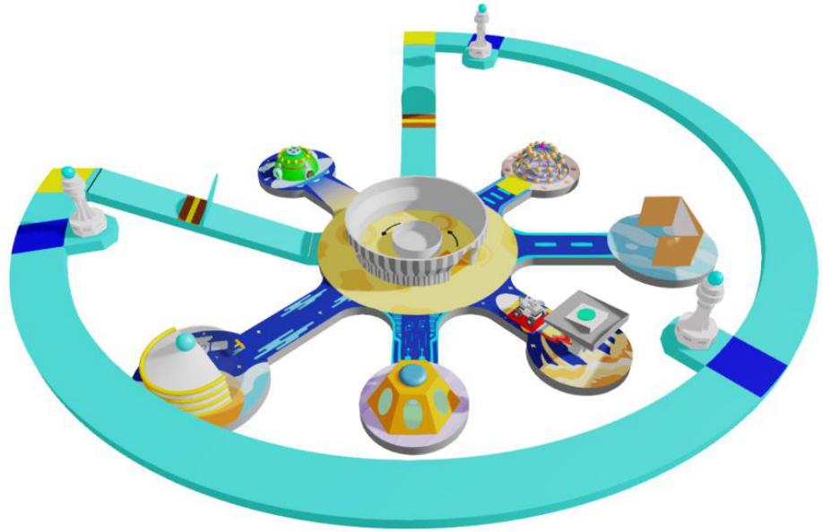  
图 1 人工智能虚拟仿真场景三维示意图  

2.人工智能助手训练任务示意图如图2 所示。  

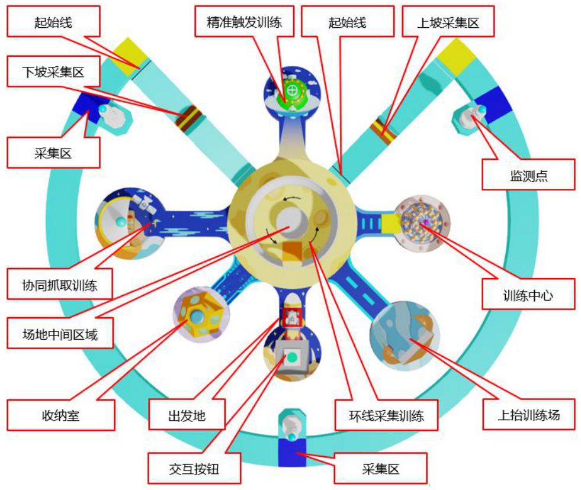  
图2 人工智能助手训练任务示意图  

3.智能机器人功能示意图如图3 所示。  

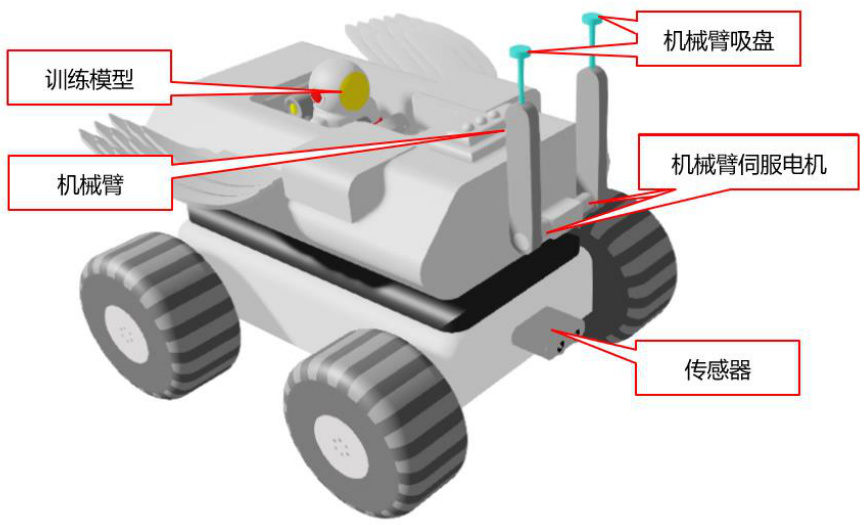  
图3 智能机器人功能示意图  

# （二）任务说明  

挑战赛场景上规定了各组别要完成的任务，各组别要完成的任务数不同。其中“精准触发训练、协同抓取训练、抬升执行训练、随机数据训练”四个任务的位置会在不同场次的比赛中随机调换（位置调换仅在四个任务之间进行，调换后任务完成的方式不变。单场比赛中任务位置保持不变），具体任务分配及变化参照表1。  

表1：各组别任务总览  

<html><body><table><tr><td>序号</td><td>任务名称</td><td>小学低龄组、小 学高龄组</td><td>初中组、高中组</td><td>任务位置</td></tr><tr><td>1</td><td>训练模型</td><td><</td><td><</td><td>固定不变</td></tr><tr><td>2</td><td>精准触发训练</td><td></td><td></td><td>可调换</td></tr><tr><td>3</td><td>协同抓取训练</td><td><</td><td></td><td>可调换</td></tr><tr><td>4</td><td>上坡采集训练</td><td><</td><td><</td><td>固定不变</td></tr><tr><td>5</td><td>弧线采集训练</td><td></td><td></td><td>固定不变</td></tr><tr><td>6</td><td>下坡采集训练</td><td><</td><td><</td><td>固定不变</td></tr><tr><td>7</td><td>环线采集训练</td><td></td><td></td><td>固定不变</td></tr><tr><td>8</td><td>抬升执行训练</td><td></td><td><</td><td>可调换</td></tr><tr><td>9</td><td>人机交互训练</td><td><</td><td><</td><td>固定不变</td></tr></table></body></html>  

<html><body><table><tr><td>10</td><td>随机采集训练</td><td></td><td>√</td><td>可调换</td></tr></table></body></html>  

# （三）任务介绍  

# 1.训练模型  

任务情境：人工智能助手能够认识特定模型，是需要基于训练模型进行机器学习，机器学习过程至少需要形成若干组比对数据才会有效。  

任务描述：智能机器人将训练模型（初始位置在出发地）运载到采集区（如图4 所示黄色区域），系统自动进行机器学习（如图 5 所示），等待3 秒后完成训练。  

（1）等待3 秒期间，智能机器人不能离开采集区，若离开则计时停止，再次进入采集区会重新计时；  

（2）训练模型任务未完成，无法进行后续任务；  

（3）在采集区停留3 秒后训练模型回到车上，获得14 分。  

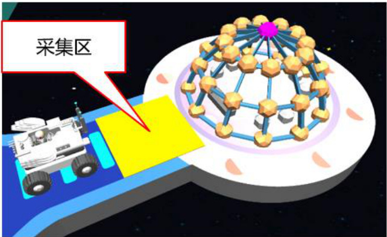  
图4 训练中心采集区  

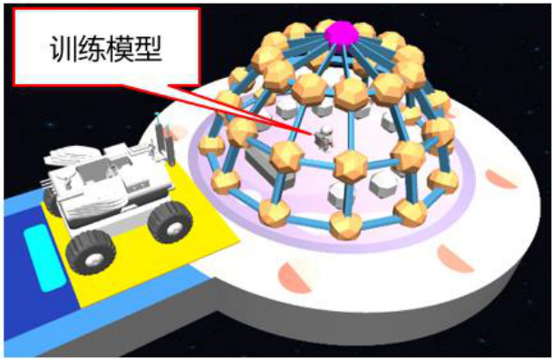  
图5 自动机器学习  

# 2.精准触发训练  

任务情境：机器臂作为人工智能系统中非常常见的执行机构，它通过编程控制以及各种传感器技术的辅助，可以在多个领域内执行精确、复杂的任务。  

任务描述：智能机器人精准触碰红色按钮（如图 6 所示）。获取内部模型（如图7 所示）。  

装备消失后任务完成，获得11 分。  

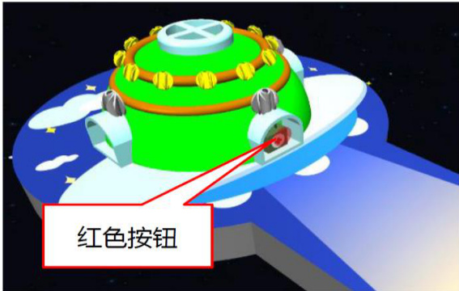  
图6 红色按钮位置  

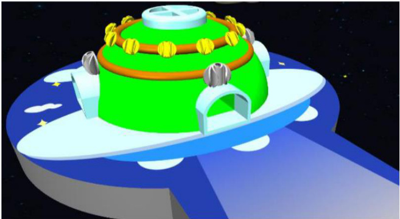  
图7 获取内部模型后  

# 3.协同抓取训练  

任务情境：机器臂可以执行各种精确和复杂的任务，通过精密的控制系统和算法，机械臂可以学习、模拟和储蓄具体动作。这种技术涉及到机器学习、传感器技术以及机械设计，确保机械臂能够在不同的环境和条件下高效、准确地自动执行任务。  

任务描述：使用智能机器人的机械臂转动旋钮装置，打开防护罩（如图 8 所示），再利用机械臂的抓取机构，将识别物运输至场地中间指定位置（如图9 所示）。  

（1）旋转装置旋转超过90 度即可打开防护罩；  

（2）识别物进入场地中间区域会自动消失，每放入一个识别物获得14 分，共2 个(红色和灰色模型得分相同)。  

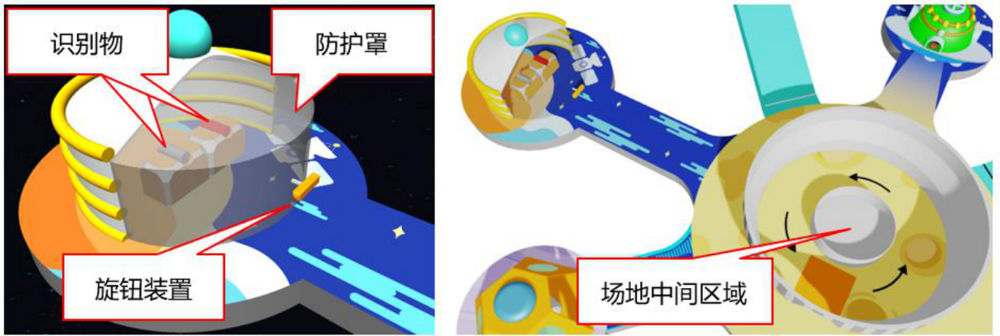  

4.上坡采集训练  

任务情境：智能机器人在上坡时的运动姿态和在水平路面时是不同的，通过传感器定位完成机器人上坡行进的数据模型训练。  

任务描述：智能机器人通过起始线开始计时，3 秒内到达上坡采集区并停车（如图10 所示），完成上坡数据采集并开启环线训练。  

（1）智能机器人传感器前端垂直投影经过起始线后开始计时，第3秒时系统检测停车位置；（2）智能机器人传感器前端垂直投影停留在黄色区域获得 13 分；智能机器人传感器前端垂直投影停留在褐色区域获得 6 分；其他区域不得分（如图11 所示）；  

（3）智能机器人通过上坡起始线3 秒后，障碍物消失。  

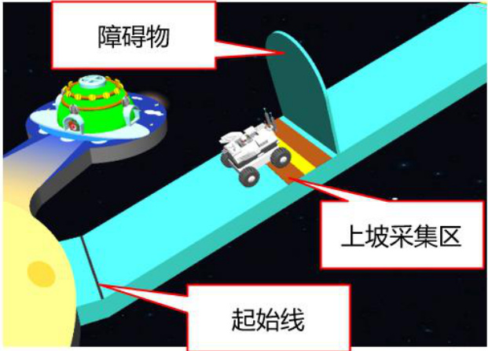  
图8 旋钮装置  
图10 上坡检测位置  

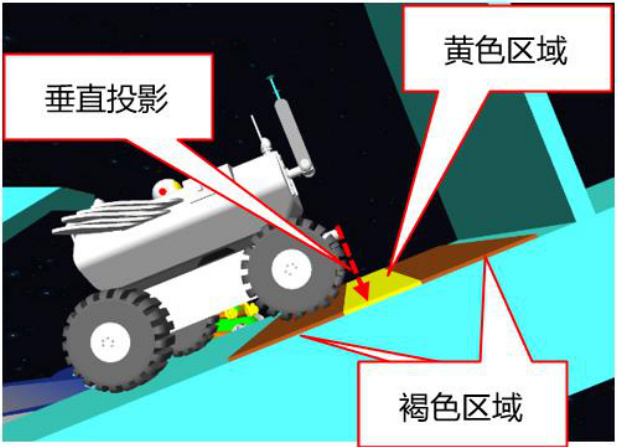  
图9 场地中间区域位置  
图11 垂直投影检测位置  

5.弧线采集训练  

任务情境：智能机器人能够自动驾驶，除了需要具备高级的感知能力，还必须能够对各种环境做出快速准确的决策，如加速、减速、转向等。通过操控机器人完成机器人弧线行进的数据模型训练。  

任务描述：智能机器人经过监测点的采集区（如图 12 所示）,监测点顶部由蓝色变为绿色（如图13 所示），每经过一个获得9 分，共3 个。  

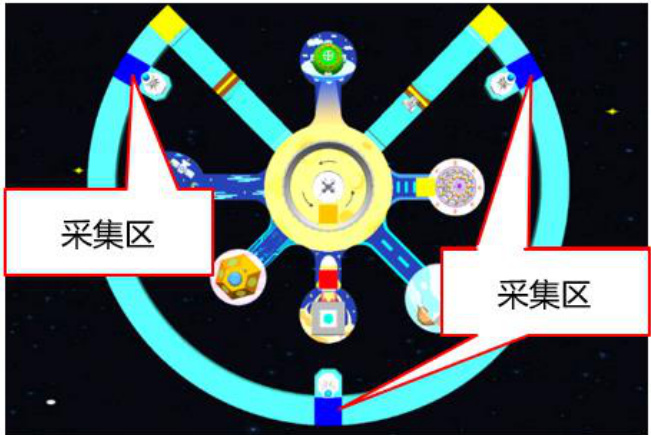  
图12 监测点的采集区  

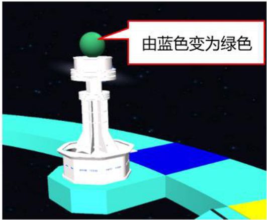  
图13 监测点顶部变为绿色  

# 6.下坡采集训练  

任务情境：智能机器人在下坡时的运动姿态和在水平路面时是不同的，通过传感器定位，完成机器人上坡行进的数据模型训练。  

任务描述：智能机器人通过起始线开始计时，3 秒内到达下坡采集区并停车（如图14 所示），完成下坡数据采集。  

（1）智能机器人传感器前端垂直投影经过起始线后开始计时，第3秒时系统检测停车位置；  

（2）智能机器人传感器前端垂直投影停留在黄色区域获得 13 分；智能机器人传感器前端垂直投影停留在褐色区域获得 6 分；其他区域不得分（如图15 所示）；  

（3）智能机器人通过起始线3 秒后，障碍物消失。  

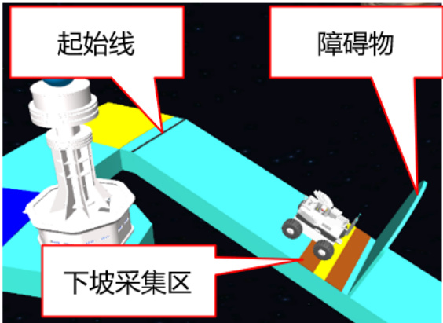  
图14 下坡检测位置  

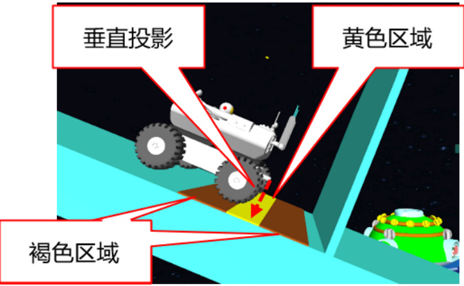  
图15 垂直投影检测位置  

# 7.环线采集训练  

任务情境：通过操控机器人，完成机器人环线行进的数据模型训练。  

任务描述：控制智能机器人从监测起点位置出发，按箭头所指方向行驶一圈并回到监测起点（如图16 所示），完成数据模型训练。  

绕行一圈后，监测起点由橙色变为绿色（如图 17 所示），获得 16分。  

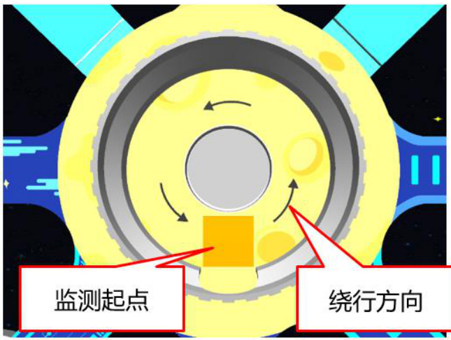  
图16 环线训练地点  

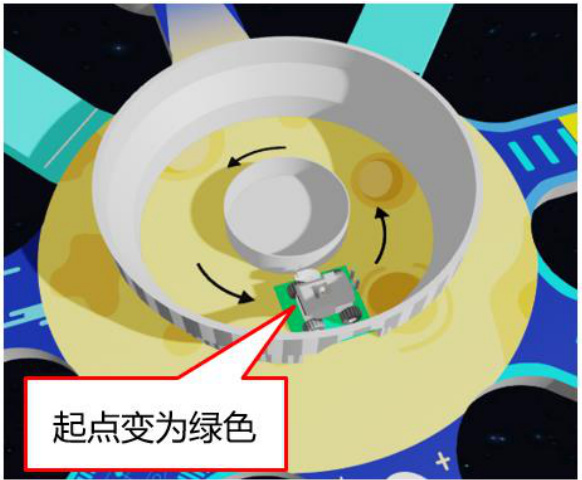  
图17 完成训练  

8.抬升执行训练  

任务情境：控制智能机器人的机械臂，精准上抬开关，完成系统抬升数据模型训练。  

任务描述：智能机器人利用机械臂上抬训练场的开关（如图 18、图19 所示）。  

（1）开关上抬超过 $45^{\circ}$ ，获得10 分。  

（2）小学组无此任务。  

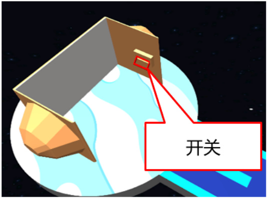  
图18 训练场  

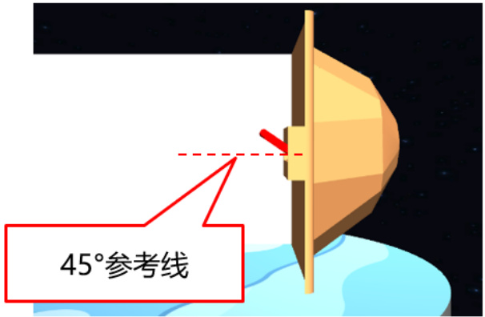  
图19 上抬超过 $45^{\circ}$  

9.人机交互训练  

任务情境：人机交互的核心目标是创建出既高效又易用的交互系统，让用户能随时与人工智能助手协作完成任务，同时在完成任务时能够体验到便利、效率和满意度。  

任务描述：智能机器人完全进入出发地后（如图20 所示），选手通过鼠标点击场景按钮（如图21 所示），完成人机交互训练。  

（1）前序任务（小学组任务 1-7，初、高中组任务 1-8）必须全部完成，智能机器人完全进入出发地后，出发地由红色变为绿色。  

（2）出发地为绿色时，鼠标点击按钮，获得18 分。  

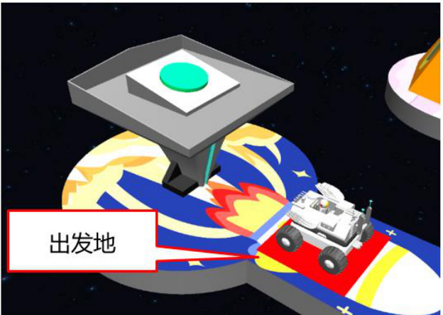  
图20 出发地  

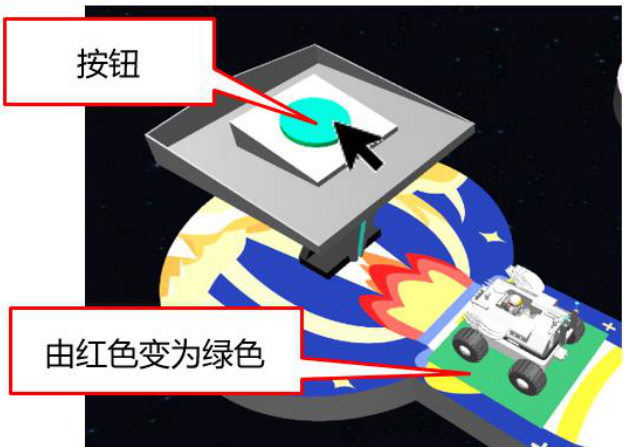  
图 21 按钮  

# 10.随机采集训练  

任务情境：在场景的特定区域会随机出现 2 个模型，通过随机采集的数据，尤其是在复杂或不确定的环境中，能够提供更丰富的情景和问题实例，帮助AI 模型学习如何在各种条件下做出响应。这种能力对于应对现实世界的复杂性和不确定性至关重要。  

任务描述：“人机交互”任务完成后，控制智能机器人收集在场地中间的黄色环状区域内随机出现的模型（如图22 所示），并运送至收纳室（如图23 所示）。  

（1）“人机交互”任务完成前，黄色环状区域内无随机模型；（2）智能机器人将随机模型送入收纳室，每送入 1 个获得 15 分，共2 个；  

（3）小学组无此任务。  

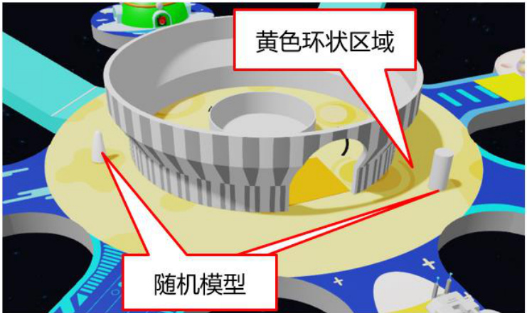  

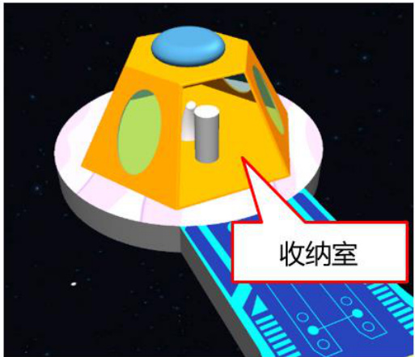  

（四）得分表  

小学低龄组和小学高龄组得分表内容相同，详见表2。初中组和高中组得分表内容相同，详见表3。  

表 2：小学低龄组、小学高龄组得分表  

<html><body><table><tr><td>序号</td><td>任务</td><td colspan="2">描述</td><td>数量分值</td><td></td><td>最高分</td></tr><tr><td>1</td><td>训练模型</td><td colspan="2">智能机器人在训练中心的采集区停留 超过3秒</td><td>1</td><td>14</td><td>14</td></tr><tr><td>2</td><td>精准触发 训练</td><td colspan="2">智能机器人任意部位触碰红色按钮</td><td>1</td><td>11</td><td>11</td></tr><tr><td>3</td><td>协同抓取 训练</td><td colspan="2">转动旋钮装置打开防护罩，利用机械 臂将识别物运输至场地中间区域</td><td>2</td><td>14</td><td>28</td></tr><tr><td rowspan="2">4</td><td>上坡采集 训练</td><td rowspan="2">智能机器人传感器前端</td><td>黄色区域</td><td>1</td><td>13</td><td rowspan="2">13</td></tr><tr><td>垂直投影停留在采集区</td><td>褐色区域</td><td>1</td><td>6</td></tr><tr><td>5</td><td>弧线采集 训练</td><td colspan="2">控制智能机器人进行弧线行进，准确 经过监测点的采集区</td><td>3</td><td>9</td><td>27</td></tr><tr><td rowspan="2">6</td><td>下坡采集</td><td rowspan="2">智能机器人传感器前端 垂直投影停留在采集区</td><td>黄色区域</td><td>1</td><td>13</td><td rowspan="2">13</td></tr><tr><td>训练 环线采集</td><td>褐色区域 控制智能机器人进行环线行进，环绕</td><td>1</td><td>6</td></tr><tr><td>7</td><td>训练</td><td colspan="2">一周回到监测起点</td><td>1</td><td>16</td><td>16</td></tr><tr><td>8</td><td>人机交互 训练</td><td colspan="2">完成前面 1-7 全部任务，智能机器人 完全进入出发地，利用鼠标点击按钮</td><td>1</td><td>18</td><td>18</td></tr></table></body></html>  

<html><body><table><tr><td></td><td></td><td>完成任务</td><td></td><td></td><td></td></tr><tr><td></td><td colspan="5">最高总分 140</td></tr></table></body></html>  

表3：初中组、高中组得分表  

<html><body><table><tr><td>序号</td><td>任务</td><td colspan="2">描述</td><td>数量分值</td><td></td><td>最高分</td></tr><tr><td>1</td><td>训练模型</td><td colspan="2">智能机器人在训练中心的采集区停留 超过3秒</td><td>1</td><td>14</td><td>14</td></tr><tr><td>2</td><td>精准触发 训练</td><td colspan="2">智能机器人任意部位触碰红色按钮</td><td>1</td><td>11</td><td>11</td></tr><tr><td>3</td><td>协同抓取 训练</td><td colspan="2">转动旋钮装置打开防护罩，利用机械 臂将识别物运输至场地中间区域</td><td>2</td><td>14</td><td>28</td></tr><tr><td>4</td><td>上坡采集 训练</td><td rowspan="2">智能机器人传感器前端垂 直投影停留在采集区</td><td>黄色区域 褐色区域</td><td>1</td><td>13</td><td rowspan="2">13</td></tr><tr><td>5</td><td>弧线采集</td><td colspan="2">控制智能机器人进行弧线行进，准确</td><td>1 6 3</td></tr><tr><td></td><td>训练 下坡采集</td><td colspan="2">经过监测点的采集区 智能机器人传感器前端垂 黄色区域</td><td>1</td><td>9 13</td><td rowspan="2">27 13</td></tr><tr><td>6</td><td>训练</td><td colspan="2">直投影停留在采集区</td><td>褐色区域 1</td><td>6</td></tr><tr><td>7</td><td>环线采集 训练</td><td colspan="2">控制智能机器人进行环线行进，环绕 一周回到监测起点</td><td>1</td><td>16</td><td>16</td></tr><tr><td>8</td><td>抬升执行 训练</td><td colspan="2">智能机器人利用机械臂上抬训练场的 开关，超过45°</td><td>1</td><td>10</td><td>10</td></tr></table></body></html>  

<html><body><table><tr><td>9</td><td>人机交互 训练</td><td>完成前面 1-8 全部任务，智能机器人 完全进入出发地，利用鼠标点击按钮 完成任务</td><td>1</td><td>18</td><td>18</td></tr><tr><td>10</td><td>随机采集 训练</td><td>“人机交互”任务完成后，在场地中 间黄色环状区域内，会出现位置随机 的模型，将其运输到收纳室</td><td>2</td><td>15</td><td>30</td></tr><tr><td></td><td colspan="3">最高总分</td><td></td><td>180</td></tr></table></body></html>  

# 五、线上选拔赛流程  

# （一）赛前准备  

1.参加活动的青少年需通过“人工智能创新挑战赛”网站点击“参加选拔赛”链接，选择“虚拟仿真平台创新设计专项赛”并凭报名信息获取竞赛统一发放的比赛账号和监控会议号进行参赛。  

2.比赛开始前参赛选手需检查计算机、网络、监控等设备是否满足比赛要求。  

监控会议室机位角度要求：  

将监控设备横向放置，架设在身后斜上 $45^{\circ}$ 方向，如是手机则需开启自动旋转功能，开启摄像头，监控画面可观察到电脑屏幕和选手周边环境。架设效果如图 24 所示。  

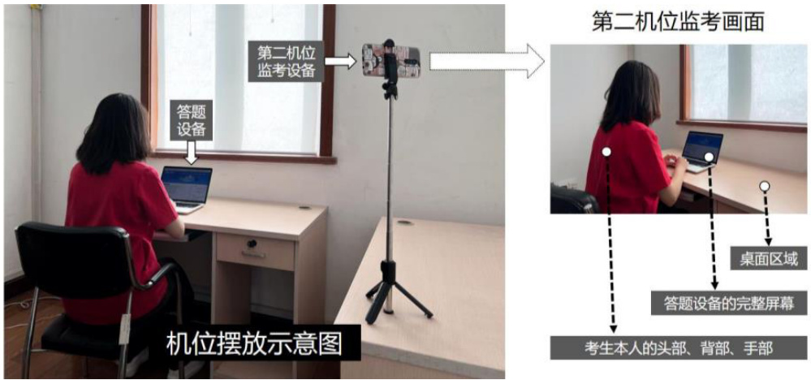  
图24 监控环境布置  

3.根据组委会要求，在规定时间内用发放的参赛账号登录竞赛平台进行参赛。  

4.比赛开始前 10 分钟，参赛选手下载竞赛场景，确认无误后开始比赛。  

# （二）竞赛期间  

在竞赛时间内，参赛选手可以编程并随时进入仿真环境进行测试，也可以多次点击“提交成绩”按钮进行成绩提交，系统将自动保留提交的最高成绩。如整场比赛未点击“提交成绩”，则无成绩。  

# （三）评审机制  

提交分数后系统会自行记录并统计参赛选手得分情况，参赛选手按仿真成绩排名。如果出现成绩并列的情况，则按如下顺序排名：  

1.仿真用时少的选手在前；  
2.仿真最高成绩提交时间早的选手在前。  

# 六、全国挑战赛决赛规则  

全国决赛与线上选拔赛规则一致，任务内容不变，任务难度增加。  

# 七、异议处理机制  

1.第七届全国青少年人工智能创新挑战赛接受社会的监督，挑战赛的评审工作实行异议制度。  

2.任何单位或者个人对第七届全国青少年人工智能创新挑战赛参赛选手、参赛单位及其项目的创新性、先进性、实用性及推荐材料真实性、比赛成绩等持有异议的，应当在项目成绩公布之日起 10 日内向活动组委会提出，逾期不予受理。  

3.提出异议的单位或者个人应当提供书面异议材料，并提供必要的证明文件。提出异议的单位、个人应当表明真实身份。个人提出异议的，应当在书面异议材料上签署真实姓名；以单位名义提出异议的，应当加盖本单位公章。以匿名方式提出的异议一般不予受理。  

4.提出异议的单位、个人不得擅自将异议材料直接提交评审组织或者评审专家；专家收到异议材料的，应当及时转交活动组委会，不得提交评审组织讨论和转发其他评审专家。  

5.活动组委会在接到异议材料后应当进行审查，对符合规定并能提供充分证据的异议，应予受理。  

6.为维护异议者的合法权益，活动组委会、推荐单位及其指导老师，以及其他参与异议调查、处理的有关人员应当对异议者的身份予以保密；确实需要公开的，应当事前征求异议者的意见。  

7.涉及参赛选手所完成比赛成绩的真实性等内容的异议由活动组委会负责协调，由有关指导单位或者指导老师协助。参赛选手接到异议通知后，应当在规定的时间内核实异议材料，并将调查、核实情况报送活动组委会审核。必要时，活动组委会可以组织评审专家进行调查，提出处理意见。涉及参赛选手及其排序的异议由指导单位或者指导老师负责协调，提出初步处理意见报送活动组委会审核。参赛选手接到异议材料后，在异议通知规定的时间内未提出调查、核实报告和协调处理意见的，该项目不认可其比赛成绩。  

8.异议处理过程中，涉及异议的任何一方应当积极配合，不得推诿和延误。参赛选手在规定时间内未按要求提供相关证明材料的，视为承认异议内容；提出异议的单位、个人在规定时间内未按要求提供相关证明材料的，视为放弃异议。  

9.异议自异议受理截止之日起60 日内处理完毕的，可以认可其比赛成绩；自异议受理截止之日起一年内处理完毕的，可以直接参加下一年度比赛。  

10.活动组委会应当向活动专家评审委员会报告异议核实情况及处理意见，并将决定意见通知异议方和参赛选手。  

# 八、赛事组委会  

本届挑战赛信息发布平台为：  

“中国少年儿童发展服务中心”微信公众号；  
主办单位网站：http://www.china61.org.cn；  
挑战赛网站：http://aiic.china61.org.cn。  

组委会联系方式：  

联系人：屈老师、辛老师邮  箱：xiaoyuanshi@163.com电  话：010-65124399  

涉赛违规问题线索专用举报邮箱：ghstfmct@163.com  

赛事技术咨询：  

联系人：谢琼联系方式：13206279958 (xieqiong@zwsoft.com)  

# 九、知识产权声明  

挑战赛组委会鼓励并倡导技术创新以及技术开源，并尊重参赛队伍的知识产权。参赛队伍比赛中开发的所有知识产权均归所在队伍所有，组委会不参与处理队伍内部成员之间的知识产权纠纷，参赛队伍须妥善处理本队内部学校及其他身份的成员之间对知识产权的所有关系。参赛队伍在使用组委会提供的裁判系统及赛事支持物资过程中，须尊重原产品的所有知识产权归属方，不得针对产品进行反向工程、复制、翻译等任何有损于归属方知识产权的行为。  

# 十、主办单位免责声明  

1.未经主办单位书面授权，任何单位和个人以本赛事名义开展的活动均属假冒、侵权。  

2.主办单位不会以本赛事名义向学生收取任何费用，更不会以本赛事名义举办夏冬令营、培训班，捆绑销售器材商品、书籍材料等。本赛事也不存在任何指定器材、指定培训机构、指定教材等，请参与活动的师生和家长朋友们谨防上当受骗。  

3.所有参赛作品，均须为参赛个人原创，不能存在任何侵犯第三方权利的内容，不能违反法律法规的规定。  

# 十一、其他  

1.关于挑战赛规则的任何补充、修订，将在中国少年儿童发展服务中心网站及微信公众号上发布。2.比赛期间，凡是规则中没有说明的事项由专家评审委员会现场决定。3.主办单位凡是对规则中未说明及有争议的事项拥有最终解释权、补充权和决定权。  