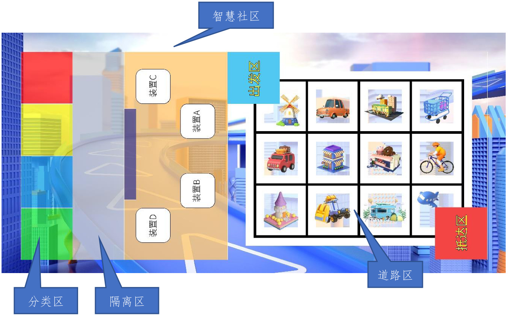
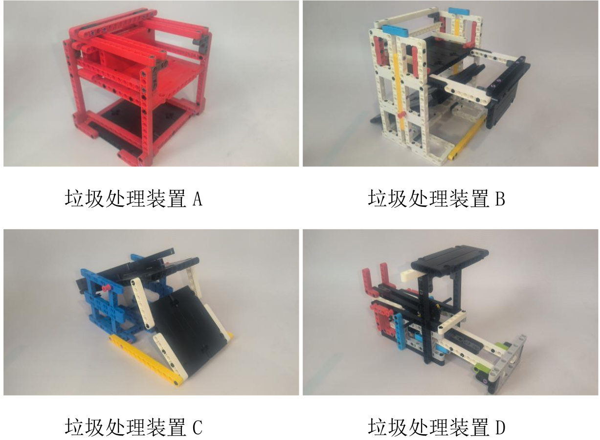
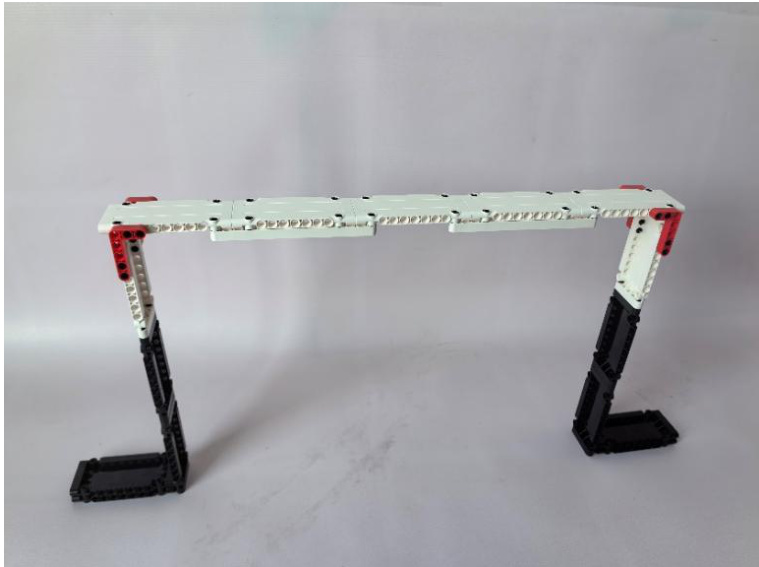
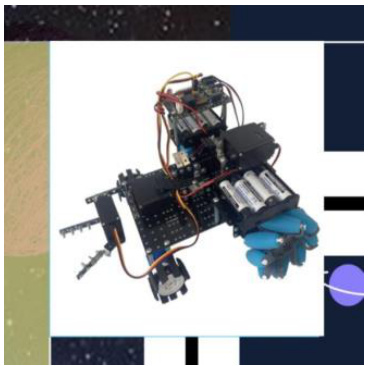
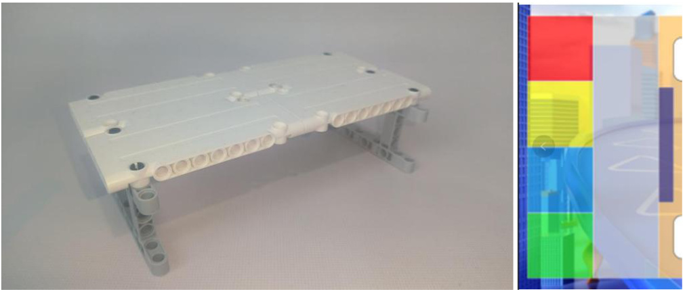
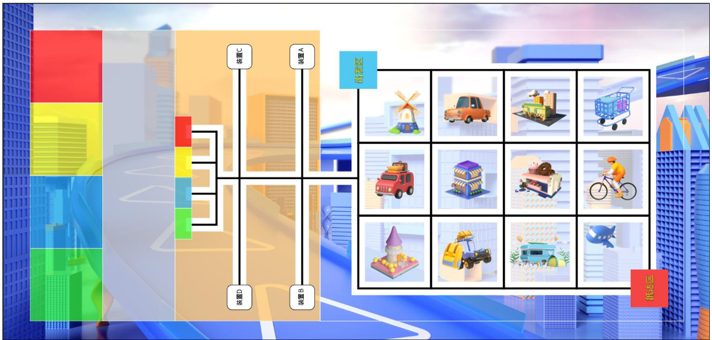
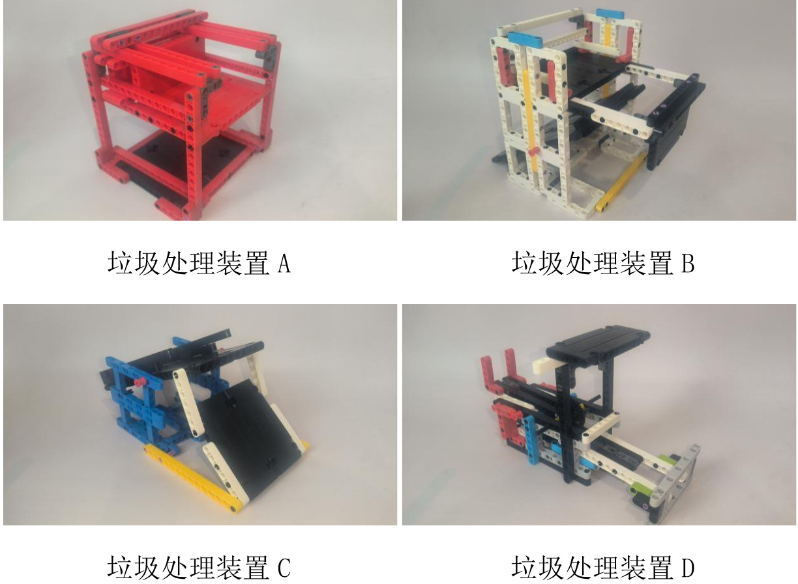
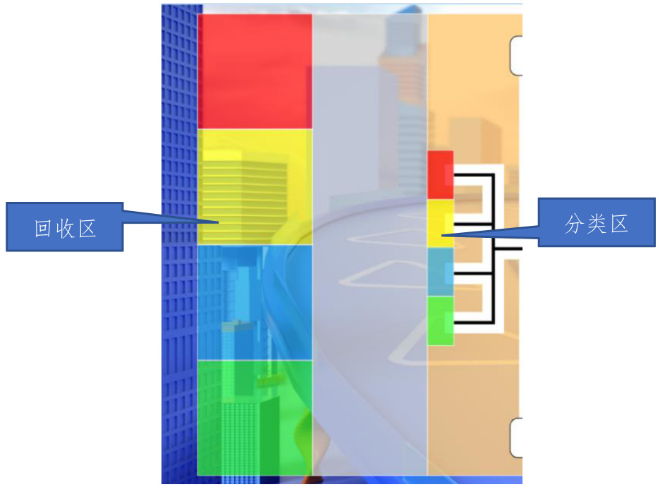
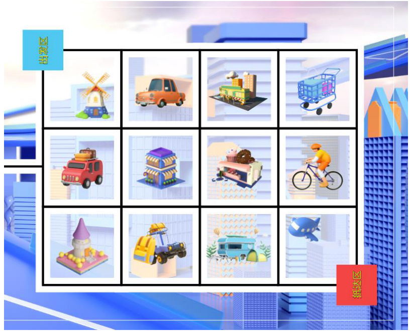

# 第七届全国青少年人工智能创新挑战赛智慧城市主题设计专项赛  

# 项目手册  

中国少年儿童发展服务中心2024年4月  

# 一、赛事简介  

智慧城市是以发展更科学、管理更高效、生活更美好为目标，以信息技术和通信技术为支撑，通过透明、充分的信息获取，广泛、安全的信息传递和有效、科学的信息处理，提高城市运行效率，改善公共服务水平，形成低碳城市生态圈而构建的新形态城市。随着科技的飞速发展和信息化社会的到来，智慧城市已成为今后城市规划的新方向。时至今日我国智慧城市建设方面的投资持续增加，技术不断革新，主要发展领域包括智慧政务、智慧应急和智慧交通等。智慧城市不仅能够提高城市治理的效率和质量，而且在应对环境变化、提升居民生活质量方面发挥着重要作用。展望未来，以人为本，城市数智化转型、绿色低碳发展和技术创新多元化发展，包括数字孪生、元宇宙等新兴技术的深入应用，将使城市服务更加智能化和人性化。  

参赛队伍以智慧城市为主题，在比赛现场以工程任务的形式探索和创作机器人来完成社区管理、垃圾分类和智轨交通等任务，思考如何更好地建设和运营智慧城市。  

本次挑战赛坚持公益性，赛事任何环节，任何单位都不会向学生、学校收取成本费、工本费、活动费、报名费、食宿费、参赛材料费、器材费和其他各种名目的费用，做到“零收费”；不会指定参与竞赛活动时的交通、酒店、餐厅等配套服务；不会通过面向参赛学生组织与竞赛关联的培训、游学、冬令营、夏令营等方式，变相收取费用；不会推销或变相推销资料、书籍、辅助工具、器材、材料等商品；不会面向参赛的学生、家长或老师开展培训；不会借竞赛之名开展等级考试违规收取费用；不会以任何方式向学生或组织学生参赛的学校转嫁竞赛活动成本。  

本次挑战赛坚持自愿原则，不强迫、诱导任何学校、学生或家长参加竞赛活动。竞赛以及竞赛产生的结果不作为中小学招生入学的依据。赞助单位不得借赞助竞赛活动进行相关营销、促销活动。  

# 二、参赛条件及分组办法  

1.在校小学、初中、高中、中专或职高学生均可参赛。  

2.选手所在学段组别分为：小学低年级组、小学高年级组、中学组。  

3.智慧城市主题设计专项赛为个人赛，每支队伍由 1 名选手和 1 名指导老师组成，多名学生的指导老师可以重复。指导老师作为责任人，有责任监督竞赛期间人身安全保护、财产，指导参赛学生制定学习计划，督促参赛学生顺利完成比赛。  

# 三、选拔赛参与办法  

1.选拔赛报名。参加活动的青少年通过访问“人工智能创新挑战赛”网站 https://aiic.china61.org.cn/，在首页点击“选拔赛报名”进行在线报名，详细登记相关信息和报名赛项、组别。  

2.参加选拔赛。根据各地区报名实际情况，本赛项选拔赛设置线上、线下两种形式：线下选拔赛采用现场竞技的方式，线上选拔赛以视频连线完成任务的方式，由专家根据参赛情况进行评判。对于不具备线上视频连线参赛的队伍可以利用虚拟仿真平台进行参赛，由专家根据参赛情况进行评判。参赛青少年只需选择参加线下现场竞技、视频连线、虚拟平台其中的一种选拔赛。  

3.报名时间：2024 年 4 月 15 日- 5 月 15 日，选拔赛时间为 2024 年5 月16 日-7 月1 日（具体时间另行通知）。  

参加选拔赛的青少年需通过“人工智能创新挑战赛”网站点击“参加选拔赛”链接，选择“智慧城市主题设计专项赛”了解选拔赛详细信息。  

4.主办单位将结合线上线下选拔赛的成绩，甄选出部分优秀选手入围全国挑战赛决赛。  

5.选拔赛成绩可以在 2024 年 7 月 15 日后，登录“人工智能创新挑战赛”网站进行查询，入围决赛的选手可以参加全国决赛。  

# 四、线下选拨赛规则  

# （一）场地图和道具  

场地图采用彩色喷绘布，尺寸为 $2700\mathrm{mm}\times1200\mathrm{mm}$ ，如下图1 所示。比赛现场，场地地图铺在地面上，组委会会尽力保证场地的平整度，但不排除场地褶皱等情况。  

  
图1：场地图  

1. 出发区：地图中央蓝色正方形为出发区（自动任务和遥控任务共用一个出发区域），含边线在内尺寸 $300\mathrm{mm}{*}300\mathrm{mm}.$ 。  
2. 抵达区：地图右下角红色区域为抵达区域，含边线在内尺寸为300mm\*300mm。  
3. 道路区：右侧黑白区域为城市规划道路区（自动区域），黑线区域范围为1200mm\*1500mm，规则发布后会随机选取2-5 个道路交点贴黄色标记（标记点数量与参赛组别相关）。轨迹线为 $30\pm$ 1mm 宽的黑线。  
4. 智慧社区：尺寸 $600\mathrm{mm*1200mm}$ 。在智慧社区内，四个方形白色区域有不同的垃圾处理装置（如图 2 所示）用来放置垃圾块。垃圾块：彩色木制方块，尺寸 $30\mathrm{{mm}*30\mathrm{{mm}*30\mathrm{{mm}}}}$ 。  

  
图2：四种垃圾处理装置的样式  

智慧社区内深紫色区域放有围栏装置（270mm\*440mm）（如图 3 所示）。机器人可以在围栏下方将垃圾块击打至分类区的收集装置内。  

  
图3：围栏装置示意图  

5.隔离区：尺寸为 $300\mathrm{mm}{*}1200\mathrm{mm}$ 。隔离区及分类区禁止携带垃圾块的机器人驶入隔离区完成对应任务（小低组除外）。  

6.分类区：地图最左侧区域为分类区，有四个颜色分别为红、黄、蓝、绿且长宽为 $300\mathrm{mm*300mm}$ 的回收区。不同回收区对应放置 4 个收集装置，机器人需将垃圾块投放至对应颜色的分类区。  

# （二）机器人要求  

参赛机器人的参数要求如表1 所示。  

表1：机器人的参数要求  

<html><body><table><tr><td>项目</td><td>要求</td></tr><tr><td>数量</td><td>每支队伍限用一台机器人。</td></tr><tr><td>规格</td><td>比赛开始前机器人长宽高不超过300mm*300mm*300mm（垂直投影 不得超出启动区），比赛开始后可自由伸展。（如图4)</td></tr><tr><td></td><td>控制器 每台机器人只允许使用一个控制器，控制器需为无塑料外壳的电</td></tr></table></body></html>  

<html><body><table><tr><td></td><td>路板（小学低年级组不限制该要求），控制器端口总数不少于12 个。处理器的型号限定为 ATmega328PB、ATmega64 和NRF52833三 种开源硬件芯片。</td></tr><tr><td>传感器</td><td>机器人允许使用的传感器类型不限，数量仅限2个。不得使用循 迹卡等集成式传感器。</td></tr><tr><td>电机</td><td>小学低年级组电机使用数量不得超过4个，其余组别每台机器人 使用电机（含舵机）总数不超过8个。单个电机最高转速不超过</td></tr><tr><td></td><td>400RPM。单个电机只能驱动单个着地的轮子。（如图5) 驱动轮机器人用于着地的轮子（含胎皮）直径不得大于80mm。</td></tr><tr><td>结构</td><td>机器人必需使用仿螺栓或螺栓结构组装搭建（小学低年级组不限 制该要求），不得使用3D打印件，可以使用皮筋，履带等其他辅 助材料。</td></tr><tr><td>电池</td><td>每台机器人电源类型不限，但最大输出电压不得超过12V。</td></tr><tr><td>检录</td><td>选手第一轮进场前，各参赛队伍可使用自备的器材自行设计和构 建机器人，机器人可于赛前制作完成但必须符合“器材及机器人 规范”中的各项要求。选手应对不符合要求的地方进行修整改进, 由裁判确认无误后方可参加比赛。</td></tr></table></body></html>  

  
图4：机器人的垂直投影不超出启动区示意图  

  
图5：电机驱动单个着地轮子示意图  

# （三）竞赛任务  

场地上分布有颜色不同的任务区域，机器人需从出发区出发，完成对应的任务，并在比赛结束前从出发区自动程序回到红色的抵达区域内。  

在整个竞赛中，机器人需要以遥控器操作的方式完成社区管理和垃圾分类两个任务。然后遥控机器人返回出发区，完成智慧交通的自动任务。每完成一个任务即可获得相应任务的分数。  

1.社区管理（遥控任务）  

任务描述：智慧社区是区域共治的管理平台和改善社区人居环境的服务平台，是智慧城市建设的核心组成部分。  

任务过程：在智慧社区内有不同的垃圾处理装置用来放置垃圾块（垃圾块：木制方块，尺寸 $30\mathrm{mm}{*}30\mathrm{mm}{*}30\mathrm{mm}$ 。）。选手可操作机器人使用接触垃圾处理装置指定位置、夹取等不破坏垃圾处理装置的方式获取垃圾块。  

完成标准：垃圾块成功掉落地图上即可得分，每个10 分。每个装置放置2 个垃圾块，总共 8 个。  

2.垃圾分类（遥控任务）  

任务描述：智慧城市垃圾分类是指在传统垃圾分类基础上,利用物联网、云计算、大数据等技术手段进行合理分拣,更科学、更便捷、更高效地实现垃圾处理的过程。  

任务过程：机器人在获取垃圾块后，需要将垃圾块分别运送至地图最左侧的分类区。运送时，机器人任何部位不得接触隔离带内（小学低年级组不限制该要求）。垃圾块的颜色代表了对应颜色的分类区。垃圾块的运送方式可采用携带、推送、夹取、投掷等诸多方式。最多每次运送 2 个垃圾块，不限颜色。以比赛结束时，方块静止状态判定得分。如在比赛结束时有掉落，脱图的情况出现，以机器人到达抵达区域时间点的最终状态作为判定标准。分类区内的收集装置有不同得分方式，根据选手使用的机器人搭建方式和实际操作方式自行决定获取得分。社区管理和垃圾分类的任务结束后由选手操作机器人重新返回出发区开始自动任务。机器人返回出发区之前不得触碰机器人，返回出发区且开始自动任务前可以用手触碰机器人调整位置或者启动自动程序阶段前可以修改程序，期间不停表。  

完成标准：分类区内垃圾块最终停留的位置有不同的得分方式，根据选手使用的机器人搭建方式和实际操作方式自行决定获取得分。将对应颜色垃圾块携带、推送、夹取、投掷对应颜色区域方可得分，具体得分如下：  

（1）成功在指定位置将垃圾块投送至黄色和蓝色区域内，每个 20 分；  
（2）最终停留在黄色和蓝色收集装置上方的方块，每个40 分；  
（3）成功在指定位置将垃圾块投送至红色和绿色区域内，每个 30 分；  
（4）最终停留在红色和绿色收集装置上方的方块，每个50 分。  

  
图6：收集装置及四个分类区样式  

# 3.智慧交通（自动任务）  

任务描述：智慧交通作为智慧城市建设的重要组成部分，不仅能够提高城市交通的管理效率和安全性，还能优化交通资源的配置，为人们出行提供更多便利和舒适。  

任务过程：在地图右侧网格区内为道路区，机器人由出发区开始至抵达区结束，自动行驶过程中不得用身体任何部位触碰机器人或干扰机器人自动运行。在网格区内有18 个交叉点，标记点的位置将在比赛前公布，标记点可能在黑色路线交叉点或者黑色路线上，以现场公布为准。其中小学组低龄组从中随机抽取 2 个标记点完成，小学组高龄组从中随机抽取 3 个标记点完成，中学组从中随机抽签 4 个标记点完成。机器人在自动行驶的过程中需沿黑色路线行驶，不得脱线。  

完成标准：自动行驶过程中需经过标记点获取得分，判定标准为机器人垂直投影部分覆盖标记点，黑色路线均可重复多次行驶，每个标记点只获取一次得分，每个标记点20 分，直至抵达区结束。机器人有两个接触地面部分停泊在抵达区域内代表本轮比赛结束。机器人接触地面部分完全进入抵达区内有额外50 的得分。  

  
图7：道路区样式  

# （四）竞赛机制  

比赛调试开始前，由裁判组或组委会抽签决定任务道具的摆放位置及道具数量（选拔赛由裁判组在 4 个节点装置中随机抽取 2 个，决赛需全部完成），任务道具主体框架参考任务说明示意图，实际比赛道具搭建可能有所出入，例如实际使用的梁、销等结构颜色不同，或尺寸、高度略有误差。参赛选手应具备根据实际情况调整的能力，模型所在的位置一旦确定，各场次的比赛均尽量做到相同。  

# 1.编程调试  

机器人的搭建、编程、调试只能在准备区进行，时间至少为 60 分钟。第一轮结束后，至少有 30 分钟的时间进行第二轮调试。裁判组可根据实际情况调整调试时间，并在每一轮的调试前向所有参赛队伍宣布调试时间段。  

# 2.赛前准备  

参赛队员需要按照赛场秩序，有序地排队进行编程及调试，不遵守秩序的参赛队可能会被取消参赛资格。编程调试结束后，机器人由裁判封存，参赛队员未经允许不得再接触机器人，否则将被取消参赛资格。裁判示意比赛开始后，仍没有准备好的参赛队将丧失本轮比赛机会，但  

不影响下一轮的比赛。  

# 3.启动  

裁判员确认参赛队已准备好后，将发出“5，4，3，2，1，开始”的倒计数启动口令。随着倒计数的开始，听到“开始”命令的第一个字，队员可以按下一个按键去启动机器人进行任务。如有比赛开始时裁判未发出开始比赛信号则判定为误启动，误启动扣除本轮比赛最终得分 20 分，但是误启动可以重置本轮比赛计时，由裁判重新发出信号后开始比赛。每轮比赛误启动只允许出现一次。  

# 4.重置  

比赛过程中全程不停表，如有突发情况，如机器人在运行中如果出现故障导致无法正常比赛，参赛队员可以向裁判员申请重置。需举手示意裁判，经裁判同意授权后，方可进入场地处理。裁判员同意重置后，场地状态保持不变，队员可将需要重置的机器人搬回出发区处理问题并重新启动。  

每场比赛可以无限次数重置，但每发生一次重置扣除本轮比赛最终得分20 分。重置期间计时不停止，也不重新开始计时。机器人已经完成的任务仍有效，但重置过程中选手不得触碰任务模型，否则本轮比赛不得分。  

若发生重置时机器人携带有任务道具，则该任务道具无效，并交由裁判保管，不得重新放回场地内使用。  

# 5.比赛结束  

每场比赛的规定时间，小学低年级组和小学高年级组为 180 秒，中学组为150 秒，比赛全程均不停表计时。  

参赛队的机器人出现下列情况，将以裁判哨声为准停止计时，并记  

录时间分：  

（1）机器人任务失败且无法继续执行后续任务；  
（2）参赛队完成“智慧交通”任务；  
（3）计时到达单轮比赛用时结束；  
（4）参赛队主动示意结束比赛。  

# 6.赛制  

比赛共分两轮，每位参赛选手以小组循环的方式进行两轮比赛。参加队伍采取现场抽签方式确定分组及参赛顺序，参赛队按抽签确定的顺序轮流上场比赛。比赛中上一队开始比赛时，会通知下一队候场准备。在规定时间内没有到场的队伍，将视为放弃比赛资格。比赛成绩将在两轮成绩中取两轮比赛得分成绩之和为最终成绩，进行最终排名。  

# 7.计分规则  

每场比赛结束后要计算参赛队的得分。单场比赛的得分为各任务分、剩余时间分、重置扣分及误启动扣分。任务分以比赛结束后模型的最终状态，依据任务完成标准计分。剩余时间分为该场比赛结束时剩余时间的秒数，在规定时间内机器人完成各组别应完成的全部任务，可获得剩余时间得分（取剩余时间的整数部分计算，5.91 秒取 5 秒，6.4 秒取 6秒）。  

# 8.排名规则  

某一组别的全部比赛结束后，按参赛队的总分进行排名。如果出现局部持平，按以下顺序破平：  

（1）某一单场得分高者在先；  
（2）两轮总用时少者在先；  
（3）重置次数少者在先。  

# （五）竞赛评分  

1.以下情况视为犯规：  

（1）每支队伍每轮任务允许第1 次机器人“早启动”，第 2 次再犯则该轮成绩为0 分。  

（2）比赛开始后，选手如有未经裁判允许，接触场内物品或者机器人的行为，第一次将受到警告，第二次再犯则该轮成绩为 0 分。  

（3）辅导老师或家长存在口授选手影响互动的指引，或亲手参与搭建任务，亦或触碰、修复作品等行为的，一经查证则该轮成绩记0 分。  

（4）启动后的机器人不得为了策略的需要，故意分离部件或掉落零件在场地上，这属于犯规行为，由裁判确定给予警告、再次犯规将判罚该轮成绩为 0 分，犯规分离或掉落的零件则由裁判即时清理出场。  

（5）恶意离开地图区域，则该轮成绩为 0 分。  

（6）所有参赛队均需保护比赛场地，若比赛过程中因机器人冲撞或选手操作破坏比赛场地的，该轮比赛成绩为 0 分。  

2.以下为取消比赛资格：  

（1）参赛选手出现重复、虚假报名，一经发现将取消比赛资格。（2）比赛期间，若发生规则中未明示的部分或出现临时的突发情况，与裁判发生冲突。本规则是实施裁判工作的依据，在竞赛过程中裁判有最终裁定权。  

# 3.评分表  

具体评分表见表 2。  

表 2：智慧城市专项赛线下评分表参赛队（编号）： 组别：  

<html><body><table><tr><td>任务名称</td><td>分值</td><td>说明</td><td>第一轮</td><td>第二轮</td></tr><tr><td>社区管理</td><td>10分/个</td><td>方块脱离放置装置</td><td></td><td></td></tr><tr><td rowspan="4">垃圾分类</td><td>20分/个</td><td>垃圾块位于黄色和蓝色区域内</td><td></td><td></td></tr><tr><td>40分/个</td><td>垃圾块位于黄色和蓝色收集装置上 方</td><td></td><td></td></tr><tr><td>30分/个</td><td>垃圾块位于红色和绿色区域内</td><td></td><td></td></tr><tr><td>50分/个</td><td>垃圾块位于红色和绿色收集装置上 方</td><td></td><td></td></tr><tr><td rowspan="2">智慧交通</td><td>20分/个</td><td>机器人投影位置通过黄色标记点位</td><td></td><td></td></tr><tr><td>50分</td><td>机器人停泊位置完全进入</td><td></td><td></td></tr><tr><td>重置次数</td><td>-20分/ 次</td><td>机器人重置次数</td><td></td><td></td></tr><tr><td>误启动</td><td>-20分</td><td>裁判才发出开始信号前启动</td><td></td><td></td></tr><tr><td colspan="4">比赛用时 (0.1秒)</td><td></td><td></td></tr><tr><td colspan="4">剩余时间分 （机器人完成各组别应完成的全部任务)</td><td></td><td></td></tr><tr><td colspan="4">各单场得分</td><td></td><td></td></tr><tr><td colspan="4">比赛总得分 (各单场得分之和)</td><td colspan="2"></td></tr></table></body></html>  

裁判员： 参赛队员：  

# 五、视频连线选拔赛规则  

（一）视频连线选拔赛规则、器材设置等与线下选拔赛规则一致。  
（二）比赛流程。  

# 1. 赛前组织  

（1）由监考员建立监考钉钉群，并根据组委会安排，分别联络监考工作人员、各队参赛队指导教师进入钉钉群。  

（2）由监考钉钉群公告竞赛具体开展流程、日程安排及比赛考题（包括随机任务位置信息）。  

（3）各参赛队根据网络竞赛监考平台操作指南要求，搭建线下竞赛场地，并安装调试各项网络监考平台及设备。  

（4）监考工作群将在竞赛正式开始前，按照正式比赛流程开展监考演练，各参赛队应及时关注工作群通知并提前做好准备。  

（5）在监考演练中发现的各项问题，监考工作人员及各参赛队应及时协调并优化相应流程。  

# 2. 赛中监考  

上午比赛流程示例（具体以赛前通知为准）。  

<html><body><table><tr><td>9:30</td><td>进入监考平台直播视频会议提前测试。测试网络环境及摄像头 位置，保证场地内容、选手及桌椅清晰可见。</td></tr><tr><td>10 :00</td><td>正式开始比赛，网络直播监考。</td></tr><tr><td>10:30</td><td>可以发送比赛视频，比赛视频以邮件形式发送，视频提交邮箱： 本场赛事的评委邮箱，比赛开始前通知。 （需修改文件名为学校名称+参赛队员姓名，并留意发送时间）。</td></tr><tr><td>11:45</td><td>发送时间10:30 前和 11:45后的将不予评分。</td></tr></table></body></html>  

上午比赛流程示例（具体以赛前通知为准）。  

<html><body><table><tr><td>14:30</td><td>进入监考平台直播视频会议提前测试。测试网络环境及摄像头 位置，保证场地内容、选手及桌椅清晰可见。</td></tr></table></body></html>  

<html><body><table><tr><td>15:00</td><td>正式开始比赛，网络直播监考。</td></tr><tr><td>15 :30</td><td>可以发送比赛视频，比赛视频以邮件形式发送，视频提交邮箱： 本场赛事的评委邮箱，比赛开始前通知。 （需修改文件名为学校名称+参赛队员姓名，并留意发送时间）。</td></tr><tr><td>16 :45</td><td>发送时间15:30 前和 16:45后的将不予评分。</td></tr></table></body></html>  

3. 赛后总结监考工作人员在接收各参赛队上传的比赛视频，进行确认及核对。  

# （三）网络竞赛监考平台  

1. 参赛需要准备的设备  

（1）两台带高清摄像头的电脑和一台手机，或三台手机；（2）所有参赛选手的身份证（没有身份证的参赛选手需准备能够证明身份的证件如：户口本、学生证、护照、港澳通行证等证件）；  

# 2. 监考平台机位设置  

（1）竞赛监考平台采用双机位设置，两个机位互为备份。  

（2）竞赛监考平台“直播”机位采用已安装“钉钉”视频会议软件且配置有高清摄像头的智能设备（电脑或手机）。“钉钉”下载链接：  

https://page.dingtalk.com/wow/z/dingtalk/default/dddownloadindex?from=zebra:offline  

（3）竞赛监考平台“录制”机位采用手机录制“比赛视频”。  

3.“直播”机位要求  

（1）“直播”机位的摄像头视角内必须全程并完整展示比赛场地、参赛选手、及手持“录制”机位的辅助人员。  

（2）比赛当天仅需连线一个钉钉账号，赛前参赛队需在“直播”机位上运行并登录钉钉软件（需修改账号昵称为学校名称 $+$ 全体参赛队员姓名，在【我的】- 【设置】-【我的信息】-【昵称】修改）。如一个学校有多个赛队，需提前告知监考老师，按照监考老师要求进行调整。  

（3）正式比赛期间需保持网络稳定，若掉线超过两次，或单次黑屏（包括遮挡屏幕）超过 3 分钟视为违规，将取消比赛成绩。  

（4）以上内容应严格执行，如有违规者，监考人员无需告知，及时记录并取消成绩。  

# 4.“录制”机位要求  

（1）参赛队伍必须在规定时间内发送比赛视频至指定邮箱。  

（2）录制的比赛视频中，需首先拍摄“直播”机位的视频会议画面，再展示参赛选手在镜头前手持身份证进行自我介绍（姓名、学校）。之后辅助人员手持摄像装置，跟随自动机器人，以俯视视角拍摄自动机器人到达的每一个任务点（视频中还需要体现出具体的计时设备记录比赛时间。）  

（3）在视频中需要保证对任务点的得分项清晰可见（例如道具是否归位，彩灯显示等，若缺失内容，则该任务将作为 0 分处理）。  

（4）全程要求一镜到底（中间不得中断或者存在剪辑痕迹，否则按  

照0 分处理）。  

（5）视频名称须标明：学校名称＋全体参赛选手姓名（如未按照要求进行改名，评委老师有权不予评分。）  

（6）视频提交邮箱：本场赛事的评委邮箱，比赛开始前通知。  

5. 其他注意事项：  

（1）选手需准时抵达直播间并开启摄像头，完成比赛并提交录制的比赛视频，否则将视为比赛弃权，将不予评分。  

（2）比赛现场应远离吵杂人员进出频繁的地区。应避免室外光线和吵杂声干扰监考工作人员的视听效果。场地内不要摆放与展示无关的物品。  

（3）所有调试、比赛环节，不允许出现家长、指导老师或非参赛人员（辅助录制人员除外）出现在镜头中，一经发现，将取消比赛资格。  

（4）比赛过程中，全称麦克风保持开麦状态，不允许静音，现场应保持安静。如监考老师进行提问，三次未应答，将做扣30 分处理。  

（5）比赛视频提交：比赛视频在规定时间内发送指定邮箱，注意文件上传所需耗时，规定时间外发送将视为无效文件。如一个赛队在规定时间内有多个邮件，只取第一个邮件的内容，第二个邮件默认为无效视频，所有视频只能在一个邮件内发送，不得分开发送。  

（6）如有无法参赛的队伍，请向监考工作人员提交弃赛说明。赛前会在微信群公布，请注意查看微信群消息。  

# 六、虚拟平台选拨赛规则  

# （一）竞赛环境  

1.比赛场地  

比赛场景由地图和任务模型组成，如图（该图仅供参考用，实际场景以比赛公布为准）。  

  
图8：比赛场景  

2.地图  

机器人比赛场地具体样式以 RoboSim 软件呈现为准。场地中不规则分布有一条黑色的轨迹线，轨迹线是引导机器人移动方向的线路。在比赛场地分别设置有一个蓝色的启动区和一个红色的到达区，是机器人启动和到达的区域，比赛开始后机器人由启动区出发沿轨迹线行驶，前往各任务区完成相应设置的任务，并前往到达区。  

# 3.智慧社区  

智慧社区内四个方形白色区域有不同的垃圾处理装置（如图 9 所示）用来放置垃圾块。智慧社区左侧设置有四个分类区，并通过轨迹线与白色区域连接。机器人可以在此将垃圾块投送至回收区内。  

  
图9：四种垃圾处理装置的样式  

4.回收区：地图最左侧区域为回收区，有四个颜色分别为红、黄、蓝、绿的回收区。机器人需将垃圾块投放至对应颜色的回收区。  

5.隔离区：隔离区及回收区禁止携带垃圾块的机器人驶入。  

# （三）机器人要求  

本赛项要求学员使用仿真软件中机器人完成设置的竞赛任务。  

# （四）竞赛任务  

本赛项的机器人任务，分必做任务和选做任务。  

场地上分布有颜色不同的任务区域，机器人需从出发区出发沿着轨迹线完成对应的任务，并在比赛结束前回到红色的抵达区域内。  

除小学低年级组可使用键盘遥控完成竞赛任务，其余组别需通过程序编程自动完成竞赛任务。  

1.顺利出发  

任务过程：机器人沿轨迹线离开出发区。  

完成标准：机器人垂直投影完全离开启动区，记20 分。  

2.安全抵达  

任务过程：机器人完成任务后进入抵达区并控制机器人闪烁指定颜色，完成此任务则结束本场比赛。  

完成标准：机器人部分垂直投影接触终点区，且屏幕间隔 0.2 秒交替显示红蓝色1 秒以上，记50 分。  

# 3.社区管理  

任务描述：智慧社区是区域共治的管理平台和改善社区人居环境的服务平台，是智慧城市建设的核心组成部分。  

任务过程：在智慧社区内有不同的垃圾处理装置用来放置垃圾块。机器人出发后前往各垃圾处理装置前，并使用机器人的任意部位接触装置即可获取 1 个垃圾块。每个装置至多设置有 2 个垃圾块，机器人同时只能获取一个垃圾块。  

完成标准：机器人成功获取一个垃圾块可得分，每个10 分。。  

# 4.垃圾分类  

任务描述：智慧城市垃圾分类是指在传统垃圾分类基础上,利用物联网、云计算、大数据等技术手段进行合理分拣,更科学、更便捷、更高效地实现垃圾处理的过程。  

任务过程：机器人在获取垃圾块后，需要前往轨迹线连接的位于智慧社区左侧分类区，并根据你携带的垃圾块颜色，接触对应颜色的分类区。机器人接触分类区，即可将携带的垃圾块投送至场地左侧对应颜色的回收区。任务全程机器人任何部位不得接触隔离带内。垃圾块的颜色  

代表了对应颜色的回收区和分类区。  

完成标准：垃圾块成功进入对应颜色的回收区，每个20 分。  

  
图10：回收区及分类区  

# 5.智慧交通  

任务描述：智慧交通作为智慧城市建设的重要组成部分，不仅能够提高城市交通的管理效率和安全性，还能优化交通资源的配置，为人们出行提供更多便利和舒适。  

任务过程：在网格区内有 18 个交叉点，标记点可能在黑色路线交叉点或者黑色路线上，以仿真平台公布为准。其中小学组低龄组至少从中随机抽取 5 个标记点完成，小学组高龄组至少从中随机抽取 8 个标记点完成，中学组至少从中随机抽签 10 个标记点完成。机器人在自动行驶的过程中需沿黑色路线行驶，不得脱线。  

完成标准：自动行驶过程中需经过标记点获取得分，判定标准为机器人垂直投影部分覆盖标记点，黑色路线均可重复多次行驶，每个标记点只获取一次得分，每个标记点 10 分，直至抵达区结束。  

  
图11：智慧交通网格区  

# （五）竞赛流程  

1.任务时长  

活动时长：指活动整个过程的时长，选手需在此时长内完成搭建机器人、编写控制程序和完成仿真等所有操作。具体活动时长以相应活动通知为准。  

任务限时：指机器人从出发到完成全部任务所用的最长时间，在此时间内未完成的任务自动结束且不得分，任务限时为300 秒。  

任务耗时：指机器人从出发到完成全部任务实际经过的时间。  

# 2.随机性  

位置随机：不同比赛的任务道具的位置由系统随机决定。同一场比赛的位置均相同。  

任务随机：竞赛任务中 3.社区管理和5.智慧交通中，各组别设置的垃圾块数量、位置以及标记点的数量、位置并不固定，由仿真平台随机生成，且同一场比赛的同一组别均保持一致。  

# 3.任务中止  

任务中止后，选手可选择是否提交当次仿真的成绩。任务仿真过程中发生以下情况，将导致当次仿真的终止：到达任务限时；机器人完成安全抵达任务；机器人接触离子屏障；选手自主结束仿真。  

# 4.脱线行驶  

当机器人位于智慧交通网格区时，机器人不允许脱离轨迹线行驶，机器人的垂直投影需要保持在轨迹线上，若机器人的垂直投影全部脱离轨迹线，则本次任务中止。当机器人位于智慧社区时，不受此限制。  

（六）竞赛评分  

1.计分  

每场比赛结束后要计算参赛队的得分。单场比赛的得分为任务分、剩余时间分之和。以比赛结束后任务模型的最终状态，依据任务完成标准计分，详见 （四）竞赛任务。剩余时间分需要机器人完成全部应完成的任务才可获得，剩余时间分 $\mathbf{\bar{\rho}}=\mathbf{\rho}$ （300 秒-完成时间） $\ast0.5$ 。比赛结束后，以已提交成绩中的最高分作为参赛队的总得分。总得分是参赛队排名的主要依据。  

2.排名  

某一组别的全部比赛结束后，按参赛队的总得分进行排名。如果出现局部持平，按以下顺序破平：任务完成时间较少者在先；提交成绩总用时较少者在先。  

# 3.评分表  

线上选拔赛具体评分表见表3。  

# 表 3：智慧城市专项赛线上评分表  

参赛队（编号）： 组别：  

<html><body><table><tr><td>任务名称</td><td>分值</td><td>说明</td><td>得分</td></tr><tr><td>顺利出发</td><td>20分</td><td>机器人离开启动区</td><td></td></tr><tr><td>社区管理</td><td>10分/个</td><td>机器人成功获取一个垃圾块</td><td></td></tr><tr><td>垃圾分类</td><td>20分/个</td><td>垃圾块成功进入对应颜色回收区</td><td></td></tr><tr><td>智慧交通</td><td>10分/个</td><td>机器人投影位置通过黄色标记点位</td><td></td></tr><tr><td>安全抵达</td><td>50分</td><td>计时结束前机器人成功抵达</td><td></td></tr><tr><td colspan="4">比赛用时 (0.1秒)</td></tr><tr><td colspan="4">剩余时间分 (机器人完成各组别应完成的全部任务)</td></tr><tr><td colspan="2">单场得分</td><td></td></tr></table></body></html>  

# 七、全国决赛规则  

全国决赛的规则、器材设置等与线下选拔赛规则基本一致，唯一区别在于选拔赛由裁判组在4 个节点装置中随机抽取2 个，决赛需全部完成。  

# 八、回避范围及方式  

# （一）回避范围  

回避是指评审专家具有法定情形，必须回避，不参与相关作品评审的制度。按照相关规定，结合竞赛活动实际，如果评审专家具备以下情形之一的，应当回避：  

1.是参赛选手的近亲属；  

2.与参赛选手有其他直接利害关系；  

3.担任过参赛选手的辅导老师、指导老师的；  

4.与参赛选手有其他关系，可能影响公正评审的。  

# （二）回避方式  

回避方式有自行回避与申请回避两种：  

# 1.自行回避  

评审专家自行提出回避申请的，应当说明回避的理由，口头提出申请的，应当记录在案。  

评审专家有上述1、2、3、4 情形之一的，应当自行回避。  

评审专家在活动评审过程中，发现有上述 1、2、3、4 情形之一的，应当自行提出回避；没有自行提出回避的，活动组委会应当决定其回避。评审专家自行回避的，可以口头或者书面提出，并说明理由。口头提出申请的，应当记录在案。  

# 2.申请回避  

参赛选手及评审专家要求其他评审专家参与回避的，应当提出申请，并说明理由。口头提出申请的，应当记录在案。  

# 九、异议处理机制  

1.第七届全国青少年人工智能创新挑战赛接受社会的监督，挑战赛的评审工作实行异议制度。  

2.任何单位或者个人对第七届全国青少年人工智能创新挑战赛参赛选手、参赛单位及其项目的创新性、先进性、实用性及推荐材料真实性、比赛成绩等持有异议的，应当在项目成绩公布之日起 10 日内向活动组委会提出，逾期不予受理。  

3.提出异议的单位或者个人应当提供书面异议材料，并提供必要的证明文件。提出异议的单位、个人应当表明真实身份。个人提出异议的，应当在书面异议材料上签署真实姓名；以单位名义提出异议的，应当加盖本单位公章。以匿名方式提出的异议一般不予受理。  

4.提出异议的单位、个人不得擅自将异议材料直接提交评审组织或者评审专家；专家收到异议材料的，应当及时转交活动组委会，不得提交评审组织讨论和转发其他评审专家。  

5.活动组委会在接到异议材料后应当进行审查，对符合规定并能提供充分证据的异议，应予受理。  

6.为维护异议者的合法权益，活动组委会、推荐单位及其指导老师，以及其他参与异议调查、处理的有关人员应当对异议者的身份予以保密；确实需要公开的，应当事前征求异议者的意见。  

7.涉及参赛选手所完成项目的创新性、先进性、实用性及推荐材料真实性、比赛成绩的真实性等内容的异议由活动组委会负责协调，由有关指导单位或者指导老师协助。参赛选手接到异议通知后，应当在规定的时间内核实异议材料，并将调查、核实情况报送活动组委会审核。必要时，活动组委会可以组织评审专家进行调查，提出处理意见。涉及参赛选手及其排序的异议由指导单位或者指导老师负责协调，提出初步处理意见报送活动组委会审核。参赛选手接到异议材料后，在异议通知规定的时间内未提出调查、核实报告和协调处理意见的，该项目不认可其比赛成绩。  

8.异议处理过程中，涉及异议的任何一方应当积极配合，不得推诿和延误。参赛选手在规定时间内未按要求提供相关证明材料的，视为承认异议内容；提出异议的单位、个人在规定时间内未按要求提供相关证明材料的，视为放弃异议。  

9.异议自异议受理截止之日起 60 日内处理完毕的，可以认可其比赛成绩；自异议受理截止之日起一年内处理完毕的，可以直接参加  

下一年度比赛。  

10.活动组委会应当向活动专家评审委员会报告异议核实情况及处理意见，并将决定意见通知异议方和参赛选手。  

# 十、赛事组委会  

本届挑战赛信息发布平台为：  

“中国少年儿童发展服务中心”微信公众号；  
主办单位网站：http://www.china61.org.cn；  
挑战赛网站：http://aiic.china61.org.cn。  

组委会联系方式：  

联系人：屈老师、辛老师、张老师邮  箱：xiaoyuanshi@163.com电  话：010-65124399  

涉赛违规问题线索专用举报邮箱：ghstfmct@163.com  

赛事技术咨询：  

联系人：张老师、勇老师电话：13718681628、18610045322  

# 十一、知识产权声明  

挑战赛组委会鼓励并倡导技术创新以及技术开源，并尊重参赛队的知识产权。参赛队伍比赛中开发的所有知识产权均归所在队伍所有，组委会不参与处理队伍内部成员之间的知识产权纠纷，参赛队伍须妥善处理本队内部学校及其他身份的成员之间对知识产权的所有关系。参赛队伍在使用组委会提供的裁判系统及赛事支持物资过程中，须尊重原产品的所有知识产权归属方，不得针对产品进行反向工程、复制、翻译等任何有损于归属方知识产权的行为。  

# 十二、主办单位免责声明  

1.未经主办单位书面授权，任何单位和个人以本赛事名义开展的活动均属假冒、侵权。2.主办单位不会以本赛事名义向学生收取任何费用，更不会以本赛事名义举办夏冬令营、培训班，捆绑销售器材商品、书籍材料等。本赛事也不存在任何指定器材、指定培训机构、指定教材等，请参与活动的师生和家长朋友们谨防上当受骗。3.所有参赛作品，均须为参赛个人原创，不能存在任何侵犯第三方权利的内容，不能违反法律法规的规定。4.请参与活动人员妥善保管自己的贵重物品（如现金、笔记本电脑、手机和参赛设备等），避免丢失或损坏。  

# 十三、线下活动注意事项  

1.参与活动人员必须牢固确立“安全第一”的意识，把活动安全放在首要位置。严格注意用电安全，相关机器人设备须提前充好电，准备好备用电池，规范用电，防止触电。严格注意防火安全，禁止携带易燃易爆等危险品和打火机、火柴等进入赛场。严格注意操作安全，活动期间如有发射弹丸、切割材料、器件焊接等危险操作时必须戴好头盔、手套、护目镜等防护措施。活动期间，参与活动人员应熟悉场地环境，若遇紧急情况，严格服从安保人员指挥。  

2.参与活动人员应遵守场地制度，爱护公共设施，自觉保持公共卫生。  

3.比赛现场提供当地标准电源接口，如果参赛队需要任何电压或者频率的转换器，请参赛队自行准备。距离参赛队最近的电源接口可能距离参赛队的指定调试桌有一定的距离，请参赛队自行准备足够长的电源延长线，同时在现场使用延长线时请注意固定和安全。  

4.比赛现场为日常照明，正式比赛之前参赛选手有时间标定传感器，但是大赛组织方不保证现场光线绝对不变。随着比赛的进行，现场的阳光可能会有变化。现场可能会有照相机或摄像机的闪光灯、补光灯或者其他赛项的未知光线影响，请参赛选手自行解决。  

# 十四、其它  

1.关于挑战赛规则的任何补充、修订，将在中国少年儿童发展服务中心网站及微信公众号上发布。  

2.比赛期间，规则中没有说明的事项由专家评审委员会现场决定。  

3.主办单位和专家评审委员会对规则中未说明及有争议的事项拥有最后解释权、补充权和决定权。  